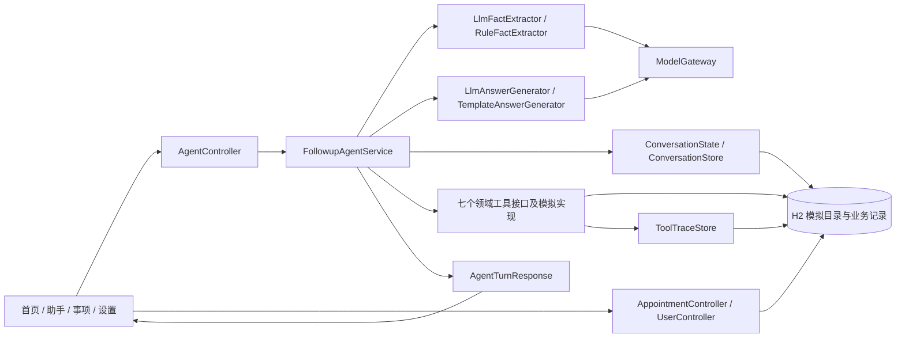
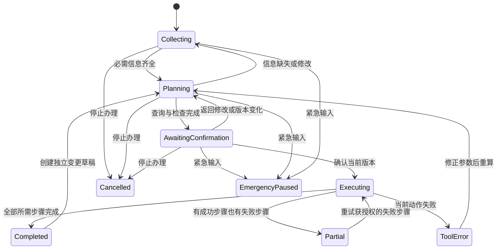

# 银龄复诊助手 — 设计总结与需求对齐

审阅日期：2026-09-07。需求基线：[Requirement.md](Requirement.md)。

## 实现更新（2026-09-07，后续修订优先于下文初次审阅）

2026-09-09：自然语言入口已从“模型提取单一 intent”升级为受控混合规划。`LlmConversationPlanner` 可提出直接回答、补问、白名单只读工具或工作流动作，`AgentRuntime`、`ToolRegistry`、`ToolPolicy` 与 `ActionValidator` 负责审核；写操作仍由原 Java 状态机和确认凭据控制。已补齐“心口疼、胸口疼、胸闷”等安全前置表达，并在 Dev Container 中通过 26 项后端测试和真实模型联调。连续只读工具循环及进一步拆薄 `FollowupAgentService` 仍是后续工作。

已修改代码：紧急/取消终态守卫；确认凭据生成、失效和消费；实际操作确认清单；预约及提醒/通知幂等处理；部分完成保存与补办；预约原地变更事务及关联提醒停用；明确选择家属；替代日期偏好；出发建议与出发提醒分离；相对日期规则；可持续查看计划及步骤状态、选项分页和取消入口。

实现采用单实例同步编排及随机 `confirmationId`，没有增加数字计划版本或分布式执行账本。修改预约在事务中更新原预约的号源；新号源失败时回滚，保留原预约和提醒。现有工具写入及会话保存仍不是同一个事务，幂等键用于补办时避免重复业务记录；不宣称支持多后端实例并发。

已补充 16 项回归测试。用户明确要求后，验证仅在 VS Code Dev Container 内进行；当前尚未连接到项目容器，容器内测试、前端构建和浏览器验收待完成。之前宿主机测试报告不作为容器验收结论。

开发容器配置已补齐 Maven、固定 `/workspace` 目录，前端依赖与后端构建产物使用独立容器卷。下文为初次审阅与目标设计记录，不能把其中“待实现”或旧测试结果当作此次修改后的最终状态。

以下初次审阅根据修改前的前后端源码、数据库脚本及测试整理。**“已有实现”表示存在代码路径，不代表已经通过完整验收；“目标设计”表示当时待实现的变更。** 当前进展以上方实现更新为准，原始需求未修改。

## 1. 当前设计总结

项目采用模块化单体：React 19 + TypeScript + vinext 手机界面，Java 17 + Spring Boot 后端，H2 模拟数据库。无需训练模型或连接真实医院、地图、短信平台。

核心分工是“模型理解并表达，Java 决定流程，工具读写模拟数据”。`LlmFactExtractor` 使用当前日期、当前阶段、已知字段和最近八条消息提取意图、偏好与情绪；`LlmAnswerGenerator` 在业务处理后依据权威事实生成自然回复。未启用模型或调用失败时分别退回规则与模板。模型不能直接提交预约，也不能改变工具结果。

### 1.1 已存在的模块

| 层次 | 实际位置 | 当前职责 |
| --- | --- | --- |
| 页面 | `frontend/app/page.tsx`、`frontend/features/` | 单个页面切换首页、助手、事项、设置四个标签；并非四条独立路由 |
| 对话组件 | `frontend/features/assistant/` | 消息、快捷选项、计划卡、确认卡、结果卡、可展开工具记录 |
| API | `backend/src/main/java/com/team/silveragent/api/` | 会话创建/恢复、消息、动作、确认、用户及预约记录查询 |
| 语言理解 | `backend/src/main/java/com/team/silveragent/agent/` | 提取医院、科室、日期、时段、陪同、提醒、通知偏好及意图 |
| 编排 | `backend/src/main/java/com/team/silveragent/application/FollowupAgentService.java` | 补问、选择时段、检查冲突、准备确认、执行与结果组合 |
| 会话 | `ConversationState`、`ConversationStore` | 内存缓存及 H2 状态快照、消息、最后一次响应；浏览器保存会话 ID |
| 工具 | `domain/tool/`、`infrastructure/mock/` | 预约、日程、出行、家属通知四类必需工具，另有材料、医院目录、科室目录工具 |
| 记录 | `AppointmentRecordStore`、`ToolTraceStore` | 查询实际模拟预约及记录工具参数、结果、成功标志 |

当前缺失检查、计划生成、确认判断和异常处理集中在 `FollowupAgentService`，不存在独立的 `ConfirmationGate`、`MissingFieldChecker` 或 `FollowUpOrchestrator` 类。旧文档中的这些名称属于概念设计。

### 1.2 当前实际主流程

1. 创建或恢复会话，接收文字；浏览器支持时转写语音，不支持时填入模拟文字。
2. 补齐医院、科室、日期后立即查询号源，按上午/下午或具体时间推荐，由用户选择实际 `slotId`。
3. 补问是否接受其他日期、陪同、出行提醒、交通方式和通知家属，生成材料清单及七项任务计划。
4. 用户点“开始办理”后检查冲突；无冲突或明确保留冲突时间后计算出行，生成最终确认卡。
5. 确认接口依次提交预约、创建前一天材料准备提醒、可选出发提醒、可选家属通知，再保存事项摘要。
6. 事项页从 H2 查询预约记录；已完成会话可申请取消预约并再次确认。

注意：号源查询早于完整计划，因此“检查计划后再开始查询”的现有回复已落后于实现。允许提前进行只读查询，但完整计划应显示哪些步骤已查询、哪些尚待执行。

## 2. 按 Requirement.md 对齐

| 需求 | 已有实现与证据 | 缺口及目标设计 |
| --- | --- | --- |
| 4.1：口语、多轮、意图识别 | `chat`、两种提取器及会话快照支持分轮收集 | 规则日期只解析数字日期，不能解析“下周三”；医院依赖名称匹配。增加相对日期/别名解析，无法确定时单问，确认具体年月日 |
| 4.1：七类信息、不得虚构成功 | `advance` 逐项检查 nullable 偏好；结果由工具生成 | 缺失校验还必须用于所有动作与确认入口，不能仅依赖正常对话顺序；通知对象不能静默缺失 |
| 4.2：七步计划及展示 | `plan` 返回七个任务名称和材料 | 任务只有字符串，没有逐步状态；前端每个会话只显示一次且随后隐藏，修改后计划不可复核。改为当前版本可持续查看的计划，展示待办/成功/跳过/失败 |
| 4.2：取消、修改、重排任务 | 有修改医院/日期、取消任务及预约入口 | 缺少统一的步骤编辑与已预约改期流程；偏好修改未统一清除依赖结果。使用版本化草稿和独立变更确认 |
| 4.3：至少四类模拟工具 | 四类均有接口和 H2 实现，另有三类辅助工具 | 保留现有工具边界，不需接真实平台；失败也必须记录，不能只有正常返回的日志 |
| 4.3：真实参数、调用和结果 | 工具实际执行 SQL，`ToolTracePanel` 展示后端记录 | 查询/出行失败缺少统一恢复响应及失败轨迹；补齐工具边界错误记录和可重复故障场景 |
| 4.4：预约、取消、提醒、通知前确认 | `confirm` 检查 `AWAITING_CONFIRMATION`，写工具集中于该入口 | 确认仅绑定会话及布尔值，未绑定计划版本；动作缺乏统一阶段约束。增加确认快照、版本校验及幂等执行 |
| 4.4：清楚展示操作、医院科室、时间、对象、影响 | 确认卡有操作列表及影响说明 | 卡片操作未包含医院科室；出发提醒显示出发时刻，实际提前十分钟；已有联系人时即显示通知，即使用户拒绝通知。确认内容必须从实际待执行动作生成 |
| 4.5：无号源、日程冲突、信息不足 | `querySlots`、`checkSchedule`、`advance` 有候选及补问 | 无号源分支未使用 `acceptAlternative`，未知/拒绝时仍给附近日期。先补问或尊重拒绝；冲突卡展示事项起止时间，换时段重新检查 |
| 4.5：工具失败 | 提交阶段捕获异常，并提供重查/人工入口 | 预约成功但提醒失败会留下真实预约，整体却没有部分完成状态。逐步保存执行结果，仅重试失败步骤，不能要求重新预约 |
| 4.5：中途修改医院/日期 | 显式修改路径清除部分派生字段 | 自然语言字段覆盖、目录查询改医院、直接 SET 动作未统一失效处理。任意来源的字段变化走同一重算规则 |
| 4.5：取消整个任务 | `cancelTask` 设置 `CANCELLED` | 后续 `CONTINUE` 等仍能重新进入流程；完成后取消任务可能错误声称未预约。终态拒绝旧动作，区分停止办理与取消已有预约 |
| 4.6：文字/模拟语音、简短、单问、大字 | 输入、语音回退、阶段提示、字号开关和卡片组件已有 | 高对比与可读性需实际页面验收；无语音能力时应明确标注模拟输入；朗读开关当前未接朗读功能，属可选扩展 |
| 4.6：少量选项、随时返回/取消/人工 | 顶部有返回、人工入口；快捷回答最多渲染四项 | 取消并非固定入口，直接截断四项会隐藏其他号源或动作。固定返回/取消/帮助，候选分页或“更多”，持续可见关键计划 |
| 4.6：五类信息事项卡 | 结果与事项页包含时间、医院科室、材料、出发、通知状态 | `needTravel` 同时控制建议和提醒，拒绝提醒就无出发建议。分开计算建议与是否提醒；部分失败、未配置联系人不能显示成“不需要” |
| 4.7：医疗服务边界 | 提取器和 `chat` 有拒绝模板及关键字检查 | 规则词表不足以覆盖推荐药品等各类表述；建立五类越界用例，输出限制采用受控回复，不仅依赖模型提示词 |
| 4.7：紧急情况停止普通流程 | 当前轮返回求助提示 | 没有紧急暂停状态，旧确认仍可执行；并且先调用模型再做关键字检查。高优先级规则前置，暂停状态持久化，各入口阻止普通业务执行 |

总体任务与补充说明：系统结构符合“理解—补问—计划—工具—确认—异常—反馈”的方向；无需训练数据或训练模型。录屏与完整异常验收仍须完成，不能以存在工具接口或历史 `DONE` 标记代替验收证据。

## 3. 对齐后的目标设计（待实现）

### 3.1 状态与入口规则

保留当前细粒度补问/时段阶段，在它们上层明确以下业务状态。新增状态名称是设计建议，并非现有 API 枚举。

紧急处理是所有入口的全局规则，图中只展示主要转移。紧急消息到达后暂停尚未执行的普通步骤，使旧确认失效；已经执行的动作必须如实保留。恢复办理须显式开启新任务，不能由旧快捷按钮或“继续”隐式恢复。取消终态也拒绝旧任务动作。人工帮助明确为模拟交接，不声称已有真人接单。

### 3.2 计划与确认必须绑定

建议扩展 `ConversationState`/持久化快照及 `AgentTurnResponse`：

| 对象 | 建议增加字段 | 用途 |
| --- | --- | --- |
| 计划 | `planVersion`、结构化 `steps` | 每步含代码、是否需要、状态、执行结果及恢复动作 |
| 确认 | `confirmationId`、`planVersion`、操作快照、有效/已消费状态 | 确认用户刚刚看到的内容，拒绝过期或重复执行 |
| 变更 | `originalAppointmentId`、旧计划、新草稿、影响摘要 | 修改已确认计划前保留原记录，展示差异并重新确认 |
| 步骤结果 | `operationId`、`appointmentId`、状态、错误及是否可重试 | 失败恢复不能重复提交已成功步骤 |
| 提醒/通知 | 所属预约、计划版本、步骤幂等键、状态 | 改期/取消时追踪相关提醒和已发送通知 |
| 偏好 | 独立的出行建议、出发提醒开关、选定 `contactId` | 不把不要提醒当作不要建议，不把默认联系人当作用户指定对象 |

统一执行规则：先校验阶段、字段完整性、医院/科室/号源的一致性，再校验确认版本。任意修改影响号源、出行、提醒或通知时，旧确认失效；重新生成相关结果后才可确认。一个合并确认卡可以授权多个操作，但必须逐项清楚列出。

卡片需独立展示医院、科室、完整日期时间、材料、陪同需求、实际提醒时刻、接收人及通知内容、影响。列表只包含实际执行的动作；用户拒绝通知时显示“不通知家属”，不得仍列入待办。

已预约改期采用独立草稿。目标方案是在本地模拟预约事务中完成新号源占用、原预约变更及原号源释放；新号源不可用时保留原预约。提醒和通知按明确授权更新，已发送通知不可声称撤回。取消预约同样说明相关提醒如何处理及是否另发取消通知。

### 3.3 异常与执行一致性

工具统一返回成功或结构化错误，错误包含步骤、原因、可选动作。查询失败允许重试/改条件；非必需提醒或通知失败允许补办或显式跳过，且结果卡保留“未完成”。预约本身失败不能生成成功事项卡。

现有预约提交有局部事务，但跨预约、提醒、通知没有整体执行账本。目标采用逐步持久化与幂等键：预约成功即保存预约编号，后续失败只重试失败步骤；同一确认重复请求返回已保存结果。同一会话的确认和修改应串行处理或使用乐观版本检查。

取消整个办理任务时，停止未执行步骤；若已有预约成功，清楚说明保留的预约，并提供另行确认的取消预约操作。不要把停止对话当作撤销所有副作用。

### 3.4 适老化交互

保留现有四个标签页，不增加办理必需的页面跳转。助手页持续提供“查看当前计划”“返回修改”“取消办理”“人工帮助”；一次突出一个问题，候选时段分批展示。修改后计划随版本更新，确认卡可单独读懂。

事项卡同时显示预约、材料、建议出发、提醒及通知的真实状态。计算出发建议与创建提醒分离；缺少地址或路线时补问/给出失败说明，不填虚构时间。通知联系人缺失时补问或请求人工，不静默跳过。

## 4. 实施优先级与验收证据

P0 是本项目内部排期建议，不是新增比赛评分项。

| 优先级 | 工作包 | 对应需求 | 必须验证的行为 |
| --- | --- | --- | --- |
| P0 | 全入口阶段守卫与紧急暂停 | 4.4、4.5、4.7 | 等待确认时输入紧急情况，再调用旧确认和 CONTINUE，均无新预约/提醒/通知 |
| P0 | 确认快照及依赖失效 | 4.2、4.4 | 改日期/医院/提醒/对象后旧确认失败；卡片内容与真实执行参数完全一致 |
| P0 | 部分完成与幂等恢复 | 4.3、4.5 | 预约成功后人为使提醒失败，结果如实显示部分完成；重试不新增预约、不重复通知 |
| P1 | 计划编辑、改期及取消关联处理 | 4.2、4.4、4.5 | 原预约在新方案失败时保留；取消确认前无变更，确认后按卡片说明处理提醒 |
| P1 | 七字段、替代日期与联系人 | 4.1、4.5 | “下周三”可解释或补问；拒绝换日期不默认选择附近日；指定家属一致 |
| P1 | 可持续查看计划与完整事项卡 | 4.2、4.6 | 刷新、修改后可看当前计划；不要提醒仍可获取出发建议；固定取消入口可达 |
| P1 | 场景与回归测试 | 总体任务、4.3—4.7 | 正常、无号、冲突、缺信息、工具失败、中途修改、取消、五类越界、紧急均可稳定复现 |

每个场景保留用户输入、最终计划版本、确认内容、工具入参与结果、H2 业务记录和最终事项卡。增加两项反向证据：未确认时无业务写入；修改、取消、紧急暂停后旧操作失效。会话与查询日志本身属于审计写入，不应误判为提交预约。

## 5. 审阅与验证范围

已静态核对前端业务页面、API/DTO、编排状态、两种提取器、核心模拟工具、H2 脚本及现有测试。现有 `SilverAgentApplicationTests` 正常流程未选择具体时段、交通方式或触发 `START_PLAN`，还断言旧工具名 `family.sendNotification`（当前为 `family.notify`），需要与现流程同步。

历史审阅曾在关闭模型的规则模式下执行测试：3 项测试中 1 项通过、2 项断言失败、0 项错误。正常/无号测试实际停在 `ASK_HOSPITAL`，与规则提取器使用完整目录名称、测试只传“市第一医院”的不匹配一致；医疗边界测试通过。即使补齐医院识别，前述时段选择与旧工具名断言仍需同步，不能只修改预期值掩盖流程问题。

本次文档不宣称完整功能验收通过。页面高对比、语音体验和录屏需后续实际交互验证。自动朗读、打印、材料照片检查、真实平台接入不属于本次最低需求补齐范围。
