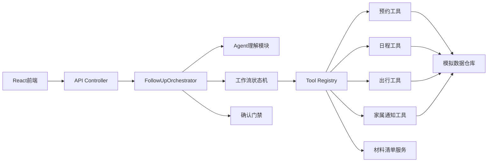

# 大框架与模块边界

> 本文中的分包、类名和对象字段是早期推荐架构，不能直接当作源码目录。实际后端为 `api/`、`agent/`、`application/`、`domain/model/`、`domain/tool/`、`infrastructure/mock/`、`config/`，编排类是 `FollowupAgentService`。实际架构图、模块职责及待补齐设计见 [Design.md](../Design.md)；目前没有独立 `workflow/`、`ConfirmationGate` 或 Tool Registry 实现。

## 一、推荐形态：模块化单体

三个初学者不适合一开始使用微服务。本仓库采用一个 Spring Boot 后端，在代码包层面隔离模块；一个 React/TypeScript 前端，在功能组件层面隔离页面。



`FollowUpOrchestrator` 是协调者，不负责实现所有细节。它读取当前状态，调用恰当模块，再组合统一响应。

## 二、后端 IDEA 分包

```text
backend/src/main/java/com/team/silveragent/
├─ SilverAgentApplication.java
├─ controller/
│  ├─ ConversationController.java
│  ├─ ConfirmationController.java
│  └─ TaskController.java
├─ agent/
│  ├─ IntentRecognizer.java
│  ├─ InformationExtractor.java
│  ├─ ResponseGenerator.java
│  └─ MedicalBoundaryGuard.java
├─ workflow/
│  ├─ FollowUpOrchestrator.java
│  ├─ FollowUpWorkflow.java
│  ├─ WorkflowPhase.java
│  ├─ MissingFieldChecker.java
│  ├─ PlanBuilder.java
│  └─ ConfirmationGate.java
├─ tool/
│  ├─ appointment/
│  │  ├─ AppointmentTool.java
│  │  └─ MockAppointmentTool.java
│  ├─ schedule/
│  │  ├─ ScheduleTool.java
│  │  └─ MockScheduleTool.java
│  ├─ travel/
│  │  ├─ TravelTool.java
│  │  └─ MockTravelTool.java
│  ├─ family/
│  │  ├─ FamilyNotificationTool.java
│  │  └─ MockFamilyNotificationTool.java
│  └─ material/
│     └─ MaterialChecklistService.java
├─ model/
│  ├─ FollowUpContext.java
│  ├─ FollowUpPlan.java
│  ├─ PlanStep.java
│  ├─ ToolCallRecord.java
│  └─ FinalTaskCard.java
├─ dto/
│  ├─ SendMessageRequest.java
│  ├─ ConversationResponse.java
│  ├─ ConfirmationRequest.java
│  └─ ConfirmationResponse.java
├─ repository/
│  ├─ ConversationRepository.java
│  └─ mock/
├─ config/
└─ exception/
```

## 三、每层能做什么、不能做什么

| 模块 | 可以做 | 不可以做 |
|---|---|---|
| Controller | 参数校验、调用服务、返回 DTO | 写提示词、查号源、决定流程 |
| Agent | 理解语言、抽取信息、生成回复 | 绕过工作流直接提交预约 |
| Workflow | 状态转移、缺失检查、确认门禁 | 直接拼页面 HTML |
| Tool | 完成一个清楚的查询或动作 | 决定整个复诊流程 |
| Repository | 读取和保存模拟数据 | 生成对话回复 |
| React组件 | 展示 DTO、收集用户操作 | 自己判断预约是否成功 |

## 四、核心领域对象

### `FollowUpContext`

一次办理任务的完整上下文，包含用户输入字段、当前状态、计划、已选时段和确认信息。

### `FollowUpPlan`

结构化任务计划，包含多个 `PlanStep`。每个步骤有：

```text
code
title
status
required
toolName
resultSummary
errorMessage
```

### `ToolCallRecord`

记录真实工具调用过程：

```text
callId
toolName
arguments
startedAt
finishedAt
status
result
error
```

这份记录既用于调试，也用于 Demo 页面证明工具确实执行。

### `ConfirmationRequest`

包含：

```text
confirmationId
actionType
actionSummary
parametersSnapshot
impact
expiresAt
status
```

确认必须绑定参数快照；相关参数改变后确认自动失效。

## 五、前端目录

```text
frontend/
├─ api/
│  ├─ conversationApi.ts
│  └─ taskApi.ts
├─ app/
│  ├─ page.tsx
│  └─ globals.css
├─ features/
│  ├─ home/
│  ├─ assistant/
│  ├─ tasks/
│  └─ profile/
├─ components/
│  ├─ common/
│  ├─ layout/
│  ├─ navigation/
│  └─ ui/
├─ types/
└─ lib/
```

## 六、为什么不用多个 Agent

当前命题不需要做“预约 Agent、出行 Agent、通知 Agent”多个自主智能体。那会增加：

- 上下文同步难度。
- 多 Agent 决策冲突。
- 调试和录屏不确定性。
- 三个人理解和维护成本。

推荐一个主 Agent + 多个确定性工具。材料、出行、通知是工具模块，不是独立人格。

## 七、框架选择边界

- IDEA：创建和运行 `backend`。
- Spring Boot：提供 Java Web API 和模块容器。
- Spring AI：后期接入大模型、结构化输出和 Tool Calling。
- Vue：实现适老化页面。
- GitHub：管理整个根目录。
- 本地 JSON 或内存仓库：第一版模拟数据。

HelloAgent 只有在确认其语言、维护状态、工具调用、结构化输出和确认拦截都适合后，才考虑替换 `agent/` 内部实现；它不应决定整个项目目录和业务架构。
