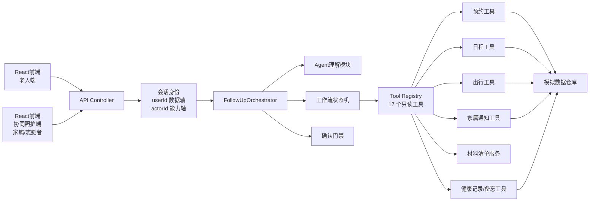

# 大框架与模块边界

> 文档版本：v0.2　更新日期：2026年9月11日

> 本文中的分包、类名和对象字段包含早期推荐结构。当前源码已采用“单一主模型＋结构化预约草稿＋真实工具”的模型主导架构；写操作确认与执行仍保留在 `FollowupAgentService`，后续再按团队维护需要拆出独立确认服务。

## 一、推荐形态：模块化单体

三个初学者不适合一开始使用微服务。本仓库采用一个 Spring Boot 后端，在代码包层面隔离模块；一个 React/TypeScript 前端，在功能组件层面隔离页面。前端有两个入口共用同一个后端：老人端（就诊人本人）和协同照护端（家属/志愿者），照护端接的仍是同一套智能体、工具与确认门禁。



`FollowUpOrchestrator` 是协调者，不负责实现所有细节。它读取当前状态，调用恰当模块，再组合统一响应。

会话身份由 `AgentRole`（`ELDER` / `FAMILY` / `VOLUNTEER`，`isCaregiver()` 即非 `ELDER`）表示，拆成两个轴：`userId` 是数据轴（这次会话服务谁），`actorId` 是能力轴（谁在操作），只用于关系校验与话术，不注入任何工具参数。身份固化在 `ConversationState` 里，因为确认接口只带 `conversationId`。

当前代码中的实际对应关系是：`AgentSystemPrompt` 是唯一主提示词，`LlmConversationPlanner` 负责首轮理解、草稿补全、工具选择，并通过 `continueAfterTools` 阅读真实工具结果继续同一用户轮次。`AgentRuntime` 负责权限审核和续跑，`FollowupAgentService` 最多执行 3 轮只读工具循环、拦截重复调用，并复用已有无号、冲突、重复预约和模糊匹配处理。模型可用时不运行关键词快速路由，也不使用 Stage 二次覆盖模型结论；`ToolRegistry` 共注册 17 个只读工具：15 个两端通用，另 2 个仅家属/志愿者可见（`care.timeline`、`care.notifications`）。模型可见的工具由 `plannerTools(role)` 按角色过滤，但过滤不等于安全，`ToolPolicy` 在执行时再按角色与风险等级校验一次。写操作仍通过确认卡完成，`ModelGateway` 隔离具体模型厂商。

对话状态与任务状态是两个维度：`DialogueMode` 表示本轮自由交流、支持性交流或流程办理，`TaskStatus` 表示是否存在未完成复诊任务。流程节点只决定恢复任务时从哪里继续，不能覆盖用户本轮真正的问题。地图模块同样保持工具化：`RouteGuideTool` 查询院外路线，`FacilityGuideTool` 查询院内位置，`TravelGuideService` 为事项页组合两类只读结果。

## 二、后端 IDEA 分包

```text
backend/src/main/java/com/team/silveragent/
├─ SilverAgentApplication.java
├─ controller/
│  ├─ ConversationController.java
│  ├─ ConfirmationController.java
│  └─ TaskController.java
├─ agent/
│  ├─ IntentRecognizer.java
│  ├─ InformationExtractor.java
│  ├─ ResponseGenerator.java
│  └─ MedicalBoundaryGuard.java
├─ workflow/
│  ├─ FollowUpOrchestrator.java
│  ├─ FollowUpWorkflow.java
│  ├─ WorkflowPhase.java
│  ├─ MissingFieldChecker.java
│  ├─ PlanBuilder.java
│  └─ ConfirmationGate.java
├─ tool/
│  ├─ appointment/
│  │  ├─ AppointmentTool.java
│  │  └─ MockAppointmentTool.java
│  ├─ schedule/
│  │  ├─ ScheduleTool.java
│  │  └─ MockScheduleTool.java
│  ├─ travel/
│  │  ├─ TravelTool.java
│  │  └─ MockTravelTool.java
│  ├─ family/
│  │  ├─ FamilyNotificationTool.java
│  │  └─ MockFamilyNotificationTool.java
│  └─ material/
│     └─ MaterialChecklistService.java
├─ model/
│  ├─ FollowUpContext.java
│  ├─ FollowUpPlan.java
│  ├─ PlanStep.java
│  ├─ ToolCallRecord.java
│  └─ FinalTaskCard.java
├─ dto/
│  ├─ SendMessageRequest.java
│  ├─ ConversationResponse.java
│  ├─ ConfirmationRequest.java
│  └─ ConfirmationResponse.java
├─ repository/
│  ├─ ConversationRepository.java
│  └─ mock/
├─ config/
└─ exception/
```

### 当前实际分包（2026-09-12）

上面的树是早期推荐形态；源码实际按“接口 / 智能体 / 应用服务 / 领域工具 / 基础设施”分层：

```text
backend/src/main/java/com/team/silveragent/
├─ api/                  REST 控制器（会话、预约、协同照护、健康记录、备忘、出行、用户）
├─ agent/                身份与语言概念（AgentRole、ExtractedFacts、回答生成）
│  ├─ model/             模型网关接口
│  └─ planning/          主提示词、规划器、决策与工具调用模型
├─ application/          编排与门禁留在根包：FollowupAgentService、AgentOrchestrator、
│  │                     AgentRuntime、ToolRegistry、ToolPolicy、ActionValidator、
│  │                     SafetyGuard、ConversationState/Store/Lifecycle、
│  │                     AppointmentRecordStore、TurnProgress
│  ├─ care/              协同照护：CareService、CareBookingService、CareCatalogRepository
│  ├─ demo/              演示场景：DemoScenario、DemoScenarioService
│  ├─ health/            健康记录与报告：HealthRecordStore、HealthRecordParser、
│  │                     HealthReportParser、HealthReportService
│  ├─ longterm/          跨对话长期记忆：MemoryStore（常去的医院、科室、习惯时段）
│  ├─ memo/              备忘：MemoStore、MemoParser、MemoCommandParser
│  ├─ preference/        用户设置：UserPreferenceStore（朗读开关、语速、音色）
│  └─ travel/            出行：TravelGuideService
├─ domain/
│  ├─ model/             领域对象与 DTO
│  └─ tool/              15 个领域工具接口（含 HealthRecordTool、MemoTool、DrugKnowledgeTool）
├─ infrastructure/
│  ├─ mock/              模拟数据实现（含 MockHealthRecordTool、MockMemoTool）
│  ├─ model/             模型网关实现
│  └─ persistence/       持久化
└─ config/
```

「长期记忆」的包名是 `longterm/` 而不是 `memory/`：`memo/`（备忘＝要做的事，能完成能删除）和 `memory/` 只差一个字母却指两回事，看错一次就找错地方。同理 `UserPreferenceStore` 存的是朗读开关、语速、音色这类**设置**，不跟长期记忆同包，单独放 `preference/`。

### 状态存在哪儿（2026-09-11）

每类状态各有一个该去的地方，不是随手挑的：

| 状态 | 存在哪 | 为什么 |
|---|---|---|
| 会话办理到哪一步（草稿、确认卡） | `conversation_sessions.state_json` | 跨请求恢复，随会话走 |
| 会话生命周期 `ACTIVE`/`CLOSED`/`EXPIRED` | 同表的 `status` **列** | 是列不是快照字段，加它不动 `state_json`，旧会话照常反序列化 |
| 一轮的实时进度 | `TurnProgress`，纯内存 | 「此刻在做什么」重启后本来就无从谈起；落库反而把工具参数多留一份 |
| 跨对话长期记忆 | `user_memories` 表 | 必须活过会话结束 |
| 每次工具调用的事实记录 | `tool_call_logs` | 审计用，与实时进度互不替代 |
| 图片与识别结论 | `conversation_attachments` / `vision_results` | base64 不能进提示词，也不能进 `VARCHAR(500)` 的 `photo_url` |

## 三、每层能做什么、不能做什么

| 模块 | 可以做 | 不可以做 |
|---|---|---|
| Controller | 参数校验、调用服务、返回 DTO | 写提示词、查号源、决定流程 |
| Agent | 理解语言、抽取信息、生成回复 | 绕过工作流直接提交预约 |
| Workflow | 状态转移、缺失检查、确认门禁 | 直接拼页面 HTML |
| Tool | 完成一个清楚的查询或动作 | 决定整个复诊流程 |
| Repository | 读取和保存模拟数据 | 生成对话回复 |
| React组件 | 展示 DTO、收集用户操作 | 自己判断预约是否成功 |

## 四、核心领域对象

> 本节是**早期设计时的对象草图**，用途是说明「一次办理该由哪几块数据组成」，不是当前源码的类清单。当前实际落地的对象是：会话状态 `ConversationState`（含 `Snapshot` 持久化）、计划卡 `PlanCard`（`tasks` 与 `taskStatuses` 两个并列列表，不用步骤对象）、确认卡 `ConfirmationCard`、结果卡 `ResultCard`、工具入参出参 `ToolModels`，都收在 `AgentTurnResponse` 里下发给前端——字段见 [05-api-contracts.md](05-api-contracts.md)，模块划分见 [11-agent-architecture-and-controlled-tool-calling.md](11-agent-architecture-and-controlled-tool-calling.md)。

### `FollowUpContext`

一次办理任务的完整上下文，包含用户输入字段、当前状态、计划、已选时段和确认信息。

### `FollowUpPlan`

结构化任务计划，包含多个 `PlanStep`。每个步骤有：

```text
code
title
status
required
toolName
resultSummary
errorMessage
```

### `ToolCallRecord`

记录真实工具调用过程：

```text
callId
toolName
arguments
startedAt
finishedAt
status
result
error
```

这份记录既用于调试，也用于 Demo 页面证明工具确实执行。

### `ConfirmationRequest`

包含：

```text
confirmationId
actionType
actionSummary
parametersSnapshot
impact
expiresAt
status
```

确认必须绑定参数快照；相关参数改变后确认自动失效。

### `AgentRole` 与 `ConversationState`

`AgentRole` 是会话操作者身份，取值 `ELDER` / `FAMILY` / `VOLUNTEER`，由后端按 `care_relations` 判定并固定进会话，既不采信模型输出，也不直接采信前端传入的角色字段。`ConversationState` 用 `actorUserId` 保存操作者、`actorRole` 保存身份、`relationLabel` 保存话术称呼；就诊人仍由 `userId` 表示。两者不同即为代他人办理。

## 五、前端目录

```text
frontend/
├─ app/
│  ├─ page.tsx        根页面：先选身份（就诊人本人 / 家属 / 志愿者），再进入对应界面
│  └─ globals.css
├─ features/
│  ├─ home/
│  ├─ assistant/
│  ├─ care/           协同照护端页面（家属/志愿者）
│  ├─ records/        健康记录与健康备忘页
│  ├─ tasks/
│  ├─ materials/
│  ├─ travel/
│  ├─ voice/
│  └─ profile/
├─ components/
│  ├─ common/
│  ├─ layout/
│  ├─ navigation/
│  └─ ui/
├─ lib/               前端 API 封装（含 agent-api.ts：userId/actorId 双轴建会话）
├─ hooks/
└─ types/
```

进入应用的根页面 `app/page.tsx` 先选身份：就诊人本人走老人端，家属/志愿者走协同照护端；照护端页面在 `frontend/features/care/`。

## 六、为什么不用多个 Agent

当前命题不需要做“预约 Agent、出行 Agent、通知 Agent”多个自主智能体。那会增加：

- 上下文同步难度。
- 多 Agent 决策冲突。
- 调试和录屏不确定性。
- 三个人理解和维护成本。

推荐一个主 Agent + 多个确定性工具。材料、出行、通知是工具模块，不是独立人格。协同照护端同样遵循这一点：家属/志愿者端并不是另起一个 Agent，而是复用同一个智能体、同一套工具与确认门禁，只在会话身份（`AgentRole`）上区分，并由工具可见性按角色收窄。

## 七、框架选择边界

- IDEA：创建和运行 `backend`。
- Spring Boot：提供 Java Web API 和模块容器。
- Spring AI：后期接入大模型、结构化输出和 Tool Calling。
- React + TypeScript：实现适老化移动端页面。
- GitHub：管理整个根目录。
- 本地 JSON 或内存仓库：第一版模拟数据。

HelloAgent 只有在确认其语言、维护状态、工具调用、结构化输出和确认拦截都适合后，才考虑替换 `agent/` 内部实现；它不应决定整个项目目录和业务架构。
