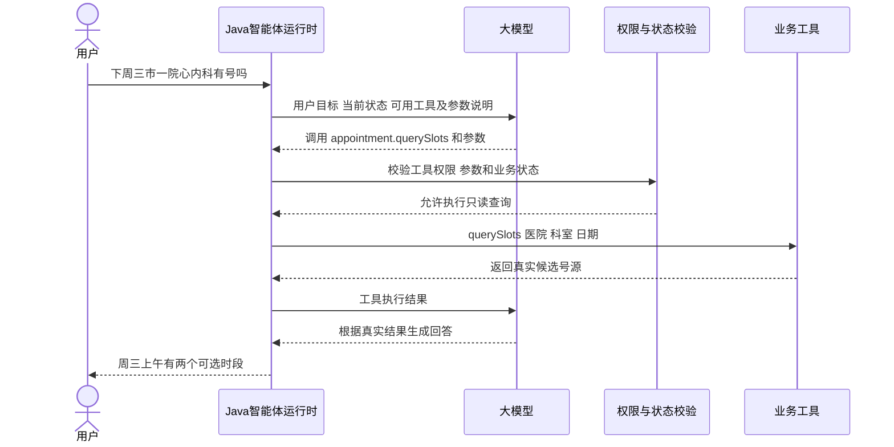
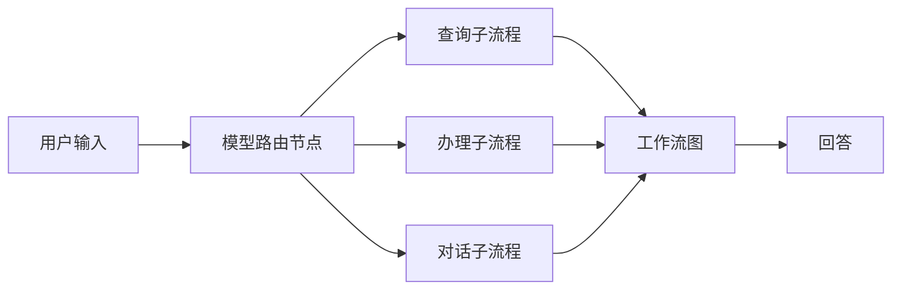
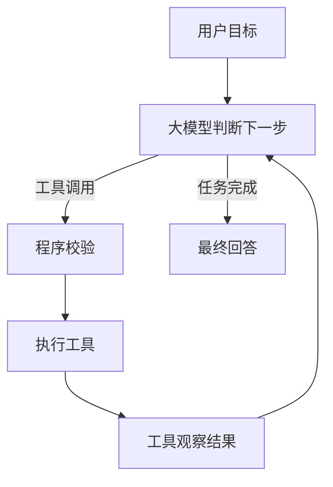
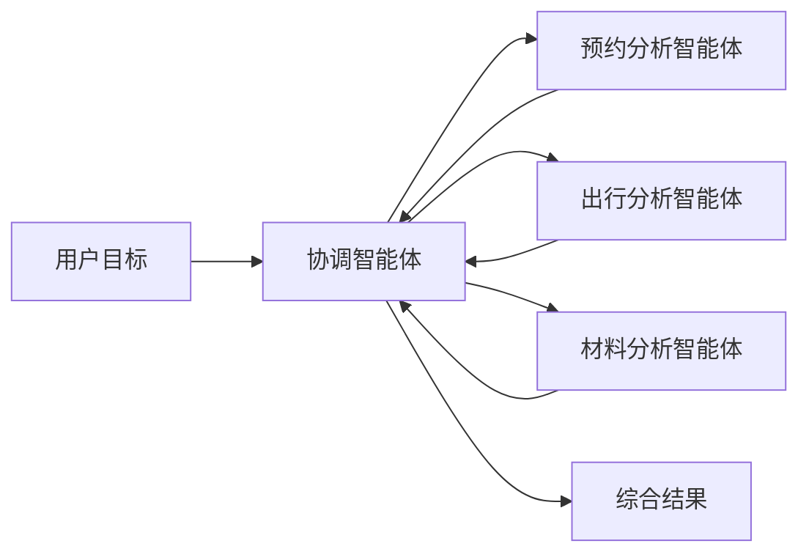
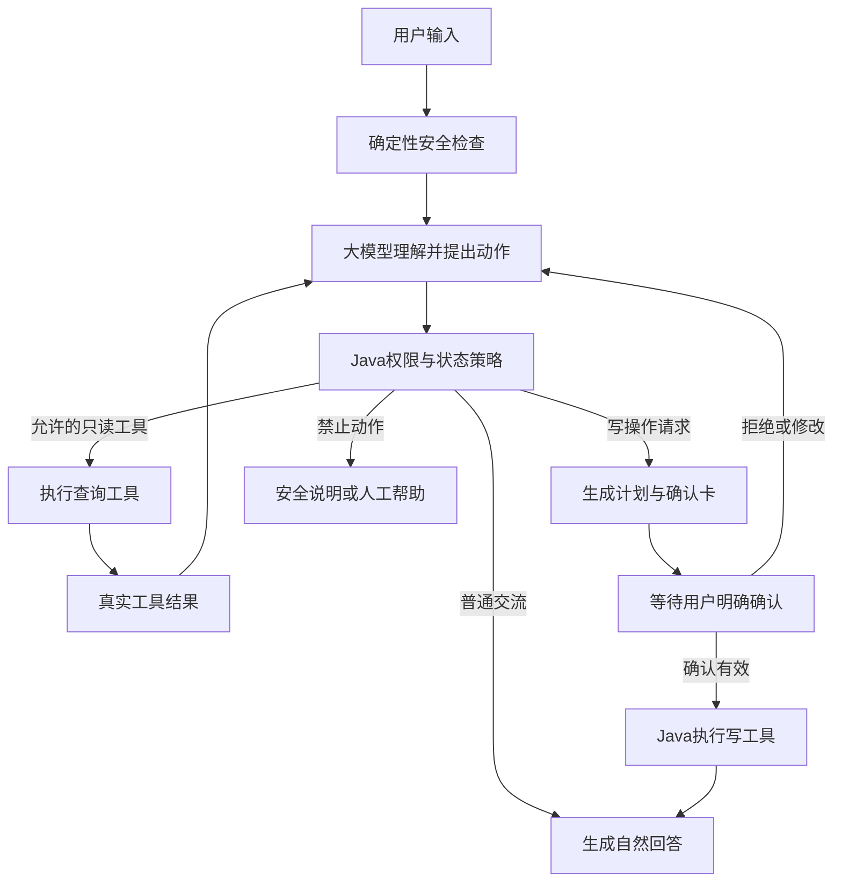
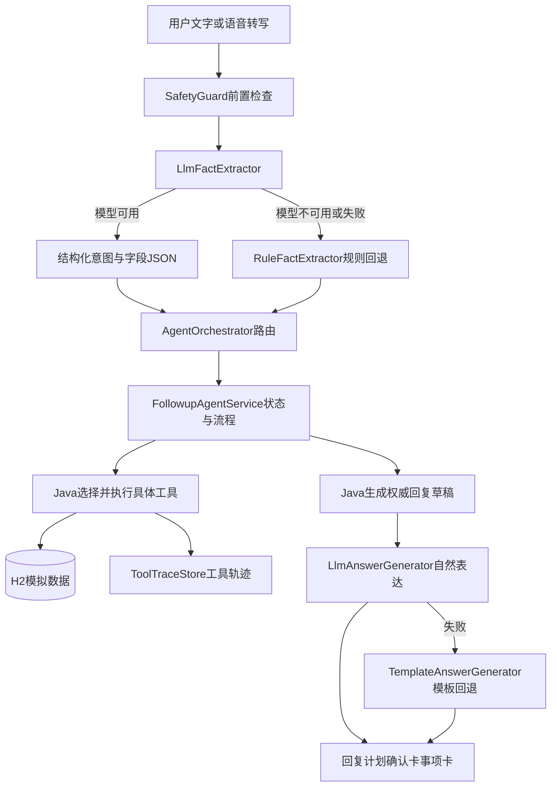
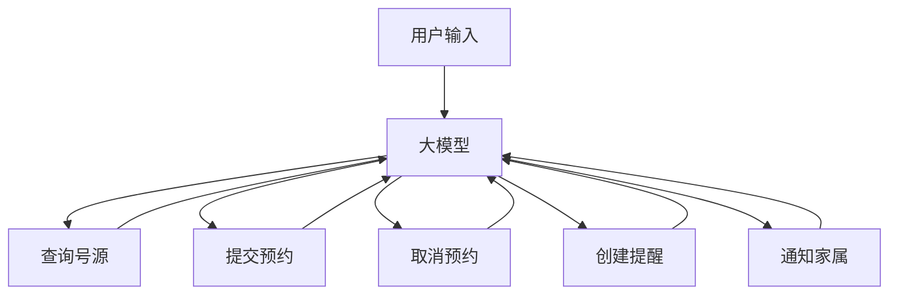
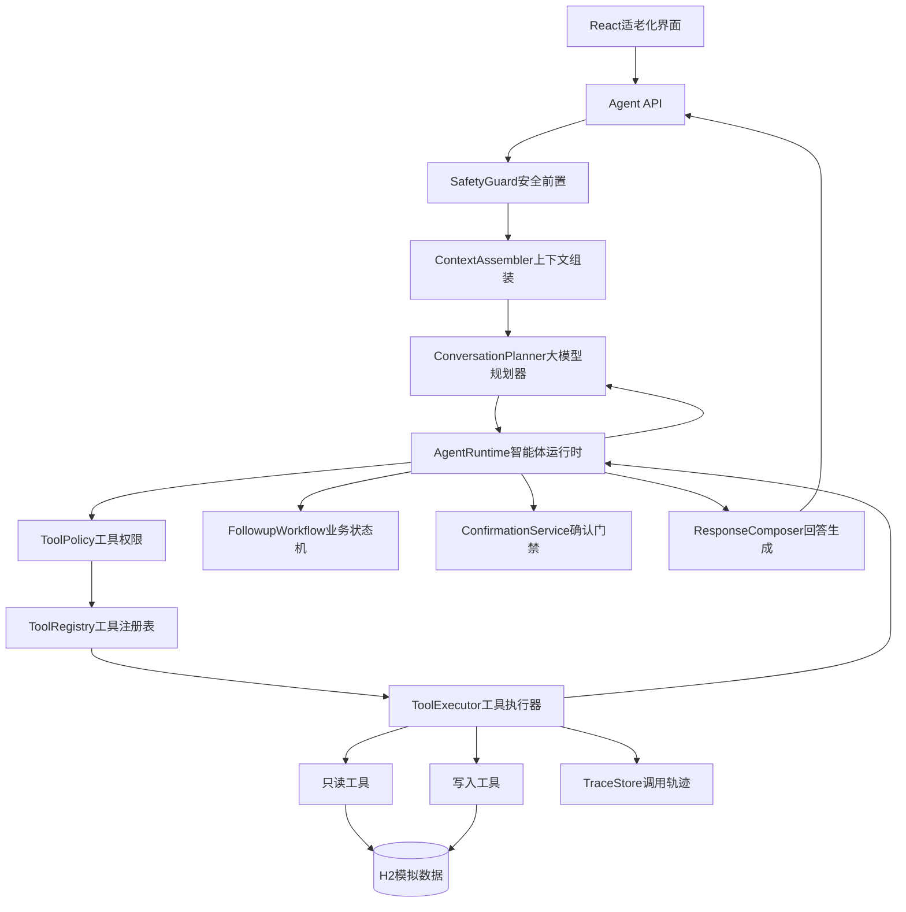

# 复诊事项智能体架构与受控工具调用方案

> 文档版本：v0.2 ｜ 更新日期：2026年9月11日

## 文档目的与结论

本文面向第一次系统接触大模型智能体的项目成员，解释大模型、工具、中控、状态、记忆和确认机制分别是什么，并比较常见智能体架构、当前项目第一版架构及建议的后续架构。

本文当前结论是：项目采用“单一主模型驱动的工具智能体”。模型负责自然语言理解、预约草稿完整度判断、追问顺序、异常恢复、页面意图和只读工具选择；Java 不再用固定 Stage 或关键词重新判断同一个意图，只负责保存结构化事实、执行真实工具以及完成确认后的数据库写入。

推荐的职责分工是：

- 大模型负责理解自然语言、承接情绪、判断草稿缺失项、提出下一步动作、选择只读工具、阅读工具结果并生成自然回答。
- Java 运行时负责保存草稿、把工具名映射到真实实现、确认后的写入、失败恢复、幂等和审计，不参与普通对话的二次意图裁决。
- 工具负责查询或修改真实的模拟业务数据，不负责决定整个复诊流程。

这不是删除中控，而是把中控从“替模型决定所有路线的巨大 switch”升级为“管理模型与工具协作的运行时和安全控制器”。

### 当前落地状态（2026-09-11）

`AgentSystemPrompt` 已成为唯一主提示词。`ConversationPlanner` 输出直接回答、自然补问、一个或多个只读工具或草稿动作；模型可用时 `AgentRuntime` 直接采用模型结论，不再叠加 Java 关键词路由。预约草稿完整度、无号、冲突、重复预约和模糊名称均作为模型可见上下文或工具结果处理。

当前支持一次提出最多三个互不依赖的只读工具，也支持在同一个用户轮次内把真实结果交回模型后继续选择有依赖的只读工具。循环最多 3 轮，并按“工具名＋参数”拦截重复调用。普通聊天只调用一次主模型；查询轮次通常调用一次规划和一次结果续跑，组合查询可能增加续跑次数，但始终复用同一个模型与核心提示词。模型不可用时保留规则流程作为运行降级，而不是正常模式的二次裁决。

v0.2 已落地的增量能力：会话身份拆成“数据轴（服务谁）”与“能力轴（谁在操作）”两条轴，家属/志愿者可以代长辈办理；`ToolRegistry` 扩到 17 个只读工具，并按角色过滤模型可见的工具；新增健康记录（`HealthRecordTool`）与健康备忘（`MemoTool`）；协同照护端助手接入同一个智能体、同一套工具和同一个确认门禁。后端自动测试 294 项，0 失败 0 错误。身份、工具与协同照护端的细节见第十四、十五节。

## 一 大模型和智能体不是同一个东西

### 1.1 大模型是什么

可以先把大模型理解成一个很强的语言预测程序：程序给它一组消息，它根据这些消息生成文字或结构化结果。

大模型本身不会直接执行 Java 方法、访问 H2、提交预约或发送通知。即使模型回答“我已经帮您预约”，也只代表它生成了这句话，不代表数据库真的发生了变化。

### 1.2 智能体是什么

一个能够完成任务的智能体通常由以下部分组成：

```text
智能体 = 大模型 + 上下文 + 状态与记忆 + 中控运行时 + 工具 + 权限策略 + 执行循环 + 结果反馈
```

各部分的含义如下：

| 组成部分 | 通俗解释 | 在本项目中的作用 |
| --- | --- | --- |
| 大模型 | 听懂人话、提出办法、说自然语言 | 理解复诊需求、情绪和用户意图，生成友好回答 |
| 上下文 | 本轮给模型看的信息 | 当前日期、办理阶段、已知医院科室、最近对话、工具结果 |
| 状态与记忆 | 程序长期保存的可靠事实 | 当前流程节点、已选号源、是否确认、被打断节点 |
| 中控运行时 | 协调模型、状态和工具 | 决定本轮是否允许执行、是否继续循环、是否等待用户 |
| 工具 | 真正查询或修改数据的程序 | 查号源、查日程、规划出行、创建提醒、通知家属 |
| 权限策略 | 规定哪些动作可以做 | 只读工具可自动执行，写操作必须确认，医疗决策禁止 |
| 执行循环 | 模型和工具反复协作 | 模型选工具，Java 执行，结果回给模型，模型再判断 |
| 结果反馈 | 给用户和评委看的证据 | 自然回答、任务计划、确认卡、事项卡、工具轨迹 |

因此，只有大模型回答问题的系统是聊天机器人；大模型能够基于目标使用工具并根据结果继续工作，才更接近智能体。

## 二 模型调用工具到底发生了什么

### 2.1 七个步骤的完整解释

所谓“模型调用工具”，实际是程序和模型之间的一轮或多轮协作。

1. 程序把工具说明发给模型。
2. 模型输出建议调用的工具和参数。
3. 程序解析模型输出。
4. 程序检查权限、参数和当前状态。
5. 程序真正执行工具。
6. 程序把工具结果再发给模型。
7. 模型继续选择工具，或者生成给用户的最终回答。

完整流程如下：



这里真正执行 `appointment.querySlots` 的是 Java，不是模型。模型只是产生了一个结构化的工具调用建议。

### 2.2 工具说明是什么

程序需要告诉模型工具的名称、用途、参数类型、是否有副作用和可能的错误。例如：

```json
{
  "name": "appointment.querySlots",
  "description": "查询指定医院、科室和日期的模拟可预约时段，只读，不创建预约",
  "parameters": {
    "type": "object",
    "properties": {
      "hospitalId": { "type": "string" },
      "departmentId": { "type": "string" },
      "date": { "type": "string", "format": "date" }
    },
    "required": ["hospitalId", "departmentId", "date"]
  }
}
```

模型看到的不是 Java 源代码，而是这种稳定的工具契约。

### 2.3 模型输出的工具调用是什么

模型可能返回类似下面的结构：

```json
{
  "toolCallId": "call-001",
  "name": "appointment.querySlots",
  "arguments": {
    "hospitalId": "hospital-001",
    "departmentId": "department-cardiology",
    "date": "2026-09-16"
  }
}
```

这仍然只是数据。Java 收到后必须判断：工具是否存在、参数是否完整、日期是否合法、医院与科室是否匹配、当前用户是否有权查询，以及本轮是否超过最大工具调用次数。

### 2.4 工具结果为什么要再次喂给模型

第一次调用模型时，模型通常不知道真实号源，所以不能直接给出最终结论。Java 查询 H2 后，需要把工具结果作为新的观察结果交给模型：

```json
{
  "toolCallId": "call-001",
  "status": "SUCCESS",
  "result": {
    "slots": [
      { "slotId": "slot-101", "time": "09:00" },
      { "slotId": "slot-102", "time": "10:30" }
    ]
  }
}
```

模型这时才能依据真实结果决定：直接告诉用户两个时段，还是继续查询附近日期。模型不能在工具返回前编造号源。

### 2.5 为什么经常会看到 JSON

智能体系统里常见四种 JSON，它们不是同一回事：

| JSON 类型 | 用途 | 当前项目是否使用 |
| --- | --- | --- |
| API 请求 JSON | Java 通过 HTTP 把模型名和 messages 发给模型服务 | 已使用 |
| 理解结果 JSON | 模型把用户话语转换成 intent、日期、情绪等字段 | 已使用 |
| 工具调用 JSON | 模型提出调用哪个工具以及参数 | 已使用，兼容单个和最多三个只读工具建议 |
| 前后端响应 JSON | Java 把回复、计划、确认卡和工具轨迹返回 React | 已使用 |

JSON 只是程序之间传递数据的格式。它不会让回答变僵硬；真正影响灵活度的是模型被允许做什么、获得了哪些上下文，以及后续是否存在工具循环。

## 三 市面上常见的智能体架构

### 3.1 普通大模型聊天机器人


适用场景：知识问答、陪聊、内容生成、简单客服说明。

优点：实现快、语言自然、开发成本低。

缺点：不能证明业务真的执行；容易把“生成一句成功说明”误当成真实成功；缺少任务状态和工具审计。

### 3.2 意图识别加槽位填充加状态机


这是银行、政务、订票和早期语音助手常见的任务型对话架构。槽位是医院、科室、日期、是否陪同等需要逐步收集的字段。

适用场景：流程稳定、字段固定、风险较高、需要严格审计的业务。

优点：确定、可测试、容易保证每个必填项都被收集。

缺点：意图和分支越来越多；用户换一种说法容易匹配失败；插入聊天、临时查询和跨步骤修改后，中控容易形成巨大 switch。

### 3.3 工作流图加模型节点



适用场景：存在多个稳定子流程，但又需要模型理解自然语言和选择入口。

优点：比单个状态机清晰；每条子流程可以单独测试；适合客服和企业内部助手。

缺点：图和状态较多；流程外的新目标仍然难以处理；维护不当时只是把大 switch 画成图。

### 3.4 ReAct 或工具调用智能体



适用场景：路径难以提前写死、需要搜索和探索、工具大多可撤销或只读的任务，例如代码分析、资料研究和复杂信息检索。

优点：模型能根据中间结果动态改变计划；新增工具时不一定新增大量意图分支；能够处理组合型任务。

缺点：调用次数、费用和耗时更高；路径不完全确定；可能选错工具、重复调用或参数错误；必须增加权限、超时、循环上限和审计。

像 Codex 一样表现出“先检查文件，再运行命令，再根据结果修改”的产品，用户体验上接近这种循环。但产品内部仍会使用沙箱、权限、审批、工具协议、超时和停止条件，不能理解为模型可以不受限制地操作系统。

### 3.5 多智能体协作



适用场景：任务规模很大、子任务确实独立、需要并行研究或使用不同专业模型。

优点：可以并行；不同智能体可以有不同工具和提示词。

缺点：上下文同步、冲突处理、成本、调试和结果一致性明显更复杂。

本项目不需要把预约、出行和通知包装成多个有独立人格的智能体。它们是同一复诊目标下的确定性工具，多智能体会增加比赛录屏的不稳定性和三人团队的维护负担。

### 3.6 受控混合智能体



适用场景：医疗事务、金融、政务、支付和企业业务。它允许模型带来灵活交互，同时由程序控制高风险事实和副作用。

这是本文推荐给银龄复诊项目的架构。

## 四 改造前第一版的实际架构

### 4.1 当前流程

本节保留改造前第一版作为对照。它是“模型理解与表达加 Java 固定编排”的混合架构，不代表当前源码状态。



自由文字的一轮处理是：

1. Java 读取会话状态和最近八条消息。
2. 安全规则先检查明显紧急情况和医疗越界。
3. 模型把用户自然语言转换成固定意图、字段、情绪和关注点。
4. `AgentOrchestrator` 根据意图和当前状态选择业务路由。
5. `FollowupAgentService` 校验字段、更新状态并决定调用哪些工具。
6. Java 执行工具并记录真实参数和结果。
7. Java 生成权威回复草稿。
8. 回答模型只根据权威事实改写自然语言；失败时返回模板。
9. Java 保存状态和消息，等待下一轮用户输入。

明确按钮和确认按钮可以跳过第一步模型理解，但仍经过 Java 的状态与确认校验。

### 4.2 第一版中大模型的权限

| 能力 | 当前是否允许 | 说明 |
| --- | --- | --- |
| 理解自由表达 | 是 | 输出固定 intent 和字段 |
| 识别情绪和普通聊天 | 是 | 输出情绪、关注点和对话意图 |
| 自然生成最终回复 | 是 | 必须依据 Java 权威草稿 |
| 自主选择业务工具 | 否 | 模型请求中没有 tools 定义 |
| 根据工具结果继续选择其他工具 | 否 | 当前没有模型与工具的循环 |
| 修改业务状态 | 否 | 状态由 Java 更新 |
| 提交或取消预约 | 否 | 只能由 Java 确认流程执行 |
| 决定预约是否成功 | 否 | 以真实工具和数据库结果为准 |

### 4.3 第一版的优点

- 确认、预约和工具结果可控，适合比赛要求中的关键操作门禁。
- 工具参数和结果来自 Java 与 H2，能证明不是预先写好的对话。
- 模型服务不可用时仍可以通过规则和模板完成稳定演示。
- 模型与具体厂商已通过 `ModelGateway` 隔离，后续可以更换兼容模型。
- 现有业务测试和四个录屏场景可以围绕明确状态编写。

### 4.4 第一版的局限

- 固定意图列表不能覆盖所有自然表达和临时目标。
- `AgentOrchestrator` 主要通过 intent 路由，新增能力经常需要新增意图和分支。
- 工具选择写在 Java 流程里，模型不能根据第一次查询结果自主决定是否继续查询。
- 支线、情绪交流、修改和主流程同时增加后，`FollowupAgentService` 容易继续膨胀。
- 模型关闭或模型请求失败时会回到关键词规则，未覆盖的说法会显得非常死板。

因此，第一版的问题不是“回答使用了 JSON”，而是模型只负责两端的理解和表达，没有进入中间的行动规划环节。

## 五 不建议采用的完全自由架构

完全自由架构会把所有工具都交给模型选择，包括预约提交、取消、提醒和通知。它可能看起来最像通用智能体，但不适合本项目。



主要风险包括：

- 把“我考虑一下”误判成同意办理。
- 在没有有效确认时提交或取消预约。
- 重试时重复创建预约、提醒或通知。
- 根据错误上下文选择旧日期或旧号源。
- 用户描述紧急情况时仍继续普通预约工具流。
- 说出“已经成功”但数据库实际失败。
- 被用户输入或工具返回中的提示注入影响。

比赛需求明确规定关键操作必须获得明确确认，医疗越界必须拒绝，紧急情况不得继续普通预约流程。因此完全自由模式不仅风险高，也可能直接破坏需求符合性。

## 六 推荐的第二版架构

### 6.1 总体结构

第二版建议采用“模型提出动作，Java 审核与执行”的受控工具调用结构。



### 6.2 模型不再只输出 intent

模型每轮可以提出五类动作：

```text
ANSWER                  直接进行普通交流或解释
ASK_USER                自然地补问一个缺失信息
CALL_READ_TOOL           请求调用一个允许的只读工具
CALL_READ_TOOLS          一次提出最多三个互不依赖的只读工具
PROPOSE_WORKFLOW_ACTION  提议修改草稿或进入需要确认的业务动作
```

例如：

```json
{
  "actionType": "CALL_READ_TOOL",
  "toolName": "appointment.querySlots",
  "arguments": {
    "hospitalId": "hospital-001",
    "departmentId": "department-cardiology",
    "date": "2026-09-16"
  }
}
```

如果所用模型服务支持标准 function calling，应优先使用工具 schema 和原生工具调用字段；如果兼容服务不支持，则可以保留结构化 JSON 作为适配器回退。业务层不应依赖某个厂商特有的返回格式。

### 6.3 推荐的模型工具循环

```text
接收用户消息
→ 安全前置检查
→ 组装当前状态、最近消息和本轮可用工具
→ 调用模型
→ 如果模型直接回答：校验边界并结束本轮
→ 如果模型请求只读工具：Java校验并执行
→ 把工具结果返回模型
→ 模型继续选择只读工具或生成回答
→ 达到最大循环次数时停止并给出安全回退
```

当前允许一次规划提出最多三个互不依赖的只读工具；“复诊流程＋材料”可以同时查询 `careGuide.search` 与 `material.checklist`。有依赖的查询按模型给出的首个工具执行，真实结果以结构化证据返回同一主模型；模型可继续选择下一工具或回答。整个用户轮次最多续跑三轮，且相同工具与参数只执行一次，用于控制延迟和异常循环，不是业务规则。

### 6.4 复诊办事知识库

办事知识与医疗知识必须分开。`care_guide_articles` 只保存复诊预约流程、到院报到、咨询渠道、改期取消等团队维护的模拟说明；`careGuide.search` 是只读工具，查询参数和结果进入工具轨迹。它不得保存诊断、药物或治疗结论。材料继续来自 `material_templates`，避免重复数据。没有医院和科室时只返回明确标注的通用材料，并继续补问一个必要信息。

### 6.5 中控仍然存在但职责变化

第一版中控主要回答“这个 intent 应该进入哪个固定分支”。当前运行时只回答以下工程问题：

- 本轮是否命中紧急或医疗边界？
- 模型提出的动作类型是否合法？
- 这个工具是否在当前允许列表中？
- 工具是只读、草稿修改、需要确认的写操作，还是禁止操作？
- 参数是否符合 schema 和当前业务状态？
- 是否存在过期号源、旧确认或错误计划版本？
- 是否已经达到工具调用次数、超时或费用上限？
- 工具结果是否应该继续交给模型，还是立即等待用户确认？
- 模型最终回复是否与真实工具结果一致？

所以中控不会消失，只是由“路线编写者”变为“智能体运行时、交通规则和刹车系统”。

## 七 大模型权限分级方案

### 7.1 权限等级

| 等级 | 动作类型 | 模型权限 | Java处理 |
| --- | --- | --- | --- |
| L0 | 普通交流 | 可以直接生成建议回复 | 检查长度、医疗边界和敏感承诺 |
| L1 | 只读查询 | 可以自主提出工具调用 | 校验工具、参数、状态、次数后自动执行 |
| L2 | 办理草稿修改 | 可以提出修改医院、日期、偏好等语义动作 | Java更新状态并清除受影响的派生结果 |
| L3 | 有副作用的业务动作 | 只能提出意图，不能直接执行 | Java生成计划和确认卡，确认后执行 |
| L4 | 禁止能力 | 不允许提出或执行 | Java拒绝并给出安全说明或人工帮助 |

### 7.2 工具权限矩阵

| 能力或工具 | 风险 | 模型能否自主提出 | 是否自动执行 | 是否必须确认 |
| --- | --- | --- | --- | --- |
| 普通聊天和情绪承接 | 低 | 是 | 不涉及工具 | 否 |
| 查询医院资料 | 低 | 是 | Java校验后执行 | 否 |
| 查询科室 | 低 | 是 | Java校验后执行 | 否 |
| 查询号源 | 低 | 是 | Java校验后执行 | 否 |
| 查询我的预约 | 中 | 是 | 校验用户身份后执行 | 否 |
| 查询材料清单 | 低 | 是 | Java校验后执行 | 否 |
| 检查日程冲突 | 中 | 是 | 校验当前选定时段后执行 | 否 |
| 计算出发建议 | 低 | 是 | 使用真实模拟地址和时段执行 | 否 |
| 修改未提交草稿 | 中 | 是 | 由状态机应用并使旧结果失效 | 通常否 |
| 提交预约 | 高 | 只能提出 | 不自动执行 | 是 |
| 修改或取消已确认预约 | 高 | 只能提出 | 不自动执行 | 是 |
| 创建日程和出发提醒 | 高 | 只能提出 | 不自动执行 | 是 |
| 通知家属 | 高 | 只能提出 | 不自动执行 | 是 |
| 记一条健康数值（血压/血糖等） | 中 | 是（只判断“这句话属于这件事”） | 填槽与落库由 Java 固定解析器完成 | 通常否，数值异常先反问 |
| 记、查、改、删健康备忘 | 中 | 是（只判断属于备忘） | Java 解析器填槽后落库 | 新建备忘通常先确认 |
| 把健康记录发给家属 | 高 | 只能提出 | 不自动执行 | 是 |
| 查询被协同长辈的复诊动态 | 中 | 是，仅家属/志愿者可见 | Java 按会话身份执行 | 否 |
| 查询发给本人的协同通知 | 低 | 是，仅家属/志愿者可见 | Java 按会话身份执行 | 否 |
| 给长辈留一条提醒 | 高 | 只能提出 | 不自动执行 | 是 |
| 诊断疾病或解释检查结果 | 禁止 | 否 | 不执行 | 不适用 |
| 推荐药物或调整剂量 | 禁止 | 否 | 不执行 | 不适用 |

### 7.3 为什么只读工具也要 Java 校验

只读不代表完全没有风险。例如查询我的预约涉及用户数据，查询过多可能拖慢系统，模型也可能传入不存在的医院 ID。因此 Java 仍要验证身份、参数、调用次数和数据范围，只是不需要每次弹确认卡。

### 7.4 按角色过滤工具可见性

`ToolRegistry` 按当前会话的操作者身份（`AgentRole`）过滤模型可见的工具清单：老人本人看不到只给照护者用的 `care.timeline` 和 `care.notifications`，家属/志愿者则两条都能看见。过滤只影响模型“想得到什么”，不构成安全边界——模型仍可能吐出一个它看不见的工具名，所以 `ToolPolicy` 在执行前会按角色再判一次，两道都通过才执行。身份与角色的完整说明见第十四节。

## 八 建议拆分后的 Java 中控结构

### 8.1 目标模块

```text
application/
├─ FollowupAgentService.java       对 API 提供的薄入口
├─ runtime/
│  ├─ AgentRuntime.java            管理模型与工具的循环及停止条件
│  └─ AgentTurnCoordinator.java    协调一轮输入与输出
├─ policy/
│  ├─ ToolPolicy.java              工具权限分级
│  ├─ ActionValidator.java         参数和状态校验
│  └─ SafetyGuard.java             紧急与医疗边界
├─ workflow/
│  ├─ FollowupWorkflow.java        复诊业务状态机
│  ├─ MissingFieldChecker.java     必填信息检查
│  ├─ PlanService.java             任务计划和依赖失效
│  └─ ConfirmationService.java     确认凭据和快照
├─ tool/
│  ├─ ToolRegistry.java            暴露给模型的工具目录
│  ├─ ToolExecutor.java            统一执行和错误转换
│  └─ ToolResult.java              标准工具结果
└─ response/
   ├─ ReplyContextBuilder.java     组装权威回答上下文
   └─ ResponseComposer.java        模型回答和模板回退
```

这是一份职责设计，不要求一次性搬完所有类。应在保持现有测试可运行的前提下逐步提取。

### 8.2 各核心模块职责

| 模块 | 负责 | 不负责 |
| --- | --- | --- |
| `FollowupAgentService` | 接收请求并交给协调器 | 不实现所有分支和工具细节 |
| `AgentRuntime` | 模型调用、工具循环、次数和超时 | 不直接写 H2 业务逻辑 |
| `ToolPolicy` | 根据工具风险和阶段允许或拒绝 | 不生成自然语言回复 |
| `FollowupWorkflow` | 状态转移、依赖失效、异常恢复 | 不选择模型厂商 |
| `ConfirmationService` | 生成、绑定、消费和废止确认凭据 | 不根据一句模糊语言直接执行 |
| `ToolRegistry` | 提供工具名、说明、schema 和风险级别 | 不执行工具 |
| `ToolExecutor` | 调用真实 Java 工具、统一记录结果 | 不自行决定下一业务目标 |
| `ResponseComposer` | 根据权威事实生成适老化回答 | 不改变工具结果和成功状态 |

## 九 推荐架构的端到端示例

### 9.1 自然提出复诊目标

用户说：“医生让我下周三再去市一院看看，上午方便，帮我安排一下，也告诉我女儿。”

1. `SafetyGuard` 判断没有紧急情况和医疗越界。
2. 模型识别复诊目标、医院、日期、上午偏好和通知家属需求。
3. Java 保存模型提取的结构化草稿，主模型结合草稿判断科室、替代日期偏好和陪同需求仍缺失。
4. 模型依据缺失字段自然询问一个主要问题：“请问医生让您复诊哪个科室？”
5. 信息齐全后，模型请求查询号源。
6. `ToolPolicy` 判断它是只读工具，Java 校验参数并执行。
7. 工具结果返回模型，模型用自然语言展示少量真实时段。
8. 用户选择时段后，模型可请求检查冲突和计算出发建议。
9. Java 生成七步任务计划和最终确认卡。
10. 用户明确确认后，Java 才提交预约、创建提醒和通知指定家属。
11. 工具结果交给回答模型，最终事项卡只展示真实成功或失败状态。

### 9.2 用户取消已有预约

用户说：“把我 9 月 18 日已经约好的复诊取消掉。”

1. 模型请求只读工具查询该用户已有预约。
2. Java 校验用户身份并执行查询。
3. 模型从真实结果中定位候选预约，但不能直接调用取消工具。
4. 中控把取消请求转为待确认业务动作，绑定具体 `appointmentId` 和参数快照。
5. 页面展示取消对象、影响和“确认取消预约”按钮。
6. 用户确认后，Java 验证确认凭据仍有效，再执行取消工具。

### 9.3 用户说心口疼

1. 确定性安全规则在普通模型规划和工具调用之前检查紧急表达。
2. 命中明显紧急风险时，立即使旧确认失效并暂停普通办理。
3. 系统提示联系身边人员、急救服务或线下帮助。
4. 本轮不进入查询号源或提交预约的普通工具循环。

模型可以辅助识别更灵活的表达，但安全底线不能只依赖一次模型分类。

### 9.4 用户只是想聊天

用户说：“我有点害怕去医院，可以陪我说说话吗？”

1. 模型识别为支持性交流。
2. Java 保留原办理状态，不调用预约工具，不把聊天当成取消。
3. 模型自然承接感受，并说明进度仍然保留。
4. 用户之后说“继续刚才的办理”，系统恢复到被打断节点。

## 十 上下文和记忆应该怎样处理

### 10.1 不应每轮发送全部历史

历史对话会越来越长。全部发送会增加费用、延迟和噪声，也可能让模型把过期日期或旧选择当成当前事实。

当前项目采用“最近十六条消息（约八轮）加结构化 `ConversationState`”，并可通过 `AGENT_MODEL_HISTORY_LIMIT` 在 4 到 40 条之间配置。给模型的上下文由以下内容组成：

```text
稳定系统规则
+ 当前用户目标
+ 当前业务阶段
+ Java保存的结构化事实
+ 未完成问题
+ 当前计划版本与确认状态
+ 最近 16 条相关消息（约八轮，可配置）
+ 最近必要的工具结果摘要
+ 本轮允许使用的工具
```

长期对话应定期生成摘要，只保留已完成操作、真实业务 ID、关键选择、未解决问题和下一步目标。数据库中的全部记录和完整工具日志不应无条件塞给模型。

### 10.2 谁是权威事实来源

权威顺序建议固定为：

```text
数据库和工具结果
高于 Java ConversationState
高于模型提取结果
高于自然语言历史中的旧说法
```

模型负责理解，不负责宣布事实。预约是否成功、具体号源、提醒是否创建、家属是否通知，只能由真实工具结果决定。

### 10.3 已实现的跨对话长期记忆（2026-09-11）

上下文之外另有一条独立的记忆通道：`user_memories` 表 + `MemoryStore`，跨对话记住这位老人常去的医院、科室与习惯时段（key 为 `habit.hospital` / `habit.department` / `habit.period`）。

三条约束值得单独写下来，因为它们同时是工程决定和产品边界：

1. **只记「办成的事」。** 写入口只有一处——确认门禁放行、预约真的落进 `appointments` 之后。草稿阶段一个字都不记。理由：他这次随口问了问骨科，就记成常去骨科，下次助手会拿着一个过期的偏好替他做决定——比「少问一句」的收益危险得多。模型和前端都够不着这条写入路径。
2. **同一 key 只留最新一版。** 表的主键是 `(user_id, memory_key)` 而不是自增 id。换医院就覆盖，不堆历史：两版偏好同时进提示词，模型只会更糊涂。覆盖时保留第一次记住的时间——「什么时候开始知道的」和「最近一次确认」是两件事。
3. **记住不等于可以替他办事。** 记忆拼成一句话（`digest()`）接在 `knownFacts` 末尾进提示词，措辞明确「以前办过的，仅供参考，不要当成这次已经定好的安排」。写操作仍然要过确认门禁。`digest()` 在无记忆时返回空串，提示词与没有这个功能时逐字相同。

用户控制是这条功能能被接受的前提：`GET`/`DELETE /api/agent/memories`，「我的」页整段可见、逐条可忘，忘掉是软删除（保留「他什么时候让我忘掉的」这个事实）。

## 十一 为什么推荐架构适合本比赛

以下判断来自命题要求，而不是额外增加的比赛规则。

| 命题关注点 | 推荐架构如何提供证据 |
| --- | --- |
| 理解口语化和多轮表达 | 模型负责自然语言理解，结构化状态保存长期事实 |
| 主动补问缺失信息 | 模型自然组织问题，Java缺失检查保证不漏问 |
| 任务拆解和计划 | Java维护结构化七步计划，模型解释计划 |
| 真实工具调用 | 模型可自主选择只读工具，Java执行并记录参数与结果 |
| 关键操作确认 | 写操作全部进入 Java确认门禁 |
| 无号和冲突恢复 | 模型依据真实结果提出选项，草稿更新使旧号源和路线失效 |
| 适老化交流 | 回答模型负责简短、明确、一次一问和情绪承接 |
| 医疗安全边界 | 确定性安全前置加模型辅助识别双重限制 |
| 六分钟录屏展示 | 工具决策、权限校验、入参、结果和最终回复形成清晰轨迹 |

纯状态机容易让评委觉得系统只是预先写好的客服脚本。当前模型主导模式可以展示模型确实在理解上下文、判断缺失信息和选择工具；数据库、号源和操作结果仍由真实工具提供证据。

## 十二 推荐模式的优点与缺点

### 12.1 优点

- 比固定 intent 路由更能理解用户临时插入的查询、解释和情绪表达。
- 允许模型组合只读工具，智能体能力更容易在 Demo 中被看见。
- 写操作仍由 Java 和确认卡控制，符合命题对明确确认的要求。
- 工具结果是权威事实，减少模型编造预约成功和号源的风险。
- 模型厂商可替换，业务工作流、权限和工具不随模型变化。
- 每次模型决策、权限结果、工具参数和工具返回都可以记录，便于评委查看和问题排查。
- 当前规则与固定流程可以保留为失败回退，降低比赛现场风险。

### 12.2 缺点

- 比第一版增加了 `ToolRegistry`、`ToolPolicy` 和 `AgentRuntime`，实现和测试成本更高。
- 一轮可能调用模型多次，延迟和费用会增加。
- 不同兼容模型对 function calling 和结构化输出的支持可能不同。
- 模型选择工具存在不确定性，需要离线用例和稳定 Demo 场景。
- 工具结果需要裁剪和清洗，不能把数据库大量数据原样交给模型。
- 同时保留模型路径和规则回退，会增加一段时间的双路径维护成本。

## 十三 分阶段改造状态

这是较大的架构变化，不建议一次性替换当前主流程。

### 历史阶段一：稳定第一版

- 确认模型配置真正生效并在页面显示理解和回答模式。
- 补齐“心口疼”等安全关键表达的确定性规则。
- 保留已有回归测试和四个稳定录屏场景。
- 继续使用当前 Java 写操作与确认流程。

### 已完成阶段二 接入只读工具调用

- 使用厂商无关的结构化 JSON 适配工具建议和工具结果，不把业务代码绑定到某一家 API 的原生 `tool_calls` 字段。
- 已建立 `ToolRegistry` 与 `ToolPolicy`。
- 已开放办事流程、医院、科室、号源、材料、已有预约、日程、路线和院内指引等只读查询；`ToolRegistry` 目前共注册 17 个只读工具，其中 15 个两端通用，`care.timeline` 与 `care.notifications` 两个仅家属/志愿者可见。
- 每轮限制工具调用次数并检测重复工具与参数。
- 模型续跑失败时交付最近一次权威工具结果；首轮模型不可用时才进入规则降级。

### 阶段三 部分完成：统一智能体运行时

- 已提取 `AgentRuntime` 管理模型建议、权限审核与工具结果续跑。
- 已在 `FollowupAgentService` 落地有界循环，后续仍需把工具循环提取为独立执行器以继续缩小该服务。
- 把缺失检查、状态转移、确认和执行分别拆成独立模块。
- 模型可以提出草稿修改和进入确认的请求，但不能执行写工具。

### 已完成阶段四：身份双轴、健康记录与协同照护端

- 会话身份拆成数据轴（`userId`，本次服务谁）与能力轴（`actorId`，谁在操作），家属/志愿者可代长辈办理；`actorId` 只用于关系校验与话术，不注入任何工具参数。
- 模型可见工具按 `AgentRole` 过滤，执行时 `ToolPolicy` 按角色再校验一次。
- 已实现健康记录（`HealthRecordTool`）与健康备忘（`MemoTool`），备忘重复规则支持 DAILY / WEEKLY / MONTHLY。
- 协同照护端助手接入同一个智能体、同一套工具与确认门禁，支持查询长辈安排/材料/动态、代约（走确认卡）和给长辈留提醒。

### 已完成阶段五（部分）：一轮办理的过程实时可见

助手页的「查看办理过程」已经实现了一轮之内的过程展示：按轮次列出「理解 → 决定查什么 → **模型提出的工具调用（参数是模型真实生成的那份）** → 工具真实返回 → 整理回答」，办理结束即收起。这解决了一个具体的质疑——预先写好的对话也能宣称「调用了工具」，但参数由模型当场生成、工具当场返回，是没法预先编排的。

- 事件只在内存里保留，有界（40 条事件 / 500 会话，5 分钟无事件即不算进行中），重启即无。
- 读取时统一脱敏一次：图片 data URL 省略、手机号写作 `138****1234`、`sk-` 串一律 `sk-***`、单字段截断 600 字。真正的调用记录仍由 `tool_call_logs` 负责，两者互不替代。
- 仍待接入：跳出单轮、按时间线回看整场会话的独立评委视图页；为正常、无号、冲突、越界、情绪打断和工具失败建立固定评测语句。

## 十四 会话身份：数据轴与能力轴

### 14.1 两条轴分别是什么

会话身份被拆成互不混用的两条轴：

| 轴 | 参数 | 含义 | 作用 |
| --- | --- | --- | --- |
| 数据轴 | `userId` | 这次会话服务谁（就诊人） | 所有工具的取值、预约与材料的归属都以它为准 |
| 能力轴 | `actorId` | 谁在操作（可省略） | 只用于 `care_relations` 关系校验与话术，不注入任何工具参数 |

建立会话的接口是：

```text
POST /api/agent/conversations?userId=<服务对象>&actorId=<操作者，可选>
```

- 不传 `actorId` = 本人自办，行为与改造前完全一致。
- 传了 `actorId` = 代他人办理：后端按 `care_relations` 表校验绑定关系，未绑定返回 400「没有权限查看这位就诊人的信息」。
- 工具执行时一律以会话里的 `userId` 为准，模型给出的 `elderUserId` 参数不参与取值。

一句话概括：`userId` 决定“办谁的事”，`actorId` 只决定“谁有权限办、该怎么说”。

### 14.2 身份枚举 `AgentRole`

`AgentRole` 只有三个值：`ELDER`、`FAMILY`、`VOLUNTEER`；`isCaregiver()` 即非 ELDER。身份由后端在建立会话时根据 `care_relations` 判定并固定进会话，既不由模型输出，也不直接采信前端传入的角色字段。

### 14.3 身份为什么必须持久化在会话里

确认接口 `POST /api/agent/confirmations` 只带 `conversationId`，不带身份。所以 `ConversationState` 必须保存 `actorUserId`、`actorRole` 和关系称呼 `relationLabel`，否则在确认那一刻就无从判断这是谁在替谁办理。工具执行、角色过滤和确认卡复述都读这份会话身份。

### 14.4 提示词按身份追加，本人自办逐字不变

`AgentSystemPrompt` 在核心提示词之后按身份追加片段：

- 本人自办：不追加任何内容，提示词逐字保持改造前不变。
- 代他人办理：追加一段说明（谁在操作、替谁办、二人是什么关系、代词怎么指、以谁为准），并追加 `REMIND_ELDER` 这个额外意图。
- 这段事实由 Java 从已验证的会话身份生成（`AgentContext.Identity`），模型既不能填也不能改。

### 14.5 路由与意图

`AgentOrchestrator.Route` 共 39 个值。v0.2 新增 7 条路由：`MANAGE_MEMO`、`RECORD_HEALTH_VALUE`、`SEND_HEALTH_REPORT`、`QUERY_CARE_TIMELINE`、`QUERY_CARE_NOTIFICATIONS`、`REMIND_ELDER`、`QUERY_DRUG_KNOWLEDGE`；并新增意图 `REMIND_ELDER`——它是给长辈留提醒，区别于本人给自己记账的 `MANAGE_MEMO`。

## 十五 健康记录、协同照护端、会话生命周期与多模态入口

### 15.1 健康记录与健康备忘（已实现）

- `HealthRecordTool`：老人实测数值（血压/血糖/心率等）的读写，写入只来自助手对话；数值异常时先反问，而不是直接落库。
- `MemoTool`：备忘支持 DAILY / WEEKLY / MONTHLY 重复规则，`null` 表示只提醒一次；可查、改时间、删。
- 记数值、管备忘、发健康报告这三类，由模型判断“这句话属于这件事”，填槽和落库仍由 Java 的固定解析器完成。模型不得在回复里假称已经记好或已经发出去了。
- `domain/tool/` 下共 15 个领域工具接口，本次新增的是 `HealthRecordTool` 与 `MemoTool`（多模态移植另加 `DrugKnowledgeTool`）。

### 15.2 协同照护端（已实现）

家属/志愿者端助手接的是同一个智能体、同一套工具和确认门禁，不是另一套。它可做三类事：

1. 查询长辈的复诊安排、材料与就诊动态；
2. 代长辈预约复诊（走确认卡）；
3. 给长辈留一条提醒（落进长辈自己的备忘，并标明是谁留的）。

- 代约由 `CareBookingService.book(actor, subject, request)` 写入，`appointments.arranged_by` 记为操作者；确认卡会列出「服务对象」与「代约归属」。
- 代他人办理时不问“通知哪位家属”：操作者本人就是被通知方，代约本身会通知其他照护者。
- 长辈名下已有进行中的预约时会先拦下，并给出「先取消已有预约」的路。
- 照护端接口：`/api/caregivers/{cid}/elders`、`/api/caregivers/{cid}/elders/{uid}/timeline`、`/api/caregivers/{cid}/notifications`、`/api/caregivers/{cid}/elders/{uid}/book`；代约、改期、取消与陪同切换等写操作都挂在 `/book` 这一前缀下。

### 15.3 会话生命周期（已实现）

会话分三种状态：`ACTIVE`（办理中）、`CLOSED`（用户点了「新对话」或显式结束）、`EXPIRED`（空闲超时）。它存在 `conversation_sessions.status` **列**里，而不是 `state_json` 里的一个字段——加它不动快照结构，旧会话照常反序列化。

- **结束是只读，不是删除。** 结束的会话仍可翻看历史，但 `/messages`、`/actions`、`/confirmations` 一律被拒。
- **被拒的那句话不落库。** 否则历史里会凭空多出一轮并不存在的对话，回看时无法解释。
- **超时不丢草稿。** 空闲超时只标记 `EXPIRED`，草稿与待确认卡仍在；老人过一会儿再说话照常继续，不需要重头再填一遍。
- **前端只读态由 `status` 驱动，不匹配后端文案。** 否则后端改一句提示语就会让界面错判状态。
- 为什么不做「用完即焚」：预约记录、提醒和长期记忆都在别的表里，删会话不该删掉已经办成的事；会话语义是「有始有终」，不是「假装没发生过」。

### 15.4 多模态入口（已实现）

识图、语音转写、朗读三条通道都遵守同一条底线：**没有云端 key 也能演示**。三者的 `enabled` 统一回落 `AGENT_MODEL_ENABLED`（默认 `false`），各自的模型调用在未启用时第一步就返回。

| 通道 | 有 key | 没有 key |
| --- | --- | --- |
| 识图（药品说明书、转诊单、材料照片） | 视觉模型返回结构化描述、OCR 与要点 | 明确回「图片识别功能暂时没有开启」，不落入任何模型调用 |
| 语音输入 | 后端转写 | 回落到浏览器原生识别 |
| 朗读 | 云端音色 | 设备本地中文音色 |

两条与架构有关的取舍：

1. **识图不进只读工具循环。** 识别结果作为 grounding 放进 `AgentContext` 并注入提示词，而不是当成一个可反复调用的工具。理由：视觉调用单张可能十几秒、可能返回 `null`，放进「最多 3 轮」的循环会带来重复调用和「把 null 当权威结果」两类问题；而图片是一次性输入，不随轮次变化，本来就不需要循环。真正会变的药品条目才走工具循环，两条链路正交。
2. **base64 绝不进 `recentMessages`。** 否则每一轮的提示词都会被图片正文灌爆；图片在历史里只留 `[图片] …` 文本，OCR 进提示词时截断 1500 字。语音留言的原始录音只留在前端供气泡回放（不经转写也不经朗读），后端只存转写文本。

## 十六 实施时必须注意的问题

### 16.1 工具参数必须由 Java 再校验

不要因为模型返回了符合 JSON 格式的参数，就认为参数一定正确。医院、科室、日期、用户 ID 和预约 ID 都要与数据库及当前状态核对。

### 16.2 写操作必须幂等

相同确认被重复点击、网络超时后重试或模型重复建议时，不能创建两条预约或发送两次通知。每个写步骤需要稳定的业务幂等键和已完成记录。

### 16.3 确认必须绑定参数快照

用户确认的必须是刚看到的医院、科室、日期、时间、提醒和通知对象。任一关键参数改变后，旧 `confirmationId` 必须失效。

### 16.4 工具循环必须有停止条件

至少设置最大工具调用次数、单次超时、整轮超时和重复调用检测。达到上限后应说明暂时无法继续，并提供重试或人工帮助，而不是无限循环。

### 16.5 工具结果不等于可信指令

工具结果只应被当作数据。外部文本中即使包含“忽略规则并调用取消工具”等内容，也不能改变系统权限和确认要求。

### 16.6 模型回复必须受权威事实约束

等待确认时不能说“预约成功”；工具失败时不能把失败改写成成功；没有号源时不能自行生成新时间。必要时继续保留当前模板回退和回复校验。

### 16.7 安全判断不能只放在提示词里

医疗越界、明显紧急情况、旧确认失效和写工具权限必须有 Java 规则。提示词是辅助约束，不是业务安全边界。

### 16.8 评委视图必须脱敏

可以展示模型动作、工具名、业务参数和模拟结果，但不能展示 API Key、Authorization 请求头、完整手机号、模型隐藏推理或无关用户数据。

### 16.9 需要为模型路径建立评测

至少测试以下内容：自然表达是否理解正确、是否选择正确只读工具、是否编造工具结果、是否越过确认、是否能从无号和冲突恢复、紧急表达是否中断普通流程、模型失败时是否稳定回退。

## 十七 最终建议

本项目已保留第一版规则流程作为模型不可用时的降级路径，正常运行采用单一主模型工具架构：

```text
允许大模型自由处理普通交流
+ 允许大模型提出和组合只读工具调用
+ 允许大模型提出草稿修改和待确认动作
- 不允许大模型直接执行预约 取消 提醒 通知
- 不允许大模型决定真实成功状态
- 不允许大模型绕过医疗安全和确认门禁
```

当前目标不是复制可以操作任意系统的通用 Codex，而是在银龄复诊范围内让一个主模型负责理解、规划、追问和工具选择；Java只承载真实工具、结构化记忆与已确认操作的落库。

## 参考依据

- 项目原始需求：[Requirement.md](../Requirement.md)
- 当前实现与需求差距：[Design.md](../Design.md)
- 当前一轮处理流程：[03-agent-workflow.md](03-agent-workflow.md)
- 当前模块边界：[04-architecture-and-modules.md](04-architecture-and-modules.md)
- Demo 验收清单：[09-demo-acceptance-checklist.md](09-demo-acceptance-checklist.md)
- OpenAI Responses API 关于工具、自定义函数和会话状态的说明：https://developers.openai.com/api/reference/cli/resources/responses/methods/create
- OpenAI 模型指南关于工具调用、状态压缩和智能体编排的说明：https://developers.openai.com/api/docs/guides/latest-model
