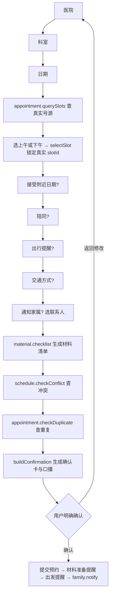

# 四个演示场景的智能体工作流

> 文档版本：v0.2　更新日期：2026年9月12日

命题要求的四个演示场景——**正常办理、预约失败、时间冲突、服务越界**——在当前实现里各自走哪条路径。需求基线见 [Requirement.md](../Requirement.md)，逐项验收清单见 [09-demo-acceptance-checklist.md](09-demo-acceptance-checklist.md)，一轮处理的总体说明见 [03-agent-workflow.md](03-agent-workflow.md)，架构取舍见 [11-agent-architecture-and-controlled-tool-calling.md](11-agent-architecture-and-controlled-tool-calling.md)。

本文只记录**当前源码事实**。文件行号会漂移，因此引用一律用类名与方法名，不写行号。

## 一、四个场景共用的一轮骨架

核心分工是「模型负责理解和表达，Java 负责流程、工具和写操作」。一轮自由文字的处理入口是 `FollowupAgentService#chatInternalBody`。

| 步骤 | 实现 | 做什么 |
| --- | --- | --- |
| 1 载入会话 | `FollowupAgentService#chatInternal`、`ConversationStore` | 按 `conversationId` 取 `ConversationState` 与最近 16 条消息 |
| 2 安全前置 | `SafetyGuard#precheck` | **仅在模型不可用时**执行，关键词表命中即拦截 |
| 3 主模型规划 | `AgentRuntime#plan` → `ConversationPlanner` | 模型输出 `ANSWER` / `ASK_USER` / `CALL_READ_TOOL` / `CALL_READ_TOOLS` / `PROPOSE_WORKFLOW_ACTION` |
| 4 权限审核 | `AgentRuntime#modelProposal`、`ToolRegistry`、`ToolPolicy` | 工具白名单按角色过滤，执行时再校验一次 |
| 5 只读工具循环 | `FollowupAgentService#runModelToolLoop` | 工具结果回喂同一模型，最多 `MAX_MODEL_TOOL_ROUNDS = 3` 轮，`toolSignature` 拦重复调用 |
| 6 业务状态机 | `FollowupAgentService#advance` 及其下游 | 补问、查号源、查冲突、查重复、生成确认卡 |
| 7 写操作 | `FollowupAgentService#confirm` | **只有** `confirmationId` 匹配才执行；模型无法直接触达 |
| 8 收尾 | `finish` / `finishWithoutModel` | 确认摘要与完成卡由权威事实确定性拼接，不经模型改写 |

### 1.1 两种运行模式

`AgentRuntime#modelAvailable` 决定走哪条链路，由 `AGENT_MODEL_ENABLED` 控制（默认 `false`）：

- **模型模式**：模型判断医疗语义、普通意图和页面意图，Java 只保存结构化事实、执行工具、完成写入。
- **规则回退**：模型调用失败或未启用时，才运行 `RuleFactExtractor`、`AgentOrchestrator` 与 `ToolRegistry` 的确定性路由。

配置未启用模型时，全部四个场景都能在回退模式下走完，这是比赛现场的降级路径。

### 1.2 场景起始状态由种子摆好

四个场景不靠口头说明选哪一天，而是一次调用把起始状态复位：

```text
POST /api/demo/scenarios/{normal|no-slot|conflict|boundary}
```

入口是 `DemoController#resetScenario` → `DemoScenarioService#reset`：清掉上一轮演示产生的可变数据、重排号源与既有日程、清空内存会话表，再开一段新会话，并返回一份照着念就能走完的步骤。日期一律按「今天」现算，因此隔一周再演示，无号和冲突两个场景仍然造得出来。

本文以下四节均假定已调用过对应的重置接口。

## 二、场景一：正常办理

起始状态由 `DemoScenario.NORMAL` 摆好，数据侧由 `RollingAppointmentSlotInitializer` 提供：每个启用科室从今天起一个月、**只排工作日**，每天 4 个时间点（09:00 / 10:30 / 14:00 / 15:30）。

### 2.1 流程

补问是一条直线，`FollowupAgentService#advance` 一次只问一个问题：



关键设计：

- **号源早于计划**。日期一到就调 `appointment.querySlots`，拿到真实 `slotId` 才算选定；Java 不凭空造时间，推荐也用 `#nearestSlot` 在真实候选里挑。
- **信息齐了直接检查，不再要求点「开始办理」**。`advance` 末尾直接调 `#checkSchedule`，因为查日程是只读的，不产生预约写入。
- **确认卡内容全部由权威状态拼**。`#confirmationCard` 逐行生成操作清单，`#confirmationNarration` 的口播用同一份事实，两者都不交给模型压缩，避免关键事实变形。
- **执行分步持久化并幂等**。`confirm` 依次提交预约、创建材料准备提醒（复诊前一天）、创建出发提醒（出发前 10 分钟）、通知家属。每步成功即 `ConversationStore#save`，任一步抛异常落 `#toolError`，已成功的步骤不会重做。
- **长期记忆只在办成之后写**。`#rememberBookingPreferences` 在预约真的落进 `appointments` 之后才调用，草稿阶段一个字都不记。

七步计划卡的状态由 `#plan` 依据草稿字段现算（待查询/已查询、待创建/已创建、存在冲突…），与真实进度一一对应。

## 三、场景二：预约失败（指定日期无号源）

现场是这样造的：号源种子**刻意不给周末排号**（`RollingAppointmentSlotInitializer#seed` 中的显式跳过），所以选「下周六」必然无号。

### 3.1 分支

`FollowupAgentService#querySlots` 在真实查询返回空列表时进入 `NO_SLOT` 阶段：

```java
state.stage = NO_SLOT;
if (state.acceptAlternative == null)   // 先问，不擅自换日期
    提问「这一天暂无号源。您接受附近的其他日期吗？」
if (!state.acceptAlternative)          // 明确拒绝 → 尊重，不默认选附近日
    回复「已保留只选这一天的意愿」+ 稍后再查 / 修改日期 / 换医院
state.alternatives = queryAlternatives(...)   // 接受之后才查附近
```

三个要点：

1. **先问后查**。`acceptAlternative` 为 `null` 时只提问，不默认展开附近日期。
2. **拒绝就尊重**。明确说不换日期时不默认选一个，只给「稍后再查 / 主动修改日期 / 换医院」。
3. **「附近日期」的口径在工具层定义**。

### 3.2 「只往后看 3 天」

实现在 `MockAppointmentTool#queryAlternatives`：

```java
"from", date.plusDays(1), "to", date.plusDays(3)
```

代码注释写明了口径：往前会捞出已经过去的时段；把当天其它时段算进「附近日期」还会和上一句「这一天暂无号源」自相矛盾。**当天之内换时段由 `SELECT_PERIOD` 那条路单独负责**，两条路不重叠。

查到候选后列 3 个真实时段并附「重新选择日期」；三天内也没有则给「换日期 / 换医院 / 稍后再查」。

用户选定后走 `#selectSlot` 锁定新的 `slotId`，回到 `advance` 继续，**并重新执行 `#checkSchedule`**——新时间经过新的检查、新的确认卡，即验收清单中「新时间经过新的确认」那一项。

## 四、场景三：时间冲突

冲突是**必然撞上的**，不依赖演示当天的运气：`RollingUserScheduleInitializer` 把「社区体检」固定排在**下周三 10:00–11:00**，而号源生成器给每个工作日都排了 **10:30**，两者必然重叠。该日程随今天滚动重排，所以演示话术「下周三去市第一医院心内科复诊」不管哪天演示都能造出冲突。

### 4.1 检查点

`FollowupAgentService#checkSchedule`：

```java
List<Conflict> conflicts = scheduleTool.findConflicts(userId, start, start + 60min);
if (!conflicts.isEmpty()) {
    state.stage = CONFLICT;
    state.conflicts = conflicts;                // 记住冲突，确认卡要用
    ... 当天其它号源（只取 1 个）+「重新选择日期」+「仍保留这个时间」
}
```

两个细节：

- **当天候选只给一个**。加上另外两个按钮正好三个，一屏放得下。给两个的话「仍保留这个时间」会被挤到第二页，老人翻不到——这是验收清单里明确的一条。
- **判据是区间相交**。`MockScheduleTool#findConflicts` 用 `start_at < end AND end_at > start`，所以 09:00（结束 10:00）与体检**不算冲突**，正好是不冲突的对照组。

### 4.2 两条出口

| 用户选择 | 路径 | 结果 |
| --- | --- | --- |
| 换一个不冲突的号源 | `#selectSlot` → `advance` → `#checkSchedule` | `state.conflicts` 被清空，确认卡上不再有冲突行 |
| 明确保留冲突时间 | `KEEP_CONFLICT` → `#keepConflict` | `scheduleChecked = true`，进入 `#buildConfirmation` |

选择保留时，`#confirmationCard` 会在操作清单里多写一行：

```text
已知冲突：与"社区体检"（10:00 至 11:00）时间重叠，您已选择保留
```

这一行是提交前最后一次提醒，也是家属通知和事后审计能看到的证据。改到不冲突的时间后该行自动消失。

**冲突不会被静默覆盖**：保留只影响确认卡的内容，原有日程没有任何写操作。

## 五、场景四：服务越界

### 5.1 判定口径

判定统一收在 `MedicalBoundaryRules`，口径是**「默认怀疑」而不是「关键词命中才拒绝」**。类注释写明了理由：越界漏判的表现是整句话被当成普通信息静默忽略，老人会以为得到了答复，这个失败模式比多提示一次更贵。

因此判定不是单张动词表，而是组合条件：

| 词表 | 生效方式 |
| --- | --- |
| `EXPLICIT`（要不要紧、什么病、怎么用药、剂量…） | 命中即越界，无需疑问语气 |
| `SYMPTOMS` + `QUESTION_MARKERS` | 症状词与疑问语气同时出现即越界 |
| `MEDICATIONS` + `QUESTION_MARKERS` | 药物与用药行为同理 |
| `REPORTS` + `LOOK_MARKERS` | 报告类名词与查看诉求同时出现 |
| `LOGISTICS_REQUESTS`（带什么、准备什么） | 优先放行，属于办理事项 |
| `SELF_RECORD_QUERIES`（我最近的血压是多少） | 优先放行，属于本项目的健康记录回查 |

场景四的演示句「我血压有点高，**要不要紧**？」命中的是 `EXPLICIT`。

### 5.2 两条执行路径

| 模式 | 时机 | 方法 |
| --- | --- | --- |
| 规则回退 | 模型调用**之前** | `SafetyGuard#precheck` |
| 模型模式 | 模型规划**之后** | `SafetyGuard#evaluateModel`：认模型的 `MEDICAL_ADVICE` / `HEALTH_CONCERN` 意图，**再加一道 `looksLikeMedicalAdvice` 规则兜底** |

兜底那一道是刻意加的，方法注释解释了成本取舍：模型漏判时整句话会被静默忽略，比多提示一次更贵。

### 5.3 回复的装配

`FollowupAgentService#medicalBoundary` 做三件事：

1. 给一句权威回复（说明不能诊断、判断原因、解读检查结果或调整用药，并建议咨询医生）。
2. 附一个 `Notice(MEDICAL_BOUNDARY)`，让前端渲染成独立提示块，而不是普通聊天气泡。
3. **把原来那张确认卡原样交回去**（`#pendingConfirmation`）。

第 3 点是这个场景最容易做错的地方：老人问到一半药，手里那张「确认办理」如果跟着消失，他会以为办不成了，而服务端那张卡其实一直有效。因此 `medicalBoundary` **刻意不改 `stage`、不清 `confirmationId`**，`#pendingConfirmation` 也不重建卡片，只把同一张卡连同原凭据交回——卡片内容始终只有一处来源。

前端由 `BoundaryAlert`（`frontend/features/assistant/assistant-cards.tsx`）渲染：`role="alert"` 的橙色独立区块，与普通气泡在视觉上可区分，**卡上不放任何按钮**（越界不改变办理流程，原有的按钮就够了），位置紧跟最近一轮消息，下方的计划卡与确认卡照常保留。

## 六、四个场景的共性

1. **共用同一条主链路**。越界、无号、冲突都不是旁路，而是在主链路的三个点上分叉（`SafetyGuard` / `querySlots` / `checkSchedule`），分叉之后仍回到同一套确认门禁。
2. **写操作只有一条路径**。`confirm` 校验 `confirmationId` 与当前状态相等，模型、快捷按钮、图片输入都绕不过去。取消预约在事项页有入口，但那个入口只是把一句话交给助手页发出，仍然走查询 → 确认卡 → 确认端点。
3. **异常都不终止对话**。每个异常分支都给出可继续的选项（换日期、换号源、保留、稍后再查、人工帮助），符合需求 4.5 第 2 条。
4. **场景可靠性靠种子而非话术**。日期、号源与既有日程都由 `RollingAppointmentSlotInitializer` 与 `RollingUserScheduleInitializer` 按「今天」现算，隔一周再演示仍然可复现。

## 七、已知差异与注意事项

这一节记录与需求或与 [Design.md](../Design.md) 目标设计之间**尚未闭合**的点，避免把现状读成已完成。

### 7.1 紧急关键词表在模型模式下不前置

`SafetyGuard#precheck` 中的紧急表达词表（胸痛、心口疼、胸口疼、胸闷、胸部压迫、呼吸困难、昏迷、大出血、喘不上气、想不开…）**只在模型不可用时执行**：`FollowupAgentService#chatInternalBody` 把它包在 `if (!agentRuntime.modelAvailable())` 里。

模型模式下，紧急判定来自 `SafetyGuard#evaluateModel`，它认的是主模型给出的 `EMERGENCY` 意图，**不再跑这张词表**（越界那一侧有 `looksLikeMedicalAdvice` 规则兜底，紧急这一侧没有对应的兜底规则）。提示词中已明确要求「严重胸痛、呼吸困难、突然昏倒、突然说话困难、严重出血或明确自伤风险使用 `EMERGENCY`」并暂停普通办理，但这条底线目前依赖模型分类。

对应 [Design.md](../Design.md) `P0 全入口阶段守卫与紧急暂停` 中「高优先级规则前置」的目标，此处存在差距。**演示紧急场景前建议先实测一遍模型的实际输出**。

### 7.2 演示场景与验收清单的对应

四个场景覆盖了 [09-demo-acceptance-checklist.md](09-demo-acceptance-checklist.md) 的第一至第四节（场景一至场景四），另有第五节「代家属预约」由协同照护端单独演示，不在本文范围内。

清单中标注「待逐项提供证据」的条目仍以该清单为准，本文只说明实现路径，不构成验收结论。
