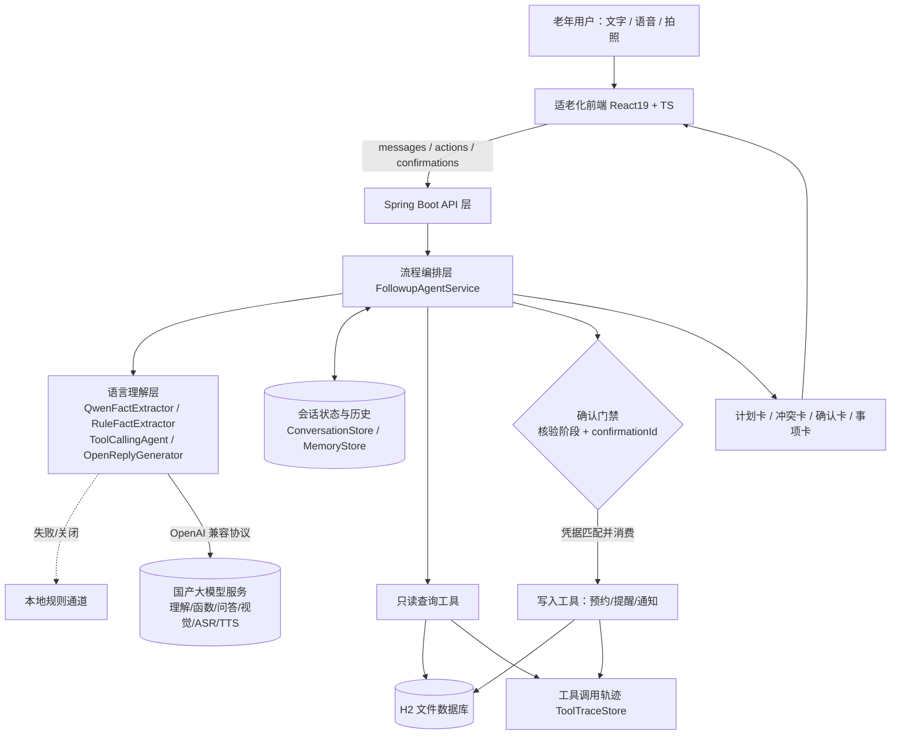
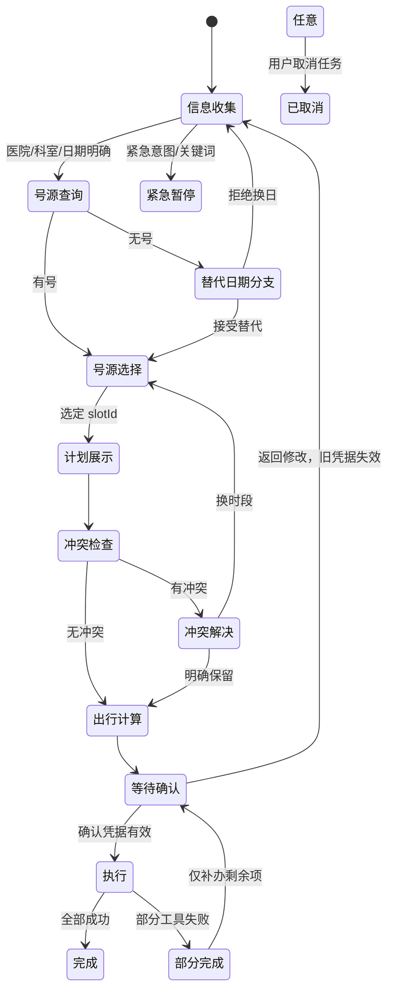

# 银龄复诊事项协同助手
## 中国国际大学生创新大赛（产业赛道）技术解决方案

| 项目 | 内容 |
| --- | --- |
| 项目名称 | 银龄复诊事项协同助手（Silver Follow-up Agent） |
| 项目定位 | 面向银发群体、以自然语言交互串联预约、材料、日程、出行与家属通知的复诊事务协同办理智能体 |
| 技术形态 | Java 17 + Spring Boot 3.5.6 后端 / React 19 + TypeScript 前端 / H2 持久化 / 国产大模型六通道接入 |
| 文档版本 | V1.0（侧重技术方案） |
| 文档日期 | 2026 年 9 月 |

> 重要声明：当前系统为可交互比赛原型，所有医院、号源、路线、用户及通知均为模拟数据，系统不提供疾病诊断或用药建议。文中标注为"规划/后续"的内容均尚未实现，不与已实现功能混述。

---

# 一、项目概述

## 1.1 背景与问题

我国 60 岁及以上人口已超过 3.1 亿、占总人口约 22%，社会整体进入深度老龄化阶段；2024 年国务院办公厅印发《关于发展银发经济增进老年人福祉的意见》，将发展银发经济、解决老年人数字鸿沟上升为国家战略。老年群体高频、刚需的医疗复诊服务，恰恰是数字鸿沟最突出的场景之一。

一次复诊在现实中不是"挂一个号"这么简单，而是一条包含七类事项、彼此依赖的事务链：

```text
找医院/科室 → 选时间 → 查个人日程冲突 → 准备就诊材料 → 规划出行
     → 设置提醒 → 通知家属/陪同人
```

这些事项分散在不同 App、不同入口中，且存在强依赖关系（例如：只有确定号源时间后才能计算出发时间、才能通知家属准确信息）。对不熟悉智能设备的老年用户，困难是双重的：

1. **操作难**：步骤多、入口散、字号小、确认含义不清，容易误预约、误通知；
2. **认知难**：不知道"先做什么、后做什么"，遇到无号、冲突、改期等变化后，不知道哪些已办事项会受到影响、需要重新调整。

现有产品的两类典型形态都未能解决该问题：

- **信息型 AI 助手**：能聊天、能给建议，但不产生任何真实办理结果，"说了等于没办"；
- **传统挂号 App**：能挂号，但只解决七个步骤中的一个，且把跨步骤的协调成本全部留给老人及其家属。

## 1.2 解决方案一句话

> 老人只需像跟子女说话一样说出"我下周想去医院复诊，帮我安排一下，出发前提醒我，再告诉我女儿"，系统即可自动补齐信息、查询真实号源、生成完整计划，并在老人逐次明确确认后，实际完成预约、提醒与家属通知，最终汇总成一张看得懂的"复诊事项卡"。

系统采用 **"语言理解 + 受控工作流 + 领域工具"的人机协同智能体架构**：大模型只负责"听懂话"，所有"办事情"的权限由确定性的 Java 工作流掌握，关键写入操作必须由老人在确认卡上明确授权。这既保留了自然语言交互的温度，又从机制上杜绝了大模型幻觉可能造成的误预约、误通知。

## 1.3 产业命题契合度

本方案对命题七项总体要求的响应均已落地为可运行代码，而非停留在设计层面：

| 命题要求 | 本项目实现 | 可核验证据 |
| --- | --- | --- |
| G-01 理解老年人复诊需求 | 口语化意图识别，抽取医院、科室、日期、时段、陪同、提醒、通知等结构化字段 | 对话中同步展示"用户原话 + 系统理解结果"；`QwenFactExtractor` |
| G-02 主动询问缺失信息 | 上下文持续累积，已答信息不问第二遍，一次只补问一个主要问题 | 分三句话断续提供信息仍能形成完整计划；`FollowupAgentService` 缺失项检查 |
| G-03 把需求拆成多个步骤 | 规则驱动任务模板，组织号源、材料、日程、出行、提醒、通知的依赖关系 | 办理计划面板实时展示各步骤状态；`FollowupPlan` |
| G-04 调用模拟工具执行 | 十个工具接口 + 模拟实现分离，真实读写 H2 数据库 | 工具调用记录面板展示工具名、参数、结果、耗时；`domain/tool` |
| G-05 关键操作前确认 | 确认凭据（confirmationId）门禁，未确认无法触发任何写入 | 确认卡 + `/api/agent/confirmations` 唯一写入口 |
| G-06 处理异常 | 无号、冲突、信息不全、工具失败、改期、取消、紧急情况均有恢复分支 | 四组内置稳定演示场景；异常状态机 |
| G-07 适老化反馈 | 大字号、高对比、短句、少量选项、语音输入输出、可返回取消 | 首页/助手/事项/材料/设置五个视图 |

需求理解（U-01~U-10）、任务拆解（P-01~P-09）、工具调用（T-01~T-07）、确认机制（C-01~C-07）、异常处理（E-01~E-07）、适老化（A-01~A-09）、安全边界（S-01~S-06）全部 58 项细分要求的逐条映射，见附录 A 与仓库 `docs/01-requirement-mapping.md`。

## 1.4 成果概览

截至当前，项目已交付一个**前后端分离、可一键启动、可现场复现异常**的完整系统：

- **后端**：Java 17 + Spring Boot 3.5.6 模块化单体，约 30 个业务类，覆盖 Agent 理解、流程编排、会话管理、十类工具、持久化与六类模型服务通道；
- **前端**：React 19 + TypeScript 手机端界面，对话、计划、号源选择、冲突卡、确认卡、工具轨迹、事项卡、材料清单、适老设置全部可交互；
- **数据层**：H2 文件数据库，医院、科室、号源、联系人、路线、药品知识库均落库，预约/提醒/通知为真实写入；
- **模型层**：单把国产大模型密钥（阿里云百炼 DashScope，OpenAI 兼容协议）点亮**对话理解、函数调用、开放问答、视觉识别、语音识别、语音合成**六类能力，并支持模型完全关闭时的纯规则降级运行；
- **验证**：内置正常办理、无号替代、日程冲突、服务越界四组稳定场景；提供通道自检接口与完整工具调用轨迹，评审可现场核验"系统真的办了事"。

---

# 二、需求分析

## 2.1 银发复诊事务链痛点拆解

| 环节 | 老年用户真实困难 | 数字化产品的现状缺口 |
| --- | --- | --- |
| 找医院/科室 | 记不住全称，只会说"上次那家医院看心脏的" | 搜索要求精确输入，不支持口语与模糊表达 |
| 选时间 | "下周三"要自己换算日期；不知道哪天有号 | 日历选择器信息密度高，无号需逐日尝试 |
| 查冲突 | 忘记自己是否已有体检、取药等安排 | 挂号系统与个人日历互不相通 |
| 备材料 | 不知道该带医保卡还是既往报告 | 无个性化材料清单，易漏带导致白跑 |
| 规划出行 | 不会算"几点出门才来得及" | 地图 App 路线复杂，未考虑取号预留时间 |
| 设提醒 | 不会用手机日历/提醒事项 | 提醒与复诊安排割裂，需手工二次录入 |
| 通知家属 | 说不清完整时间地点，或忘记通知 | 无授权化、结构化的家属协同机制 |
| 应对变化 | 无号/冲突/临时改期后，不知道哪些安排要跟着改 | 各系统状态不联动，旧提醒、旧通知成为脏数据 |

## 2.2 核心设计需求

系统将上述痛点归纳为六个可工程化的需求维度：

| 需求维度 | 用户问题 | 设计回应 |
| --- | --- | --- |
| 理解表达 | 需求口语化、信息不完整、分多次说出 | 识别复诊意图，长期保留已知信息，逐项补问 |
| 组织流程 | 不清楚复诊前要办哪些事项、先后顺序 | 展示含预约、材料、日程、出行、通知的任务计划 |
| 执行事项 | 希望助手**实际办理**而非只给建议 | 调用工具真实查询和写入数据库，展示执行结果 |
| 保留决定权 | 担心误预约、误通知、被自动改期 | 写入操作前展示明确确认卡，支持返回修改 |
| 应对变化 | 无号、冲突、改期后不知如何调整 | 说明原因 + 提供替代项 + 重算受影响步骤 |
| 看懂结果 | 难从长对话中找关键信息 | 汇总简明事项卡，区分成功、跳过、未完成 |

同时，系统在设计之初即确立三条工程红线：**可恢复**（会话可保存、可中断、可继续）、**可追溯**（每一次工具调用留痕）、**可复现**（演示场景由数据稳定构造，不依赖临场改代码）。

## 2.3 用户角色

| 角色 | 诉求 | 系统中的职责边界 |
| --- | --- | --- |
| 老年用户 | 少输入、少记忆，清楚知道下一步与结果 | 提出需求、选择方案、明确确认或拒绝，是办理决定的唯一主体 |
| 家属/陪同人 | 及时获知复诊时间、地点与陪同需求 | 仅在用户授权后接收结构化通知；当前为模拟联系人与通知记录 |
| 人工协助人员 | 用户遇困时帮助理解与操作 | 保留入口并诚实告知"尚未接通真人"，为产业落地预留衔接位 |


## 2.4 服务范围界定（有所为，有所不为）

系统明确只办理**复诊事务**，不越入医疗决策领域：不诊断疾病、不推荐药物、不调整剂量、不解读检查结果、不替代医生决定治疗方案。药品知识工具仅回答"是什么、做什么用、要注意什么"的事实性说明，不输出剂量方案；视觉识别仅做通俗描述与 OCR 文字提取，提示词明确禁止医学解释。该边界在第九节安全设计中给出工程化保障措施。

---

# 三、总体技术方案

## 3.1 核心设计思想：模型不掌权的人机协同 Agent

大模型擅长理解语言，却不适合掌握不可逆操作的执行权——它可能幻觉出不存在的号源，可能把一句模糊的"行吧"当成授权。本系统的核心设计原则是：

> **模型是"翻译官"和"顾问"，Java 工作流是"办事员"和"守门人"，工具是真实业务系统的"手"。**

```text
大模型：听懂口语 → 输出待校验的结构化字段；可调用只读工具查证；无法看到任何写入工具
工作流：校验字段、匹配目录、推进状态、检查依赖、核验确认凭据、决定调用哪个工具
工  具：只接收结构化参数，对 H2 执行真实查询/写入，返回带状态的结构化结果
```

这一分工带来三个产业级价值：**结果可信**（一切办理结果以数据库记录为准，不以模型话术为准）、**行为可控**（写入必须真人确认，模型无法自行触发）、**服务可用**（模型宕机时规则通道可独立完成全流程）。

## 3.2 总体架构



## 3.3 技术选型与依据

| 层次 | 选型 | 选择依据 |
| --- | --- | --- |
| 后端 | Java 17、Spring Boot 3.5.6、Spring JDBC | 团队技术栈统一；强类型 + 编译期检查适合承载状态机与确认门禁；生态成熟、易于产业交付 |
| 架构形态 | 模块化单体（包级隔离，非微服务） | 三人小团队无需承担服务拆分、分布式一致性与联调成本；工具按接口隔离，未来可平滑拆服务 |
| 前端 | React 19、TypeScript、vinext（基于 Vite 的 RSC 框架）、Tailwind CSS 4 | 组件化承载卡片式交互；类型契约与后端 DTO 对齐；构建快、便于演示 |
| 数据库 | H2 文件库（`jdbc:h2:file:./data/silver-agent`） | 零外部依赖、随启随用、数据可检视；Repository 接口化，产业落地可替换为 MySQL/达梦等 |
| 大模型 | 阿里云百炼 DashScope（OpenAI 兼容），通义千问系列 | 国产模型服务，合规友好；单密钥六通道；标准 HTTP 接入，不绑定特定 SDK |
| 配置 | `.env` + 环境变量，`DotenvEnvironmentPostProcessor` 最前置加载 | 密钥不入库；真实环境变量优先级高于文件，符合 12-Factor |
| 工程化 | Dev Container、Dockerfile、compose.yml、Maven | 统一团队开发环境，隔离宿主机差异，支持演示一键复现 |
| 国产适配 | 纯 Java 后端 + 纯 Web 前端，无原生依赖 | 可运行于龙芯架构 + 银河麒麟 V11 等信创环境（团队已具备该环境部署实践） |

模型通道均可通过开关独立控制：`AGENT_LLM_ENABLED` 为总开关（默认关闭即纯规则运行），视觉、ASR、TTS 另设独立开关。

## 3.4 分层模块设计

后端按"应用层—领域层—基础设施层"分包，每层权责有硬性约束：

```text
com.team.silveragent
├─ api/            接入层：Agent/Appointment/Asr/Tts/Vl/User/Diagnostics 控制器
│                   只做参数校验与 DTO 返回，不允许写提示词、不允许决定流程
├─ agent/          语言理解层：事实抽取、函数调用代理、开放问答、规则回退
│                   只能输出"待校验信息"，不允许绕过工作流触发写入
├─ application/    编排层：FollowupAgentService（状态推进/确认/异常）、
│                   ConversationState/Store/Lifecycle（会话）、MemoryStore、
│                   AppointmentRecordStore、CareCatalogRepository
├─ domain/model/   领域模型：AgentTurnResponse、FollowupPlan、ToolModels
├─ domain/tool/    工具接口（10 个）：只完成单一查询或动作，不决定整个流程
├─ infrastructure/ 工具的模拟实现（mock）、H2 实现、号源初始化器、轨迹存储
├─ service/        ASR/TTS/VL 三类模型服务的 HTTP 封装
└─ config/         Web 配置、dotenv 注入
```

前端按业务功能而非技术类型组织：`features/assistant`（对话工作台）、`features/home`（首页）、`features/tasks`（事项卡）、`features/materials`（材料清单）、`features/profile`（适老设置），配合近 60 个基础 UI 组件与 `lib/*-api.ts` 类型安全的接口层。

## 3.5 一轮对话的完整处理链路

系统不运行持续空转的 Agent 死循环，而是**用户每发一次消息触发一轮确定性处理**：

1. 按 `conversationId` 加载会话状态、最近 8 条消息、最近 3 张图片；
2. 自由文本走 `/api/agent/messages`：携带当前日期、流程阶段、已知事实、近期对话调用大模型，一轮只调用一次；明确按钮走 `/api/agent/actions`，提交结构化动作，**不调用模型**（省 token、防歧义）；
3. 模型输出结构化字段变更与简短理解反馈，Java 校验：医院/科室必须匹配模拟目录，日期必须合法，未知值与"用户明确拒绝"严格区分；
4. Java 工作流依据状态机决定下一步：补问 / 查号源 / 展示计划 / 检查冲突 / 等待确认 / 执行；
5. 工具真实读写 H2，调用名、参数、结果、耗时、状态写入轨迹表；
6. 确认类操作只有 `/api/agent/confirmations` 一个入口，核验并消费凭据后才执行；
7. 本轮状态、消息、卡片持久化，等待下一轮——刷新页面、关闭重开均可恢复。

---

# 四、核心技术实现

## 4.1 多轮事实抽取：模型与规则双通道

**上下文累积式抽取**解决"老人分三句话才说清需求"的问题。抽取器每轮把当前日期、流程阶段、已知事实、近期对话一并送入模型，只输出字段增量；Java 将增量合并进会话事实表，已确认字段不重复询问。"下周三"这类相对日期结合系统当前日期解析，并在确认卡上同时展示口语表述与具体年月日。

**规则通道兜底**：未配置密钥、密钥失效或模型超时时，`RuleFactExtractor` 基于关键词与正则继续完成意图识别与字段抽取，配合页面快捷按钮可独立走完全部办理流程。评委现场断网演示，系统仍可完整办理，这是可用性设计的关键一环。

## 4.2 状态机驱动的流程编排

主流程是显式、可审计的有限状态机，而非模型自由发挥的链式调用：



**动态调整规则**在状态机中固化：更换医院 → 科室、号源、材料、路线全部重算；更换日期 → 号源、冲突、出发时间重算；变更提醒/通知偏好 → 更新操作清单。任何涉及待执行内容的变化都使旧确认凭据失效，杜绝"看着新方案、执行旧方案"。

## 4.3 规则驱动的任务模板与依赖编排

任务计划由**规则模板**根据用户偏好与工具结果生成分支，而不是由模型任意生成可执行程序（避免"模型生成的计划不可控"这一产业落地大忌）：

| 任务 | 前置条件 | 输出与后续作用 |
| --- | --- | --- |
| 查询可预约时段 | 医院、科室、日期明确 | 候选号源；无号进入替代日期分支 |
| 选择复诊时间 | 已获候选号源 | 确定 slotId，作为后续时间基准 |
| 生成材料清单 | 医院、科室明确 | 材料项与必带标记 |
| 检查日程冲突 | 用户、时间明确 | 冲突列表；冲突时引导换时段 |
| 生成出发建议 | 地址、交通方式、时间齐全 | 路线耗时与建议出发时间 |
| 创建提醒 | 预约成功且已确认 | 材料准备提醒 + 出发提醒（按偏好） |
| 通知家属 | 预约成功、联系人明确且已授权 | 模拟通知记录；不需要则标记"跳过" |

号源查询允许在偏好未补齐时**提前执行**以尽早暴露无号，但计划状态如实反映"已查询/待检查/待确认/已完成"，不把提前执行的查询伪装成待办。

## 4.4 工具体系：十个接口、真实执行、可替换数据源

工具层采用"接口 + 模拟实现"分离，命题要求的四类核心工具之外，围绕闭环完整性扩展到十类：

| 工具 | 读/写 | 核心方法与真实行为 |
| --- | --- | --- |
| 预约工具 | 读 + 写 | 号源查询（含替代日期）、提交预约、改期、取消；号源占用真实落库 |
| 我的预约查询 | 只读 | 查询已成功写入的预约，不含对话中尚未提交的草稿 |
| 日程工具 | 读 + 写 | 冲突检查、提醒创建写入 H2 |
| 出行工具 | 只读 | 按交通方式矩阵计算耗时 |
| 家属通知工具 | 写 | 联系人查询、通知记录写入 |
| 材料清单工具 | 只读 | 按医院+科室模板生成清单与必带标记 |
| 材料准备跟踪 | 读 + 写 | 按预约号管理逐项材料状态，可标记已备/拍照确认 |
| 医院资料工具 | 只读 | 地址、特色、适老服务资料 |
| 科室资料工具 | 只读 | 科室位置、复诊范围 |
| 药品知识工具 | 只读 | 本地知识库检索，支持别名与去剂型匹配，单次≤3 条 |

**执行真实性保障**：出行建议按确定性公式计算——

```text
建议出发时间 = 预约时间 − 模拟路线耗时 − 20 分钟取号预留
材料准备提醒 = 预约前一天；出发提醒 = 建议出发时间前 10 分钟
```

路线数据缺失时返回明确错误而非编造耗时。所有写入具备幂等性：重复办理不会产生重复预约/提醒/通知；预约改期在本地事务中更新，目标号源失败时事务回滚、原预约与提醒完好保留。工具接口与实现解耦，产业对接时只需将 `infrastructure/mock` 的实现替换为真实医院平台、地图与消息网关适配器，编排层零改动。

## 4.5 模型函数调用：只读白名单 + 三步循环 + 推理剥离

系统赋予模型有限的、受白名单约束的函数调用能力（OpenAI 兼容 `tool_choice: auto`），在同一轮内循环执行、**最多 3 步**，超时未收敛即放弃并回退上层通道。白名单仅含六项**只读**工具：

```text
drug.queryKnowledge    药品知识检索      appointment.querySlots  号源查询
appointment.queryMine  我的预约查询      catalog.queryHospitals  医院目录
catalog.searchDepartments  科室检索      material.generateChecklist  材料清单
```

提交预约、改期、取消、创建提醒、发送通知等写操作**根本不在模型可见的工具列表中**，从协议层封死了"模型擅自办事"的可能。此外，模型返回中的推理过程字段在响应前被剥离，既不落库也不回传前端——内部推理不是对用户的交付内容。

## 4.6 确认门禁：凭据机制、防重放与部分完成补偿

确认机制是本项目最核心的安全设计，不是 UI 上的一个弹窗，而是工作流中的强制状态门禁：

1. **生成凭据**：每次渲染确认卡时生成随机 `confirmationId`，绑定当前方案参数快照（医院、科室、时刻、提醒、通知对象与全文）；
2. **核验消费**：确认接口同时校验"会话阶段 = 等待确认"与"凭据匹配"，通过后立即消费凭据（一次性），再执行写入；
3. **失效策略**：方案变更、执行异常、任务取消、紧急暂停均使旧凭据失效——重复点击、旧页面残留确认、已办事项的二次请求均无法再次触发操作；
4. **确认卡信息标准**：逐项列明医院科室、完整日期时刻、陪同需求、出发时间、每条提醒的时间、通知对象与消息全文；按钮文案为"确认办理 / 返回修改""确认取消预约 / 保留预约"，不使用"我已知晓"等诱导性模糊话术；
5. **部分完成补偿**：预约成功但通知失败时，保留预约、展示部分完成卡，重新生成凭据后**只补办未完成项**，绝不重复提交预约。

## 4.7 异常即常态：十类异常的恢复式处理

系统遵循"说明发生了什么 → 保留有效结果 → 提供下一步选择"的原则，任何异常都不以技术报错结束对话：

| 异常 | 系统行为 | 用户控制权 |
| --- | --- | --- |
| 信息不完整 | 指出缺失项，继续单项补问 | 不生成任何虚假结果 |
| 指定日期无号 | 说明原因，按替代偏给候选 | 用户拒绝则绝不自动换日 |
| 日程冲突 | 展示冲突事项，给换时段/保留选项 | 不自动覆盖原日程 |
| 模型异常 | 下沉规则通道，按钮继续办理 | 可修正识别结果 |
| 工具失败/路线缺失 | 标明失败步骤与原因，可重试 | 不把"无数据"说成成功 |
| 预约后提醒/通知失败 | 保留预约，部分完成卡引导补办 | 仅补办剩余项 |
| 中途换医院/日期 | 清理失效候选，重算关联事项，旧凭据作废 | 新方案重新确认 |
| 改期失败 | 事务回滚，原预约与提醒保留 | 仍可用原安排 |
| 取消整个任务 | 流程停止，旧动作不可继续 | 已成功预约不被自动删除，取消需另行确认 |
| 紧急情况 | 关键词+意图触发紧急暂停，提示急救/线下帮助 | 旧确认不可再提交普通事项 |

## 4.8 多模态适老交互：能说、能听、能看

### （1）语音输入（ASR）

- 交互形态为**按住说话**：按下即录并显示实时音量波形，上滑过阈值进入"松开取消"（用位移而非小按钮表达取消），按住不足 600ms 判为误触丢弃；
- 识别通道双保险：优先后端调用通义千问 ASR（`qwen3-asr-flash`），失败自动回退浏览器本地中文识别（支持中间结果实时回显），两者皆不可用时明确提示改用文字，绝不静默失败。

### （2）语音输出（TTS）

- 本地优先：优先浏览器本地中文合成以降低等待，失败再走后端 `qwen3-tts-flash`；全局单例播放，同一时刻只播一条，重复点击即停止，防止多条朗读叠加；
- 每条消息可单独朗读，结果卡支持整卡朗读；8 种音色、0.5–2.0 倍语速、自动朗读开关均可在设置页配置并持久化。

### （3）视觉识别（VL）

- 支持相机实时拍摄（优先后置、逐级回退）与相册多选，单轮最多 3 张、单图≤10MB；
- 先由 `qwen3-vl-plus` 生成面向老人的通俗描述，再做纯文字 OCR，提示词明确禁止医学解释；结果写入视觉上下文，可支持"这药是做什么的"等追问，且全程记入工具轨迹；
- 工程细节：连接超时 5s、读取超时 60s（说明书长 OCR 需耗时），仅对 429/5xx/网络超时做最多 2 次退避重试。

### （4）自由问答四级回退链

开放问答按级下沉，前一级不可用即切换，保证任何时候都有得体回应：

```text
① 带只读工具的回答（需查真实数据时）
        ↓ 失败
② 无工具开放问答（含视觉结果的适老化转述）
        ↓ 失败
③ 本地规则模板（就医建议/用药提示/越界拒绝固定口径）
        ↓ 失败
④ 会话内已保存的视觉识别文本（图片追问保底）
```

## 4.9 会话生命周期与可恢复性

| 机制 | 阈值 | 超限行为 |
| --- | --- | --- |
| 空闲超时 | 600 秒无交互 | 关闭会话，引导开启新对话 |
| 轮次水位 | 预警 20 轮 / 上限 30 轮 | 预警提示；超限只读化 |
| 上下文水位 | 预警 5000 / 上限 6000 字符 | 超限关闭并引导新会话 |
| 上下文回带 | 最近 8 条消息、3 张图片 | 控制 token 成本 |

已关闭会话在前端转为只读，输入区替换为"开启新对话"并配直白说明。历史对话保留最近 3 天摘要（标题、阶段、状态、消息数），可切换恢复任一会话的消息与最后一张卡片；恢复失败自动清除本地会话号并新建，不让用户卡死在错误状态。办理完成后写入**长期办理记忆**（常去医院、科室、偏好等），后续轮次减少重复询问；记忆只存办理事实，不保存诊断或健康推断。

## 4.10 数据层设计：真实持久化与号源滚动生成

- 建库脚本 `schema.sql` + 种子数据 `data.sql`，启动时模式 `always` 执行，UTF-8 编码；
- **号源滚动初始化器**保证演示不依赖固定日期：每次启动从当天生成至未来一个月、覆盖全部启用科室，每天 4 个时段（09:00、10:30、14:00、15:30），**有意跳过周末**以稳定复现"指定日期无号"分支；生成幂等，只补齐缺失记录，绝不重置已被占用的号源；
- 预约、提醒、通知、会话、消息、工具轨迹分表落库；重启不清空业务数据，连续两次预约产生两个编号且互不覆盖；
- H2 控制台（`/h2-console`）向评审开放，可直接查表核验"前端展示结果 = 数据库真实记录"。

---

# 五、安全与服务边界设计

## 5.1 医疗服务边界（产品层）

对诊断、荐药、调剂量、解读检查报告、替代医生决策五类请求，系统统一说明职责边界并建议咨询医生；紧急情况（关键词 + 意图双识别）进入紧急暂停、提示拨打急救电话。该机制定位为普通流程的保护闸，而非医疗分诊服务，不宣称临床有效性。

## 5.2 模型权限边界（架构层）

- 模型输出一律视为**待校验信息**：医院/科室/号源必须经目录与查询结果匹配，预约成功与否只以工具结果为准；
- 模型无任何写入工具可见、可调；模型对话中出现"用户已同意"不能替代确认接口的凭据核验；
- "停止任务"与"取消已成功预约"严格分离，后者必须独立确认，防止误删既有安排；
- 推理过程字段剥离，避免内部链式思考被当作对用户的承诺。

## 5.3 数据与密钥安全（工程层）

- 密钥仅通过 `.env`/环境变量注入，`.env` 不入库，`.env.example` 只给空模板；自检接口只回传通道状态与模型名，不回传任何密钥内容；
- 家属电话在设置页脱敏展示；当前使用模拟个人资料，不采集真实个人信息；
- CORS 来源白名单可配置（`CORS_ALLOWED_ORIGINS`）；Actuator 仅暴露 health/info。

## 5.4 面向真实部署的诚实差距清单

产业落地前需补齐：正式身份认证与会话归属校验、角色权限体系、数据最小化与日志脱敏、数据保存/删除策略、外部模型的数据授权、真实医院预约/支付/短信网关/家属阅读回执对接、高可用与并发保障（当前确认门禁为单实例同步编排，工具写入与会话保存未构成分布式事务）。这些差距在代码结构上均已预留替换点，不影响原型对命题的完整验证。

---

# 六、适老化工程设计

适老化不是事后"调大字号"，而是贯穿任务全过程的系统设计：

| 难点 | 工程措施 |
| --- | --- |
| 输入难 | 文字 + 按住说话双通道；ASR 双回退；短句即可，允许一次说多项或分多次说 |
| 理解难 | 助手回复一律短句、一次只问一个主问题；快捷选项每页≤3 项 |
| 看不清 | 大字号、高对比、特大字体全局开关、大点击区域；状态用"文字+图标（✓/✕）"双编码，不仅依赖颜色 |
| 怕误操作 | 600ms 录音防误触、上滑取消；写入前强确认；返回/取消/人工帮助三个入口始终可见 |
| 记不住 | 计划面板常驻；医院、科室、时间在计划卡与确认卡重复呈现；口语日期与具体日期并列 |
| 找不到结果 | 最终事项卡一页汇总"何时去、去哪、带什么、几点出发、提醒与通知状态"；事项页/材料页可独立查询，材料可逐项标记 |
| 听不清 | 8 音色 + 语速调节 + 自动朗读 + 单例播放防叠加 |
| 怕被误导 | 人工帮助入口诚实标注"尚未接通真人"；模拟环境全局明示；工具失败绝不伪装成功 |

---

# 七、创新点与技术优势

| # | 创新点 | 具体做法 | 产业价值 |
| --- | --- | --- | --- |
| 1 | **全链路四级降级** | 模型/工具问答四级回退、ASR/TTS 双通道、总开关关闭可纯规则运行 | 外部服务任何故障下服务不中断，契合老年场景对可用性的高要求 |
| 2 | **多模态适老闭环** | 按住说话、双路 ASR/TTS、拍照识药 OCR、长期办理记忆 | 覆盖不识字、不会打字老人的真实使用姿势 |

---

# 八、系统验证与演示设计

## 8.1 四组稳定内置场景

场景由数据与规则稳定构造，不靠临场改代码：

| 场景 | 触发方式 | 验证要点 |
| --- | --- | --- |
| 正常办理 | 选择工作日日期 | 有号→无冲突→确认→预约/提醒/通知全部真实写入→事项卡 |
| 预约失败 | 选择周末日期（号源生成时刻意跳过周末） | 明确告知无号 → 给出前后日期候选 → 接受替代后正常闭环 |
| 日程冲突 | 选择与既有社区体检冲突的时段 | 冲突卡展示原事项 → 换时段/保留二选一，不自动覆盖 |
| 服务越界 | 询问诊断、用药、剂量或描述紧急情况 | 礼貌拒绝医疗判断/进入紧急暂停，普通工具流不被触发 |

## 8.2 三重可核验证据链

1. **前端工具轨迹面板**：每次调用展示工具名、模型实时生成的参数、返回结果、成功/失败符号标注，可折叠展开原始 JSON；
2. **后端数据库**：H2 控制台可直接查询预约、提醒、通知、轨迹表，与前端事项卡逐项对账；
3. **通道自检接口**：
   - `GET /api/demo/health`：健康检查与数据模式（兼作容器健康探针）；
   - `GET /api/demo/channels`：六类通道的启用状态与模型名；
   - `GET /api/demo/channels?probe=true`：对每个通道真实发起最小请求，现场确认是否实际可用及失败原因。

## 8.3 自动化与工程验证

- 后端含 JUnit 测试：事实抽取器（规则/模型）、复合需求流程等，`mvn test` 可执行；
- 前端 `npm run build` 类型检查与构建通过；
- 历史 Dev Container 环境中曾完成 16 项容器化测试通过（详见仓库 `docs/records/PROGRESS.md`）；
- 统一 Dev Container 配置（`.devcontainer/`）保证三人协作与评委复现环境一致。


---

# 九、工程化交付

## 9.1 一键化开发

- **Dev Container**：`.devcontainer/Dockerfile` + `setup.sh`，在 `/workspace` 内完成 JDK/Node/Maven 依赖、构建、测试，依赖与数据走容器卷；
- **容器部署**：根目录 `Dockerfile`（后端）与 `compose.yml`（前后端编排），演示环境一条命令拉起；
- **启动顺序**：后端 8080（Spring Boot，自动建库滚动生成号源）→ 前端 3000（Vite 开发服务器 / 构建产物）；
- **配置分层**：所有模型、CORS、会话阈值、演示用户均可通过环境变量覆盖，无需改代码。


---

# 十、产业化落地路径

## 10.1 三阶段落地路线

| 阶段 | 周期 | 目标 | 关键工作 |
| --- | --- | --- | --- |
| 一期：原型验证（当前） | 已完成 | 命题全要素可运行 Demo | 模拟数据 + 四场景 + 六模型通道，完成可用性试用 |
| 二期：社区试点 |    | 1–2 个街道/社区卫生中心试点 | 接入真实医院预约公众号/开放接口、地图 API、短信/微信通知网关；补齐认证授权与数据合规；老年用户小规模知情同意试用 |
| 三期：平台化 |     | 区域养老/医疗协同平台组件 | 多租户、家属端小程序与陪同回执、人工坐席协同、运营后台；对接医保复诊、购药配送等延伸事务；信创环境规模化部署 |


---


# 十一、价值与愿景

**对老人**：一个入口说完需求，剩下的事情系统办、给确认、留凭证，让数字化复诊不再是"求人帮忙"的事。
**对家属**：经授权的结构化通知让异地子女及时、准确掌握父母就医安排。
**对社会**：以 AI Agent 技术践行银发经济国家战略，用"技术适老"对冲"数字鸿沟"，让老年人共享智能化成果。

> 愿景：让每一位老人都能像和家人说话一样，把看病复诊的麻烦事，放心地交给一个办得成、靠得住的智能助手。

---

# 附录：命题要求满足索引

| 命题章节 | 条目 | 实现位置 |
| --- | --- | --- |
| 4.1 用户需求理解 | U-01 ~ U-10 | `agent/QwenFactExtractor.java`、`agent/RuleFactExtractor.java`、`application/FollowupAgentService.java` |
| 4.2 任务拆解与计划 | P-01 ~ P-09 | `domain/model/FollowupPlan.java`、`application/FollowupAgentService.java`、前端计划面板 |
| 4.3 模拟工具调用 | T-01 ~ T-07 | `domain/tool/*`（10 接口）、`infrastructure/mock/*`、`infrastructure/persistence/RollingAppointmentSlotInitializer.java` |
| 4.4 用户确认机制 | C-01 ~ C-07 | `api/AgentController.java`（confirmations）、`FollowupAgentService` 凭据逻辑、前端确认卡 |
| 4.5 异常处理 | E-01 ~ E-07 | `application/ConversationState.java`（状态枚举）、编排层异常分支 |
| 4.6 适老化交互 | A-01 ~ A-09 | `frontend/features/*`、`service/AsrService.java`、`service/TtsService.java` |
| 4.7 安全与边界 | S-01 ~ S-06 | 编排层越界拦截与紧急暂停、`service/VlService.java`（禁止医学解释提示词）、`domain/tool/DrugKnowledgeTool.java` |


