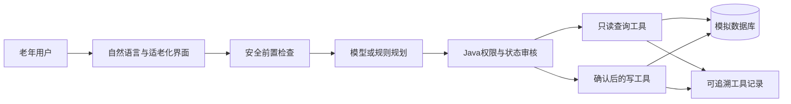

# 银龄复诊事项协同助手——企业命题组报名解决方案

**项目名称：** 银龄复诊事项协同助手
**参赛组别：** 企业命题组 产教协同创新组
**方案版本：** v0.1
**更新日期：** 2026年9月10日
**文档用途：** 报名系统“项目计划书或解决方案”的唯一可编辑正文

> 当前项目为比赛演示原型，医院、用户、号源、路线、提醒和通知使用模拟数据。本文区分已经实现、正在完善和后续规划，不把概念功能表述为完成成果。

## 一、命题理解与问题判断

老年人复诊并不只是“挂一个号”。一次完整复诊通常还包含选择医院和科室、查询号源、准备材料、检查日程冲突、安排出行、到院后寻找诊室、设置提醒和通知家属。现有能力往往分散在医院小程序、地图、日历和通信软件中，用户需要记忆办理顺序并在多个页面之间切换。

命题真正考察的也不只是大模型能否回答问题，而是智能体能否在自然交流、可靠办理和过程可验证之间取得平衡：既要听懂老人不完整、口语化和会临时改变的话，又不能虚构号源、误提交预约、越过医疗边界；还要让评委能够看到任务拆解、工具参数、返回结果和确认动作之间的对应关系。

因此，本项目把问题凝练为：**如何用一个低交互负担的自然语言入口，把分散的复诊事务组织成一项可暂停、可恢复、可修改、可确认和可追溯的协同任务。**

## 二、解决方案定位

本项目提供一个面向老年用户的复诊事项协同助手。用户既可以正常聊天、询问流程和材料，也可以在明确表达“我要预约复诊”后进入办理。系统围绕同一项复诊任务串联预约、材料、日程、出行、院内指引、提醒和家属通知，并在关键写操作前展示具体影响、等待用户确认。

方案不是医疗诊断助手，也不是把所有权限交给大模型的自由工具智能体。它采用“模型负责自然理解和低风险规划，Java 程序负责状态、权限、确认和写入，领域工具和数据库负责真实结果”的受控混合架构。

一句话方案：**让大模型负责听懂和规划，让程序负责把关，让工具负责事实，用一个适老化对话入口协同完成复诊前后的事务。**

## 三、目标用户与典型场景

主要用户是需要复诊但不熟悉数字化服务的老年人。家属或陪同人是经过授权的信息接收者，社区或医院协助人员可在用户无法独立完成时提供人工帮助。

例如，用户可以说：“我下周三想去市第一医院心内科复诊，上午方便，出发前提醒我，也告诉女儿。”系统保存已经明确的信息，只补问缺失项，并生成可持续更新的任务计划。如果用户中途说“我有点害怕去医院”，助手先进行支持性交流并暂停任务；用户说“继续刚才的办理”后，系统从原节点恢复，而不是重新开始。

## 四、总体解决方案

### 4.1 一个入口协同七项任务

系统把查询可预约日期、选择复诊时间、生成材料清单、检查日程冲突、生成出发建议、创建复诊提醒和通知指定家属组织为结构化计划。每项任务具有前置条件、状态、结果和失败恢复路径。

### 4.2 对话状态与任务状态分离

新会话默认只是普通交流，不会强迫用户选择医院。只有用户明确表达预约目标或点击开始办理后才创建预约任务。聊天、流程知识查询、材料查询和地图查询可以暂停任务但不会清空进度；用户明确停止当前办理后才取消未提交任务，已有预约记录不受影响。

### 4.3 受控工具调用

模型可以提出查询医院、科室、号源、本人预约、材料、办事流程、路线和院内位置等低风险只读工具。Java 程序校验工具白名单、参数、身份、当前阶段和调用次数后才真正执行。提交预约、取消已有预约、创建提醒和发送家属通知等写操作不允许模型直接执行，必须经过确认门禁。

### 4.4 院外路线与院内指引

出行能力分为两层。院外路线解决“什么时候出发、怎么到医院”，展示距离、预计用时、建议出发时间和路线步骤；院内指引解决“到医院后去哪里”，展示门诊楼、入口、楼层、诊室、报到点、无障碍路径和护士站。楼层房号来自数据库和工具结果，不由模型编造。

### 4.5 办事知识与医疗知识隔离

系统建立复诊办事知识库，回答预约流程、报到方式、材料准备和不清楚时去哪里咨询。知识库不保存诊断、用药和治疗建议，避免把事务协同扩展成未经验证的医疗服务。

## 五、关键机制

### 5.1 明确确认

确认卡展示医院、科室、完整日期和时间、陪同需求、建议出发时间、拟创建提醒、通知对象及可能影响。系统不把“好的”“继续”等模糊表达当作授权。每次确认绑定当前操作快照；用户修改参数或取消任务后，旧确认自动失效。

### 5.2 异常恢复

指定日期无号时查询前后 3 天；用户不接受换日期时提供换医院、重新选日或稍后再查。日程冲突时提供同日其他号源、重新选日或明确保留。修改医院或日期后，系统清除受影响的号源、材料和路线并重新计算。提醒或通知失败时保留已经成功的预约，只补办失败项，避免重复预约。

### 5.3 安全边界

系统不诊断疾病、不推荐药品、不调整剂量、不解读检查报告。明显紧急表达由确定性规则优先拦截，使旧确认失效并暂停普通流程，提示用户及时联系急救服务、身边人员或线下医疗机构。模型输出只是建议，预约成功、具体号源、路线、楼层和诊室均以工具结果为准。

### 5.4 规则回退

模型服务不可用时，规则规划器和回答模板继续支持核心办理路径，避免比赛现场因网络或模型接口异常导致整个演示瘫痪。模型适配通过通用网关配置，更换兼容模型不需要重写业务流程和工具权限。

## 六、适老化方案

界面采用大字号、高对比、较大点击区域和明确文字状态；回复使用短句，一次只提出一个主要问题。用户一次说出多项信息时，系统保存已知字段，不重复询问。首页提供下一次复诊摘要和常用入口，助手页承载对话与持续任务卡，事项页集中展示预约、材料、提醒和家属通知，出行详情页统一展示院外路线与院内指引。

当前适老化判断主要来自需求检查和页面视觉验收，后续需要通过真实老年用户试用验证独立完成率、补问轮次、误触次数、确认内容复述正确率、寻找诊室耗时和人工帮助需求。

## 七、相较普通方案的差异

| 普通方案常见做法 | 本项目的改进 | 带来的价值 |
| --- | --- | --- |
| 固定状态机始终追问下一字段 | 对话状态与任务状态分开，任务可暂停恢复 | 能承接闲聊、情绪和临时问题，不丢办理进度 |
| 大模型只能做意图分类和回复润色 | 模型可规划低风险只读工具，Java 保留写权限 | 比纯状态机自然，比自由工具智能体更可控 |
| 只提供院外地图 | 将路线与楼栋、楼层、诊室、报到点连接 | 把服务延伸到真正找到诊室 |
| 流程知识与医疗问答混在一起 | 办事知识和医疗知识隔离 | 回答“怎么办”有依据，同时守住医疗边界 |
| 演示依赖预写对话 | 模型建议、参数、工具结果和事项记录可关联 | 评委能够核验真实调用过程 |
| 绑定单一模型服务 | 通用适配器加规则回退 | 便于团队更换模型并提高现场稳定性 |

## 八、创新规划

当前已经实现的创新重点是对话任务双状态、受控混合智能体、办事知识隔离、双层到院指引、结果可追溯以及模型可替换和规则回退。

后续规划包括：材料图像识别，帮助视力不佳用户检查是否带齐材料；老人备忘和主动提醒，把明确的复诊待办转为可确认提醒；家属协同端，由家属创建草稿、老人确认后执行；评委视图，以时间线展示模型模式、权限判断、工具参数和返回结果；真实医院、地图、日历和通知平台适配。上述规划尚未全部实现，需要在身份授权、隐私保护和误操作防范机制完成后再纳入正式成果。

## 九、可行性与当前基础

项目采用前端移动界面、Java 模块化单体后端、可替换模型适配器和 H2 模拟数据库，适合在比赛时间内完成端到端验证。当前已具备多轮会话状态、预约及取消确认、号源与个人预约查询、材料、日程、路线、办事知识、院内位置和工具轨迹等基础能力。

截至 2026年9月10日，开发容器内后端 35 项自动测试全部通过，前端 TypeScript 检查和生产构建成功。真实接口验证表明普通交流不会自动创建预约任务，明确预约目标后任务才进入办理；查询楼层时可同时产生预约查询、路线规划和院内位置工具轨迹。

## 十、应用价值与推广路径

对老年用户，统一入口可以降低记忆办理顺序和跨应用切换的负担；对家属，经过授权的结构化通知可以减少反复确认时间地点；对社区、养老服务机构和医院互联网服务，工具化架构能够复用对话状态、确认规则和异常恢复机制，只需替换不同医院、地图、日历和消息平台的适配器。

方案可推广到慢病复诊、术后随访准备、康复治疗预约等流程明确且需要多方协同的事务场景。推广边界仍是行政和事务协同，而不是诊断和治疗。真实部署前需补齐身份认证、角色权限、数据最小化、日志脱敏、保存删除策略以及第三方平台授权。

## 十一、迭代计划

| 版本 | 主要内容 | 完成标准 |
| --- | --- | --- |
| v0.1 | 解决方案定位、当前架构、功能边界和创新初稿 | 与命题要求对应，已实现和规划明确区分 |
| v0.2 | 新 UI 设计稿、关键页面截图和评委视图 | 页面与方案截图一致，调用链可以核验 |
| v0.3 | 四组规定场景验收和六分钟录屏脚本 | 正常、无号、冲突、越界均可稳定复现 |
| v1.0 | 最终数据、团队信息、测试结果和答辩结论 | 解决方案、设计报告、PPT和录屏事实一致 |

## 结语

本项目的竞争力不在于叠加最多的功能，而在于把自然交流、真实工具、关键确认、异常恢复、到院指引和安全边界组织成一套可验证、可迁移的复诊事务协同方案。模型获得足够的理解和低风险规划空间，程序保留业务和安全控制权，工具与数据库提供可信结果，从而在“像人一样交流”和“像系统一样可靠”之间取得平衡。
