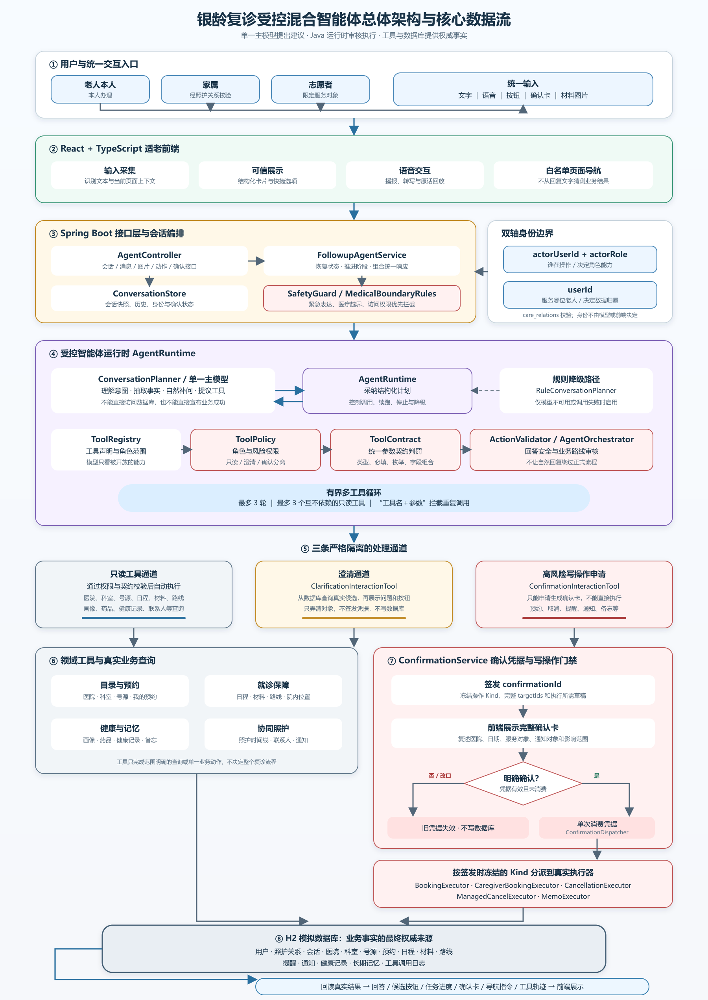

# 面向银发群体的复诊事项协同办理智能体设计思路报告

**项目名称：** 银龄复诊事项协同助手

**参赛组别：** 企业命题组 产教协同创新组

**文档版本：** v0.4【原写 v0.3】

**更新日期：** 2026年9月15日

**设计概述**

本项目面向老年人复诊过程中入口分散、办理步骤多、异常后不知道如何继续等问题，设计一套以自然语言和语音为主要入口的复诊事项协同办理智能体。用户只需说明“想去哪里复诊、什么时候方便、是否需要提醒和通知家属”，系统即可逐步补齐必要信息，将目标拆解为号源查询、时间选择、材料准备、日程检查、出行规划、提醒创建和家属通知等任务，并在产生实际影响的操作前请求用户明确确认。

项目采用“模型负责理解与建议，程序负责审核与执行，工具负责提供事实”的受控智能体架构。大模型用于理解口语化、多轮和不完整的表达，组织自然补问，并提出只读工具调用建议；Java 后端负责会话状态、任务依赖、权限检查、确认凭据和业务写入；H2 模拟数据库和领域工具提供号源、日程、路线、材料、预约编号和通知状态等可核验结果。模型不能直接提交预约，也不能仅凭生成文字宣布事项已经办成。

系统同时服务老年就诊人、家属和志愿者。老人端突出少输入、易理解和结果清晰，协同照护端支持经关系校验后为指定长辈查询或代办。当前项目是比赛演示原型，医院、号源、路线、提醒和通知均为模拟数据，不连接真实医院、地图服务、短信或即时通信平台，也不提供疾病诊断、用药调整和治疗决策。

## 一 需求分析

### 1.1 业务背景

老年人办理一次复诊，通常需要完成医院科室确认、号源查询、时间选择、材料准备、日程协调、出行安排、提醒设置和家属沟通。现有服务往往分散在医院小程序、地图、日历和通信软件中，用户不仅要在多个页面之间切换，还要记住先后顺序和各项结果。对不熟悉智能手机的老人而言，真正困难的往往不是某一个按钮，而是如何把多个步骤组织成一件完整的事情。

复诊办理还具有明显的不确定性。指定日期可能没有号源，所选时间可能与已有日程冲突，工具可能暂时失败，用户也可能在中途改变医院或日期。传统表单通常只能返回失败信息，无法根据已经完成的步骤继续提供替代方案。智能体因此需要具备持续保存任务状态、解释异常原因和恢复办理的能力。

### 1.2 核心需求

| 需求方向 | 具体要求 | 本项目的设计回应 |
| --- | --- | --- |
| 需求理解 | 理解口语化、不完整和分多次表达的需求 | 从当前输入和近期上下文提取结构化事实，并保留已知信息 |
| 主动补问 | 补齐医院、科室、日期及协同偏好 | 由程序检查缺失字段，一次聚焦一个主要问题 |
| 任务拆解 | 形成清晰、可修改的办理计划 | 用七项核心任务表达步骤、依赖和执行状态 |
| 工具调用 | 实际生成参数、调用工具并接收结果 | 工具通过 H2 模拟业务环境真实读写并记录轨迹 |
| 用户确认 | 关键操作前说明内容和影响 | 使用确认卡和一次性确认凭据控制写操作 |
| 异常恢复 | 无号、冲突、失败或改意图后继续服务 | 保留有效结果，给出换时段、换日期、重试或取消路径 |
| 适老反馈 | 输入简单、表达明确、结果易读 | 语音入口、大字号、少量按钮、朗读和事项卡 |
| 服务边界 | 不提供诊断、用药和治疗决策 | 安全规则优先拦截越界及紧急表达 |

### 1.3 设计目标

项目以“可靠完成一项复诊事务”为主要目标，而不是单纯追求对话流畅。系统需要让用户随时知道当前在办什么、已经确定什么、还缺少什么、下一步有哪些选择，以及确认之后会发生什么。预约是否成功、提醒是否创建、通知是否生成，都必须以工具和数据库结果为准。

系统还需要满足比赛演示的可验证性。评审能够看到模型当场提出的工具参数、后端的校验和真实返回，以及这些结果如何进入任务状态和最终事项卡。普通交流、只读查询、草稿修改和业务写入应有不同的权限边界，避免一次模型误判直接产生实际影响。

### 1.4 项目范围

项目不训练专用大模型，不需要收集训练数据，采用通用模型、规则规划器和业务状态机完成方案。当前使用 Java 17、Spring Boot 3.5.6、React 19、TypeScript、vinext/Vite 和 H2 构建演示系统。模型通过可替换的兼容接口接入，未配置模型时可以回退到规则与模板模式，保证核心办理路径仍可演示。

健康数值记录、备忘、药品资料查询、材料拍照和语音朗读属于围绕老人实际使用场景扩展的辅助能力。它们不能替代命题要求的复诊主流程，也不能突破医疗服务边界。

## 二 用户角色

### 2.1 老年就诊人

老年就诊人是主要服务对象。他们需要用尽量少的输入表达复诊目标，清楚理解系统提出的问题、候选时间和操作后果，并能在任务完成后快速找到预约时间、医院科室、材料和出发时间。系统允许老人通过文字或语音交流，在中途询问流程、表达担忧或暂停办理，而不必重新填写全部信息。

老人本人负责提供需求、补充必要信息、选择候选方案，并对预约、改期、取消、提醒和通知等关键操作作出明确确认。助手负责减少操作负担，但不能替老人作出授权决定。

### 2.2 家属或陪同人

家属希望及时了解长辈的复诊安排、陪同需求和变化，也可能在长辈不便操作时协助办理。家属进入协同照护端后，只能选择与自己存在预设照护关系的长辈。代办确认卡同时展示操作者和服务对象，预约记录保留代约归属，避免把家属自己的数据与长辈的数据混在一起。

### 2.3 社区或医院志愿者

志愿者可协助其结对范围内的老人办理复诊事项。一次会话只绑定一位长辈，后端按关系记录核验可服务对象。志愿者与家属使用相同的核心任务流和确认机制，但不能查看或操作未建立关系的老人数据。

### 2.4 演示与维护人员

演示与维护人员负责配置模拟医院、号源、日程、路线和联系人，复现正常办理、指定日期无号、时间冲突和医疗越界四类场景，并核对工具轨迹与数据库结果。他们不参与用户医疗判断，也不通过直接修改业务结果替代正常办理流程。

### 2.5 操作者与服务对象分离

会话同时记录“谁在操作”和“为谁办理”。前者决定角色和可见能力，后者决定预约、日程、提醒等工具实际读取哪位用户的数据。代办关系由后端根据 `care_relations` 核验，业务主体由会话状态注入，模型不能通过修改参数把查询指向另一位长辈。

这套设计使老人本人、家属和志愿者可以复用同一个智能体核心，同时保持数据边界。当前身份选择仍是比赛模拟入口，不等同于真实登录认证；正式应用还需要补充可信身份、授权申请、撤销和审计机制。

## 三 智能体架构

### 3.1 总体架构

系统采用移动端前端、Java 模块化单体后端、可替换模型适配器和 H2 模拟数据库。对于以完整业务链路和异常复现为重点的比赛原型，模块化单体便于统一维护会话、事务和工具记录，也降低了多服务部署与调试成本。

整体处理链路为：用户输入先经过身份和安全检查，再进入模型或规则规划器；规划器提出回答、补问、只读工具调用或业务动作建议；Java 运行时审核工具、参数、角色和当前任务阶段；只读工具可以在审核后执行，写操作则进入业务状态机和确认门禁；最终以工具返回和数据库状态生成回复、计划卡或事项卡。

### 3.2 分层职责

| 层次 | 主要组件 | 主要职责 |
| --- | --- | --- |
| 交互层 | 老人端、协同照护端 | 接收图片、文字和语音，展示对话、计划、确认、异常和结果 |
| 接口层 | Spring Boot API | 接收请求、恢复会话、返回统一响应结构 |
| 规划层 | `ConversationPlanner`、模型网关、规则规划器 | 理解表达，生成回复或提出工具和工作流建议 |
| 控制层 | `AgentRuntime`、`ToolPolicy`、`ActionValidator` | 校验工具白名单、角色、参数和副作用等级 |

【建议修改为：上表控制层原写 `ToolContract`，这个类在当前代码里已经不存在。实际分工是：工具白名单与副作用等级在 `ToolRegistry` + `ToolPolicy`，参数与阶段校验在 `ActionValidator`，编排与工具分发在 `AgentOrchestrator`，控制层由这四个组件共同承担。】
| 业务层 | 会话状态、确认服务、业务执行器 | 管理任务阶段、依赖失效、确认和写操作执行 |
| 工具层 | 预约、日程、出行、通知等领域工具 | 读取或写入模拟业务数据，返回结构化结果 |
| 数据层 | H2 数据库、会话与工具记录 | 保存权威业务事实、任务状态和调用证据 |

### 3.3 模型与程序的分工

大模型擅长理解“最近医生让我再去看看”“下周三有空，帮我弄一下”这类口语表达，也适合组织自然补问和解释工具结果。但模型输出具有不确定性，因此不能拥有最终写权限。医院、科室、日期、医生号源和工具参数要经过 Java 校验；预约成功、提醒创建和通知结果必须来自工具。

Java 程序负责确定性规则，包括必填字段、状态转换、身份权限、确认凭据、执行前时段检查、重复提交保护和异常收尾。模型提出的动作只是建议，只有通过运行时审核后才能进入工具或工作流。

### 3.4 上下文和记忆

系统每轮向模型提供稳定规则、当前会话身份、结构化任务状态、必要工具结果和近期对话，而不是无限累积全部历史。默认近期上下文为 16 条消息，既保留多轮表达，又控制无关内容和成本。

跨对话偏好只记录已经确认并实际办成的医院、科室和常用时段，用于下次少问一句。未确认草稿不进入长期偏好，历史偏好也不能自动成为本次安排。用户可以查看并忘记相关记录，所有业务写操作仍需依据本次明确意愿。

### 3.5 过程可见与回退

助手页可展示本轮“理解需求、决定查询、提出工具参数、工具返回、整理结果”等进度。这里展示的是外部可核验的操作事件，不展示模型隐藏推理。模型不可用、输出非法或续跑超过限制时，系统使用规则规划器和权威工具结果回退，不能用自由生成的内容补写业务事实。

> 【建议加上这一节】

### 3.6 两条链路：模型链路与规则链路

3.3 说的是分工，这一节说的是**模型出问题的时候怎么办**。

系统实际有两条链路，同一个入口按当轮情况现算：模型可用就走模型链路，模型不可用、超时或返回内容不合格式，就自动退回规则链路。两条链路最大的差别在**「事实」从哪儿来**——模型链路下，这一轮的医院、科室、日期、时间都来自模型返回的结构化结果；规则链路下是程序自己从原话里抽的。由此带来一个容易被忽略的后果：**模型链路下程序基本不解析自然语言**，模型漏掉一个字段，身后没有任何东西会补它。

为把这条缝补上，我们加了四层保障：

- **时间漏了就从原话里再抽一次。** 原则是只补空、绝不覆盖模型已经给出的值。钟点解析全项目只保留一份实现，长期备忘和预约办理共用，能认中文数字（「三点半」）、「一刻 / 三刻」以及「上午 / 下午」这类时段词。
- **时段词按整句判断。** 老人说「我要下午的三点半的」，「下午」和「三点半」中间隔着一个「的」，只看紧挨着钟点的两个字会算成凌晨 3:30，接着按最近的号源一推，就把下午的号推成了上午的号。
- **权威清单不由模型复述。** 可选日期改由程序直接出清单：日期是数据库里的事实，模型随口编一个库里没有的日子，老人照着点、下一轮查到「这天没号」，等于白跑一趟。
- **半天档位两个模式共用。** 日期定了、还没选具体钟点时，「上午 / 下午 / 直接选择具体时间」这三个按钮原先只在规则链路里出现，模型链路下老人手上是空的；现在两条链路发同一套候选，模型怎么组织问句都不影响老人有没有按钮可按。

顺带一个小口径：老人说的科室简称（「呼吸科」「消化科」）和目录里的全称**互不为子串**，靠包含匹配两个方向都兜不住，所以在目录前面加了一张别名表做一级跳转；跳转之后仍要回真实目录核对，恰好一条才认。**补别名是为了认得出来，不是为了把校验放松。**

> 【建议到此结束】

## 四 任务拆解机制

### 4.1 从表达形成结构化任务

系统从用户当前输入和上下文中识别医院、科室、期望日期、医生、时段偏好、是否接受其他日期、是否需要陪同、是否需要出行提醒、交通方式和是否通知家属。医院和科室必须与模拟目录核对；简称只有唯一近似候选时仍要复述，多候选时让用户选择，不能直接创造一个不存在的实体。

陪同、替代日期和通知等字段区分“还不知道”和“用户明确不需要”。例如用户说“不需要通知女儿”是一项有效决定，不能当作缺失信息再次追问；用户之后改变意愿时，系统更新草稿并使相关旧计划和旧确认失效。

### 4.2 七项核心任务

| 任务 | 前置条件 | 输出和影响 |
| --- | --- | --- |
| 查询可预约日期 | 医院、科室、医生信息和期望日期明确 | 返回真实模拟号源；无号时查询替代日期 |
| 选择复诊时间 | 已获得候选时段 | 保存具体 `slotId`，此时尚未预约 |
| 生成材料清单 | 医院和科室明确 | 返回材料项目、必带标记和准备状态 |
| 检查用户日程 | 已选择具体日期时间 | 返回冲突事项，交由用户决定是否调整 |
| 生成出发建议 | 预约时间、地址和交通方式齐全 | 返回路线、预计耗时和建议出发时间 |
| 创建复诊提醒 | 方案已经确认且预约成功 | 创建材料准备提醒和可选出发提醒 |
| 通知指定家属 | 通知对象明确且用户授权 | 生成包含时间、地点和陪同需求的模拟通知 |

任务顺序由依赖关系决定。例如没有具体号源就无法准确检查日程，没有预约结果就不应创建关联提醒。因此计划允许用户取消、修改和重新安排具体内容，但不提供无意义的自由拖拽排序。

### 4.3 对话状态与任务状态分离

系统分别维护对话模式、任务状态、办理阶段和会话生命周期。普通聊天不会自动创建预约任务；只有用户明确提出预约目标后，任务才进入办理状态。中途闲聊、询问材料或表达担忧时，任务可以暂停并保留原节点；用户选择继续后从原阶段恢复。

已关闭会话允许回看但不能继续写入，空闲超时只改变显示状态，不销毁尚未完成的草稿。停止当前办理只清理未提交任务，取消已有预约则必须经过另一条查询和确认路径。

### 4.4 依赖失效与重新规划

修改医院会使原科室、号源、材料和路线失效；修改日期或时段会重新查询号源、检查日程和计算出发时间；修改通知对象会重建通知内容。任何影响确认卡事实的变更都会废止旧确认凭据，避免用旧授权执行新方案。

系统通过统一的一份演示时区时钟处理提示词日期、相对日期、号源查询和执行前时点校验，默认业务时区为 `Asia/Shanghai`。确认卡保存绝对日期和时间，跨午夜后不重新解释“明天”；建卡和执行时都要检查号源是否仍有效、时段是否已经过去。

【建议修改为：原写 `BusinessClock`，这个类在当前代码里也不存在。演示时区时钟实际在 `MemoParser.DEMO_ZONE` 与 `MemoParser.nowInDemoZone()`——多个模块共用一个时区常量，历史上它落在备忘解析器里，一直没有单独抽成类，健康数值等模块也在用它。】

## 五 工具设计

### 5.1 工具设计原则

工具使用明确的结构化输入和输出，将自然语言规划与真实业务事实分开。每项工具标明参数类型、是否必填、允许值、可见角色和风险等级。工具名称只决定模型可以提出什么，执行时仍由后端重新校验权限、参数和当前阶段。

命题要求的四类工具全部通过本地程序和 H2 数据库真实执行。“模拟”表示业务数据和外部平台为比赛环境，不表示跳过调用或播放预先写好的对话。

### 5.2 核心工具

| 工具类别 | 主要输入 | 输出或副作用 |
| --- | --- | --- |
| 预约工具 | 医院、科室、日期、号源编号 | 查询号源；确认后提交、改期或取消预约 |
| 日程工具 | 服务对象、预约时间、提醒内容 | 查询冲突；确认后创建提醒记录 |
| 出行工具 | 出发地址、医院、时间、交通方式 | 路线、距离、预计用时和建议出发时间 |
| 家属通知工具 | 联系人、复诊安排和陪同需求 | 确认后写入模拟通知记录 |
| 材料工具 | 医院、科室和预约信息 | 材料清单、必带项目和准备状态 |
| 院内位置工具 | 医院、科室和号源关联位置 | 楼栋、入口、楼层、诊室和报到点 |
| 医院科室目录 | 用户说出的名称或片段 | 精确匹配、唯一近似、多候选或无匹配 |
| 办事知识工具 | 用户的流程问题 | 预约、报到、材料和咨询渠道信息 |
| 我的预约与历史 | 会话身份和查询条件 | 当前服务对象的真实预约记录 |
| 医生查询工具 | 医生、职称、号别与挂号费 | 某科室当天或未来几天出诊的信息 |
| 药品知识工具 | 药品信息 | 只回知识库里有的药，查不到就如实说没查到；不判断该不该吃、能不能加量、要不要换药 |
| 图片识别工具 | 图片/拍照上传 | 解释图片信息+安全边界保护 |

> 【建议在本表补上这两项：医生查询工具（医生、职称、号别与挂号费）与药品知识工具（只回知识库里有的药，不判断该不该吃、能不能加量），还有图片识别工具】

### 5.3 受控调用流程

模型先在当前允许的工具目录中选择工具并生成参数。例如查询号源时可以提出 `appointment.querySlots`，携带医院、科室和日期。后端检查参数类型、日期格式和工具权限，再解析医院科室并注入会话中的服务对象，最后执行 H2 查询。工具返回候选号源或空列表，系统据此更新计划，而不是由模型自行补出一个时间。

工具分为两类：`READ_ONLY` 工具可在审核后自动执行；`CONFIRMATION_ONLY` 工具只能申请或回应确认，不能直接写业务数据。模型提出“需要确认”不代表用户已经授权。

>【建议修改为两类：因为原文写的是「三条通道」，但我发现其中 `CLARIFICATION_ONLY` 这一等级在当前代码里并不存在（全仓检索不到这个标识符），现行只有上面这两类。它原来想承担的两件事也各有归属：「问清范围」由确认服务的范围参数承担，「展示真实候选」由只读查询工具和程序自己生成的候选按钮承担。】

同一轮中，模型可以根据一次只读工具结果继续提出下一项查询，例如先查指定日期，发现无号后再查附近日期。运行时限制连续调用次数，并拦截工具名和参数完全相同的重复请求。到达上限或模型续写失败时，直接使用最近的权威结果组织回复。

### 5.4 工具结果和调用轨迹

预约、提醒和通知写入产生业务编号或明确状态，工具调用记录保存到 `tool_call_logs`。前端可展示实际工具名、脱敏参数、真实返回值和成功状态，便于评审核对任务计划与执行结果。展示层会隐藏图片正文、完整手机号和疑似密钥，但界面脱敏不能替代完整的数据治理。

出行建议使用模拟路线耗时计算：建议出发时间等于预约时间减去预计路程耗时，再预留 20 分钟到院办理时间；出发提醒设置为建议出发时间前 10 分钟。以上是当前演示规则，接入真实医院和实时交通后应改为可配置策略。

> 【建议加上这一节】

### 5.5 号源从「一个号」改成「一位医生提供的一班名额」

这是我们对模拟数据层动得最大的一处，也是后面不少交互能力的地基。

原来的模型是：一条号源 = 某天某时的一个号，「这个号还在不在」由一个可以随手改的字段表示。现在改成**一条号源 = 一位医生在一个时刻里提供的一班名额**，号源上多了三样东西：

| 号源上多了什么 | 含义 |
| --- | --- |
| 医生与号别 | 这一班是哪位医生、出的是专家号还是普通号 |
| 这一班放几个号 | 按**号别**定：专家号 3 个、普通号 4 个 |
| 已经约掉几个 | 和上一项一起算出「还能不能约」 |

> 【建议到此结束】

> 【建议加上这一节】

### 5.6 推荐规则只写一份

「老人没点名医生时，每位医生只摆一个候选」这条规则，原来写在老人端助手服务里。加了医生维度之后问题来了：家属端也要推荐号源，如果那边另写一份，两个入口迟早给出不一样的推荐次序，甚至同一个老人的两个入口各说各话。所以这一步整体上移成一个共享的纯函数（`SlotRecommender`），两端调的是同一份。

- **排序**是六层严格顺序：可约优先 → 号型匹配（老人要专家号时专家号整体前移）→ 职称 → 就近日期 → 上午优先 → 同档位低价优先。挂号费永远排在最后，只在前面全部打平时才参与比较，不参与跨职称、跨号别的主排序。
- **去重**只在**没点名医生**时生效，每位医生只留最靠前的一条；老人点名了某位医生就不去重，把他的每个时段都摆出来挑时间。两条路的差别只在这一个开关上，所以规则必须收在一处。
- **它不碰数据库、不碰会话**，输入一组号源、输出一组号源，测试可以直接钉住推荐次序。

**家属端的号源按钮也跟着补上了医生。** 原来家属端看到的是并排两个「09:00」——一个上午确实有两位医生出诊，只给时间的话分不清点哪个、也不知道约的是谁。现在按钮上写全了「09:00 / 张建国 主任医师 · 专家号 · 挂号费 ¥40」。号别和挂号费都取自这条号源本身，不按医生职称推，将来同一位医生既出普通号又出专家号时这里不用改；拼接口径也收在一处，首页和事项页读同一份，不会出现一边写「专家号」一边写「EXPERT」。

> 【建议到此结束】

## 六 确认机制

### 6.1 必须确认的操作

复诊主流程中的提交预约、修改或取消预约、创建关联提醒、向家属发送信息，以及修改已确认的复诊计划，都必须在执行前获得用户明确确认。号源查询、材料查询、日程冲突检查、路线规划和院内位置查询属于只读操作，可以在形成方案时自动执行。

### 6.2 确认卡内容

确认卡以清楚、具体的方式展示即将执行的操作，包括服务对象、医院、科室、完整日期与时间、陪同需求、建议出发时间、拟创建提醒、通知对象、通知内容和可能产生的影响。按钮使用“确认办理”“返回修改”“确认取消预约”“保留预约”等动作名称，不使用“好的”“继续”等含义模糊的词代替授权。

取消预约时，确认卡基于数据库中真实存在的预约生成，并绑定具体预约编号。用户说“我不想弄了”只会停止未提交的当前任务，不会被直接解释为取消已经存在的预约。

### 6.3 一次性确认凭据

每次确认卡绑定唯一 `confirmationId`。一份授权同时保存凭据、动作类型和完整目标集合，即 `confirmationId`、`confirmationKind` 和 `confirmationTargetIds`。三者在签发时确定并随会话持久化，在消费、废止或任务变化时一起清除。

用户确认后，后端先校验会话是否可写、凭据是否匹配、授权类型是否可识别、目标集合是否完整，以及执行草稿是否仍与卡片一致。通过后凭据被单次消费，再由 `ConfirmationDispatcher` 根据签发时的类型交给相应执行器。重复点击、使用旧卡或恢复出缺少授权信息的旧快照，均不能再次执行。

### 6.4 执行阶段保护

预约提交前再次检查时段是否过期、号源是否仍可用；取消操作校验目标归属和当前状态；批量取消先校验整批目标，再在本地事务中处理。提醒使用稳定标识避免同一操作因重试而重复创建。确认负责证明用户授权，数据库事务和幂等规则负责保证执行一致性，两者共同构成保护机制。

目前集中确认门禁主要覆盖智能体复诊办理链路。独立照护页面接口和部分明确托付的备忘写入仍存在其他入口，正式完善时需要按操作风险逐项统一授权策略，不能笼统宣称系统内所有写入都已经经过同一凭据。

> 【建议加上这一节】

### 6.5 入口可以有两处，写路径只有一条

取消预约这件事，老人从哪儿都能点：事项页的卡片上有一个垃圾桶（就地弹窗核对一次，确认后直接调取消接口），卡片下方还有一条「让助手帮我取消」（把这句话递到助手页，由助手照常出确认卡）。

两条路**入口不同、落点相同**：最终调用的是同一个业务方法，同样按软删处理——状态置为已取消、当场释放号源、停掉关联提醒，记录本身留着不物理删。差别只在「谁来办」，所以按钮文字必须写明「让助手」：点下去突然换了页，老人第一反应是「我是不是点错了」，而不是「有人来帮我了」。

**两条路都保留了确认这一步。** 垃圾桶那条也不是「点一下就没了」——先弹窗把这次要取消的是哪一次写清楚（日期、时间、医院科室、医生），老人核对过再点确认。写操作必须经确认这条规矩，不因为换个入口就破例。这两条在功能上有重叠，后续可以只保留一条。

> 【建议到此结束】

## 七 异常处理

异常处理遵循三项原则：说明发生了什么，保留仍然有效的结果，给出数量有限且含义清楚的下一步。系统不能把失败改写成成功，也不能遇到异常后直接终止对话。

| 异常情况 | 处理方式 | 需要避免的行为 |
| --- | --- | --- |
| 信息不完整 | 保留已知信息，一次补问一个主要字段 | 虚构完整计划或办理结果 |
| 指定日期无号 | 查询后续可选日期并让用户选择 | 未经同意自动更换日期 |
| 日程冲突 | 展示冲突事项，提供换时段、换日期或明确保留 | 删除或覆盖用户原日程 |
| 工具调用失败 | 标明失败步骤，提供重试、修改或人工帮助 | 用自然语言假装工具成功 |
| 中途改变医院、科室、医生或日期 | 清除受影响结果并重新规划 | 沿用旧号源、旧路线和旧确认 |
| 取消当前办理 | 清理未提交任务并结束流程 | 同时取消已有预约 |
| 提醒或通知失败 | 保留成功预约，只补办失败事项 | 从预约提交步骤重新执行 |
| 旧卡或重复确认 | 拒绝旧凭据并重新生成确认 | 对另一目标执行原授权 |
| 时段过期或号源被占 | 返回重新选号状态 | 提交不可用号源 |

### 7.1 无号和冲突恢复

指定日期无号时，当前模拟工具向后查询 3 天的可用号源，不包含原日期，也不会把已经过去的时段作为候选。系统说明原日期暂无号源，再展示真实替代日期和时间。用户不接受换日时，可以修改医院、科室或稍后再查。

发现日程冲突时，系统展示冲突事项和时间，允许用户选择其他时段、其他日期或明确保留当前时间。原有日程始终保留；用户决定接受冲突时，确认卡继续显示该影响，避免冲突信息在最后一步消失。

> 【建议加上这一段，这一段算是详细解释吧，看你要不要加】

**冲突的判定口径：同一就诊人 + 同一天 + 同一时刻。** 检索时不再带医院和科室，只按日期取回这位老人的全部已确认预约，再比时刻是否相同。同时明确了两条边界：

- **同一天换时段仍然放行。** 上午看骨科、下午看呼吸内科是完全正常的需求，只有时刻撞上才自相矛盾。
- **改期不能把自己拦下来。** 比对时要把原来那条排除掉，否则「时间不动、只换医生」会被误判成冲突。

发现冲突之后系统不自动改、也不自动删，而是摆三条路让老人选：保留已有预约 / 重新选择时间 / 查看我的预约。提示话术也跟着改了口径：从「您已经有一条**相同**的复诊预约」改成「这个时间您已经有一条复诊预约」——跨科室的时候这两条其实并不相同，只是撞了时间，说「相同」是错的。

> 【建议到此结束】

### 7.2 部分成功与失败补办

预约成功而提醒或通知失败时，系统进入部分完成状态，明确列出“预约已保留”和“哪一项待补办”。后续重试只处理未完成事项，不再次提交预约。当前原型采用单实例、单数据库下的顺序执行和状态保留，尚未实现跨平台分布式事务或真实消息送达补偿。

改期时先验证并占用新号源，再处理旧号源和关联提醒。新时段不可用时保留原预约，不能让用户因一次改期失败而失去已有安排。

### 7.3 模型和安全异常

模型不可用或输出不符合工具契约时，系统回退到规则和模板路径。出现明显紧急情况或医疗越界请求时，安全规则优先暂停普通办理、废止旧确认并返回对应提示，防止用户在处理紧急问题时误触原来的预约操作。

## 八 适老化设计

### 8.1 交流方式

助手使用简短、明确的句子，一次只提出一个主要问题。用户一次说出多项信息时，系统保存已经明确的内容，只追问缺失部分。重要日期、医院科室、陪同和通知对象在确认前再次复述，并允许用户随时返回、修改、取消或请求人工帮助。

系统支持文字输入和按住说话。录音期间显示明确状态和音量反馈，允许上滑取消；语音消息保留原始录音，用户可以回放核对识别内容。语音输入对应的回复可以朗读，朗读优先使用设备本地中文语音，必要时使用云端合成。语音识别会受到方言、口音、噪声和设备能力影响，项目不宣称已经解决全部方言识别问题。

### 8.2 页面与信息层级

老人端首页给出「我的复诊预约」列表——每条已预约都摆出来、按预约时间正序，最上面一条就是他最近要去的那次；助手页承载对话、任务计划、异常卡和确认卡，事项页集中展示办成后的安排，出行页连接院外路线和院内指引，“我的”页集中管理字号、朗读和记忆。用户不需要在完成后从长对话中重新寻找时间和地点。

【建议修改为：原写「首页突出下一次复诊」，实际首页是「我的复诊预约」的全列表（只列已预约；取消过的记录后端仍留着，但首页和事项页都不再显示）。这里顺手修掉一个现成的 bug：原来取的是「最近**创建**的一条」（按创建时间倒序），不一定是最近要去的；现在按预约时间正序，「下一次复诊」就是列表第一条。首页和事项页读同一份数据、同一套过滤，取消之后广播一次事件两边同步，不会各说各话。】

完成后的事项卡至少包括以下内容：

| 事项卡内容 | 呈现原则 |
| --- | --- |
| 预约日期和时间 | 使用完整日期与明确钟点，作为视觉重点 |
| 医院和科室 | 使用统一名称，必要时补充楼栋、楼层和诊室 |
> 【建议加上这一行：医生姓名、职称和挂号费——老人拿到事项卡，第一眼要核对的就是「约的是谁」。】
| 医生姓名、职称和挂号费 | 明确显示 |
| 所需材料 | 逐项列出，区分必带与补充材料 |
| 建议出发时间 | 同时说明交通方式和预计耗时 |
| 提醒状态 | 分别说明材料提醒和出发提醒是否创建 |
| 家属通知状态 | 显示无需通知、已生成或待补办，不虚构送达 |

### 8.3 视觉和操作原则

关键内容采用较大字号、高对比度和足够大的点击区域，状态同时使用文字、图标和颜色表达，不只依赖红绿差异。页面提供特大字体模式，图标按钮具有读屏可识别的名称。同一界面突出一个主要动作，次要操作降低视觉权重，避免连续出现大量相似按钮。

### 8.4 适老验证计划

当前适老化结论主要来自需求检查、页面实现和手机视口验证，尚未完成真实老年用户研究。后续应在获得参与者同意的前提下，记录独立完成率、补问轮次、误触次数、关键安排复述正确率、寻找诊室耗时和人工帮助需求，并重点测试方言输入、弱网、低端设备和不同音频权限环境。

> 【建议加上这两节，但我不清楚要不要加】

### 8.5 一屏放几个按钮，是后端的设计约束

老人端助手页的快捷按钮一屏只渲染 3 个，超过 3 个会出现「查看更多选项」翻页。这是一条写死的前端约定，我们不打算改——一屏能放几个，本来就是屏幕和字号决定的，让每个页面各自想办法反而会乱。

于是分工问题就冒出来了：既然「一屏 3 个」是老人端的天花板，那「发几个、发哪几个」的决定权就该放在后端，前端只管渲染。演示里正好撞上这个坑：问科室那一步后端发了 4 个选项，被折进「查看更多选项」的偏偏是第 4 个「我自己说科室」，老人点开一看只有一个按钮，既不像「更多」，后面 3 个真科室也进不来。

后端因此动了两个地方：问科室改成一次摆出目录里的 6 个科室，第一页 3 个、「查看更多选项」翻到后 3 个，翻页这才有内容（原来占位的「我自己说科室」去掉了，老人本来就能直接说科室名，这个能力没丢）。

这也说明「适老」在这个项目里不是一句形容词，而是一条后端能遵守、也能检查的硬约束：每加一个候选，都要先回答一次「老人一屏看不看得完」。

### 8.6 关键信息不该跟着对话跑

办理中原来有一张「复诊办理待继续」卡，上面写着进度和两个按钮。问题是同一屏顶部的状态行已经在说「办理步骤：X」，下面这张卡又说一遍，一件事讲两遍，老人还得在两处分别找「继续」和「取消」。改法是把这张重复的卡删掉：办理中只看顶部状态行，「取消本次办理」挪到状态行右侧，只在办理中出现。

办成之后的绿色事项卡是另一个毛病：它放在对话记录里，属于「最近一轮」的东西，老人后面再问别的事，它就被一条条新消息往上顶。可这张卡恰恰是老人会反复回来看的——几点、哪个院区、几点出门，都不该让人回头去翻。改法是把事项卡从对话流里移出来，固定成一块不动的槽位。

> 【建议到此结束】

> 【建议加上这一节】

### 8.7 「推荐」这两个字，只在替你挑的那一轮说

助手什么时候该说「我推荐」，这件事我们绕了一圈才想明白。**「推荐」只在「自动推荐轮」说**——也就是老人没点名医生、也没说要哪个具体钟点、由助手替他挑候选的那一轮。老人一旦点了名（「我要看张医生」），后面就该说「按您说的给」；老人自己指定了时刻、或者在翻某个半天的清单，都同理，都不说「推荐」，说「按您说的给」。

**顺带报一句「当天还有几个时段」，报的是另一个半天。** 老人挑了上午，助手会补上一句「今天下午还有 2 个时段」，让他知道另一半也没空着。

> 【建议到此结束】

## 九 安全边界

### 9.1 医疗服务边界

智能体只负责复诊事务协同，不进行疾病诊断，不推荐药品，不调整用药剂量，不解读检查结果，也不替代医生作出治疗决定。用户提出相关问题时，系统说明服务范围，并建议咨询医生、药师或专业医疗机构。

用户描述胸痛、呼吸困难、意识异常等明显紧急情况时，确定性安全规则优先于普通任务流程。系统暂停办理，使尚未使用的确认凭据失效，并提示及时联系急救服务、身边人员或线下医疗机构。该机制属于风险提示，不能描述为医疗分诊或临床判断。

> 【建议加上这一段】
>
> **越界判定只留一份，口径是「默认怀疑」。** 原来模型链路和规则链路各有一套判定，词表写了两遍，迟早只剩一份是对的。现在收成一份规则表，两个入口都调它；口径也不是「命中关键词才拒绝」，而是默认怀疑——描述身体不适和疑问语气同时出现就判越界。这么定是因为两种错法的代价不对称：漏判等于把这句话当成普通信息咽下去，老人以为助手默认了这件事，比误判一次更糟。
>
> 同时**刻意放行两类正常的话**，否则办正经事也会被拦下：一类是「看看还有没有号」「还有几个能约的」这种报数、查数的话；一类是「我要挂心内科」这种办事句。这两类都要配上疑问语气才算越界。
>
> **越界提示只影响展示，不打断办理。** 命中越界之后，回复会带一块橙色提示卡，只说明「这条为什么不一样」；它不切办理阶段、不新建待办、不落库。还有一处容易忽略：这一轮会把**原来那张确认卡连同同一个凭据原样带回来**——否则老人问到一半，正要按的「确认办理」会跟着消失，而服务端那张卡其实一直有效。
>
> 【建议到此结束】

### 9.2 模型与工具边界

模型输出属于建议，不是业务事实，也不是用户授权。用户消息、图片文字和工具返回中即使包含指令性内容，也不能改变工具白名单、角色或副作用等级。预约、提醒、通知、路线、楼层和诊室等信息必须与工具结果核对，模型不能自行补写。

药品资料工具只返回人工整理的名称、规格、类别、用途和一般提醒，不回答“我该不该吃”“能不能加量”“能不能换药”。图片识别只读取可见信息；图片不清晰、资料不匹配或问题涉及个体判断时，系统应说明不确定并停止推断。

### 9.3 身份与数据边界

会话建立时核验操作者与服务对象的关系，工具可见性按角色过滤，执行时再校验身份和参数。该机制能够降低模拟环境中的越权和串号风险，但当前身份选择并不具备真实登录鉴权。正式部署前必须补齐可信账号、关系授权、撤销、审计，以及对独立页面接口和所有写入入口的统一鉴权。

启用外部模型后，本轮输入、近期对话和必要的业务上下文可能被发送到模型服务，因此不能宣称所有数据都在本地处理。接入真实个人信息前，需要落实数据最小化、用途说明、保存期限、删除机制和第三方授权。

### 9.4 日志与结果表述

当前办理过程展示会处理图片正文、完整手机号和疑似密钥，但原始日志、附件、异常信息和长期记录仍需系统性治理。演示场景重置接口会清理业务数据，只适合隔离的比赛环境，正式部署必须限制访问或关闭。

数据库中的提醒和通知记录只说明模拟工具已经执行，不证明消息到达真实设备或被对方阅读。真实平台接入后应分别展示“已创建”“已发送”“已送达”和“已读”，并建立重试和人工补救机制。

## 十 创新点

### 10.1 对话与任务双状态

系统把自然交流与复诊办理分开管理。用户可以在任务中途询问流程、表达担忧或暂时离开，任务暂停但不丢失；恢复后从原阶段继续。该设计避免传统固定问答流程吞掉闲聊，也避免普通聊天误改预约参数。

### 10.2 受控混合智能体

模型负责理解、补问和提出只读工具建议，Java 负责身份、状态、参数、确认和写入。相比完全固定的状态机，这种方案能够处理更自然的表达；相比把工具全部交给模型，它又把关键副作用保留在确定性程序中。模型可替换和规则回退进一步降低了比赛演示对单一服务的依赖。

### 10.3 面向操作对象的明确授权

确认不是一句由模型自由解释的“好的”，而是一份与动作类型、完整目标集合和会话状态绑定的程序对象。取消预约时先从数据库确定目标，签发后执行相同目标；恢复、重复点击和旧卡均按同一规则校验。该设计直接解决“卡片上看到的是 A，实际执行了 B”的风险。

> 【建议加上这一段】
>
> 这一条上再补一句：**入口可以有两处，写路径只有一条。** 取消范围先由模型归一成结构化范围（全选 / 日期范围 / 单条筛选 / 不明确），但事项页的垃圾桶和「让助手帮我取消」最终落到同一个业务方法、同样软删。
>
> 【建议到此结束】

### 10.4 操作者与服务对象双轴身份

系统分别判断谁在操作和本次服务谁，并由后端关系记录核验。本人办理与授权代办能够复用同一个任务流、工具和确认核心，同时将数据指向限定在当前长辈。该设计便于以后扩展家属和社区协同，而不必维护多套彼此不一致的业务规则。

### 10.5 院外路线与院内指引衔接

普通地图只解决“如何到医院”，老人到院后仍可能不知道从哪个入口进入、去哪一层和哪个诊室。项目将院外路线、建议出发时间与院内楼栋、楼层、报到点连接到同一事项中，使复诊协同从预约继续延伸到实际到院行动。

### 10.6 工具过程可核验

系统记录模型提出的参数、后端校验、工具真实返回和最终状态，并在助手页逐步展示。评审能够看到智能体当场工作，而不是只看到预写好的对话结果。这种设计也便于开发阶段发现参数错配、虚构成功和错误恢复问题。

### 10.7 克制的长期记忆

系统只从已确认并真正办成的预约中沉淀少量偏好，未确认草稿不写入记忆；偏好只用于减少重复提问，不自动替用户选择本次安排；用户还可以逐条忘记。其创新价值不在于记得更多，而在于控制“记什么、何时记、怎样删”。

> 【建议加上这一节：10.8 ~ 10.12 五条创新点】

先说清楚「冲突」这个词在我们这里的两层意思：一层是业务上真的撞车——同一时刻冒出两个号、指定的日子压根没号源、点名的医生当天不在；另一层是设计上的两难——模型自由发挥和事实准确怎么选，记忆用起来省事和不能替人做决定怎么平衡，适老想少放按钮和功能要摆得全怎么兼容。

两层看着不像一件事，处理办法其实是同一个：**凡是「两边都有道理」的地方，都把判断权收回给程序，并且让这个判断可验证、能写进测试。** 

### 10.8 号源是「一位医生的一班」

**我们的做法。** 号源改成「一位医生在一个时刻里的一班」：号源行带医生、号别和名额（专家 3 / 普通 4）；「还能不能约」从一个可以随手改的字段，变成算出来的结果（已约数 < 名额）。号别和格位绑定——专家格只在 09:00 和 14:00，普通格只在 10:30 和 15:30，于是上午下午各有一个专家号和一个普通号。

### 10.9 谁说这句话，谁就得能认这句话

**以前做法的问题。** 助手问「还是像以前那样去市第一医院吗？」，老人答「是的」，系统回「我还没有确认您说的是哪家医院」。查下来，说这句话的是润色环节（它看得到长期记忆里的常去医院），认这句话的环节手里一个候选都没有——**记忆被用在了「说」上，没被用在「记」上**。老人照着你刚说过的话答一遍，反而被退回重来。「和上次一样」这种说法更吃亏，五个字，什么判据都不满足。

**我们换的做法。** 把常去医院从「提示词里的一句话」变成「程序手里的一个候选」：读到记忆就把候选和按钮一起发出去（「是的，X」/「换一家医院」），老人点按钮，或者口头说「是的」「和上次一样」，都能落地。认领的兜底排在「刚问出口的那个候选」之后，不会盖过正常流程；记忆里那家已经不在目录里了，就一个字都不多说。

### 10.10 模型可以换，候选不能换

**以前做法的问题。** 接上大模型之后，系统实际是「每轮现算」的：这轮走模型、下轮可能退回规则。两条链路的「事实」来源不一样，如果按钮、日期清单、时间理解各说各的，老人看到的就是一个精神分裂的助手：助手列了三个日期、下面一个按钮都没有；助手问「上午还是下午」，老人说「我要下午的三点半的」，助手口头应了，下一轮却反问「我还没有确认您想要的时间」。

**我们换的做法。** 把「哪一步长什么样」拆开——**候选和权威清单归程序，措辞归模型**。可选日期直接由程序出清单，不让模型复述；半天档位（上午 / 下午 / 直接选具体时间）和号源按钮都接回模型链路，和规则链路共用同一套候选；模型漏了时间字段时，用程序自己的解析器从原话里再抽一次（只补空、不覆盖）；钟点解析全项目只保留一份实现，长期备忘和预约共用。

### 10.11 冲突的主语是「人」，不是「这条预约」

**以前做法的问题。** 判重复预约时把医院和科室也当成了条件，所以只拦得住「同一家医院、同一个科室、同一个时间」。换个科室、甚至换家医院，同一时刻照样放行。演示里就出现了一位老人名下两条 9月15日 10:30——骨科和呼吸内科。写这个条件时想的是「同院同科才算重复」，但它漏掉了最朴素的一点：老人只有一个身子。

**我们换的做法。** 把冲突的主语从「这条预约」换成「这个人」：口径收成「同一就诊人 + 同一天 + 同一时刻」，不看医院也不看科室；同一天换时段照旧放行（一天看两个科室是正常需求），改期时把原预约自己排除在外；撞上之后不自动改、不自动删，摆三条路让老人自己选。

补一句整体的话：10.8 是数据层的地基，10.9 和 10.10 管的是「模型和程序谁说了算」，10.11 是业务规则。它们不是五件不相干的事，串起来就是一句话——**把「模型能说什么」和「系统记下了什么、能不能做」彻底分开，同时不让分开的代价落到老人头上。**

> 【建议到此结束】

上述创新属于面向银发复诊场景的工程组合与机制设计，项目不宣称发明了新的基础模型、算法或行业协议。

## 十一 应用价值

### 11.1 对老年用户的价值

统一的自然语言入口降低了记忆操作顺序和跨应用切换的负担。一次只问一个主要问题、持续保存已知信息、异常后继续办理，可以减少重复输入和“失败后不知道怎么办”的挫败感。事项卡将预约、材料、出发和通知集中呈现，有助于老人复述和执行安排。

> 【建议加上这一段】
>
> 这里再补三句具体的：一是**不会出现「同一时刻两个号」**，老人只有一个身子，这条系统替他记住，省得跑两趟、也省得跟人解释；二是**事项卡的位置是固定的**，老人回头想看几点、哪个院区、几点出门，不用在对话里往上翻；三是**助手一屏最多只放三个按钮**，不用在密集的选项里挑。适老这件事，往往就落在这种很小的地方。
>
> 【建议到此结束】

### 11.2 对家属和志愿者的价值

经授权的家属或志愿者可以围绕指定长辈查看复诊动态、协助代办并留下结构化安排，减少口头转述造成的遗漏。操作者和服务对象分离，使协助过程具有明确归属，也为后续建设关系授权和社区协同服务提供了基础。

### 11.3 对医疗与养老服务机构的价值

系统可以作为复诊事务服务入口的原型，把重复的号源查询、材料说明、路线指引和提醒通知组织成标准流程，帮助工作人员把精力留给需要人工判断和情绪支持的情况。领域工具接口允许未来逐步替换为真实医院、地图、日历和通知平台，不需要重写自然语言入口和任务控制逻辑。

### 11.4 对教学与工程实践的价值

项目完整展示了大模型在真实业务中如何与状态机、权限、数据库和模拟工具协作。它不仅呈现“模型能说什么”，还呈现模型建议如何被验证、用户授权如何绑定、异常如何恢复、事实如何追溯，适合作为人工智能体、软件工程和适老化设计的综合实践案例。

### 11.5 推广前提与评估指标

当前原型能够证明设计链路和工程可行性，不能直接证明真实医疗环境中的效率提升或安全效果。推广前需要完成真实身份认证、授权治理、第三方接口可靠性、隐私评估和老年用户试用。

| 评估方向 | 建议指标 |
| --- | --- |
| 办理可靠性 | 数据库结果一致率、重复写入次数、未确认写入次数 |
| 异常恢复 | 无号和冲突场景的继续办理率、部分失败补办成功率 |
| 交互负担 | 完成时长、补问轮次、返回修改次数、人工帮助需求 |
| 适老可用性 | 独立完成率、误触次数、关键安排复述正确率 |
| 到院指引 | 找到入口和诊室所需时间、求助次数 |
| 多方协同 | 通知信息完整率、服务对象和代办归属正确率 |

本项目的应用价值建立在三个前提上：模型负责理解但不代替授权，程序负责把关但不增加不必要的操作，工具提供事实且如实报告失败。下一阶段应优先统一关键写入入口的授权规则，完成四类场景验收和真实适老测试，再逐步接入外部服务，使比赛原型转化为可持续使用的复诊协同方案。
