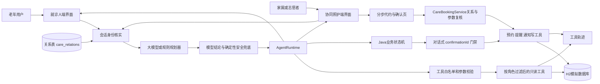
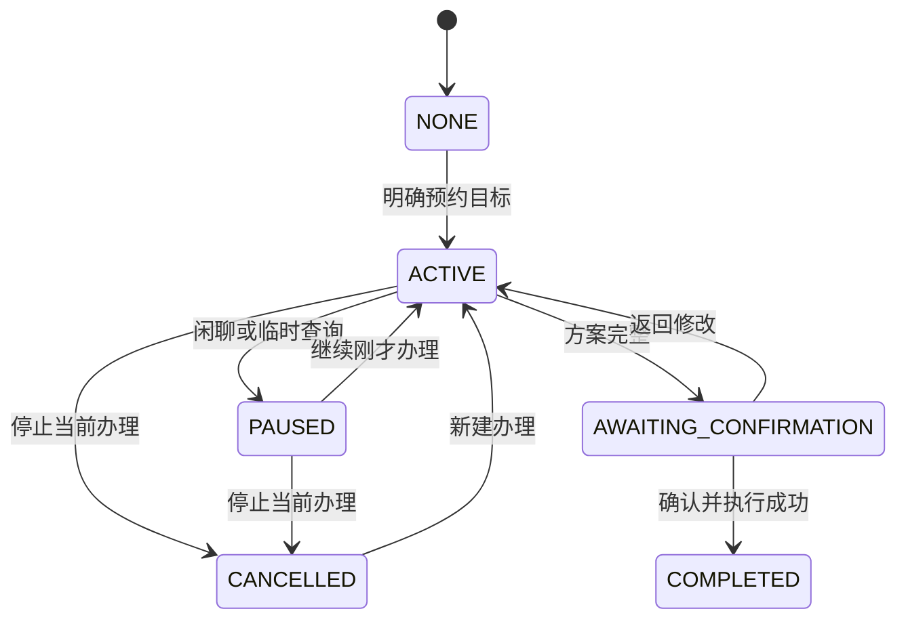

# 面向银发群体的复诊事项协同办理智能体设计思路报告

**项目名称：** 银龄复诊事项协同助手
**参赛组别：** 企业命题组 产教协同创新组
**文档版本：** v0.3
**更新日期：** 2026年9月13日
**修改人：** 蔡老师
**文档用途：** 技术设计、课程作业与比赛设计思路说明的持续更新主稿

> 本项目当前为比赛演示原型。医院、用户、号源、路线、提醒和通知均为模拟数据。报告将已实现能力、正在完善内容和后续规划分别说明，不将规划功能表述为已经完成。

## 设计摘要

本项目针对老年人复诊时“入口分散、步骤繁多、异常发生后不知道如何继续”等问题，设计并实现了一个以自然语言和语音交互为主要入口的复诊事务协同助手。系统将医院与科室选择、号源查询、材料准备、日程冲突检查、出行安排、提醒创建和家属通知组织为一项可暂停、可恢复、可修改的办理任务。预约流程之外，系统还支持记录血压、血糖等健康实测值，管理可重复的健康备忘，并在用户主动要求或每周定时任务触发时，将一定时间范围内的健康记录汇总后发送给家属。汇总仅进行次数、平均值及最高/最低值等算术处理，不评价指标是否正常。

项目采用受控混合智能体架构。大模型负责理解自然表达、组织补问、生成普通交流回复，并可提出调用低风险只读工具；Java 程序负责权限检查、业务状态、确认凭据和真实写入。预约是否成功、号源是否存在、楼层房间及提醒通知结果均来自工具和数据库，不能由模型自行宣布。

系统提供两个交互端：面向老年人的就诊人端，以及面向家属和志愿者的协同照护端。两端共用同一套用户、号源、预约、材料、路线和通知数据，也复用相同的领域工具。对话式办理统一进入智能体运行时和 `confirmationId` 确认门禁；协同照护端另有分步代约页面，在提交前展示完整确认页，并由 `CareBookingService` 在服务端再次校验照护关系、号源和参数后以事务方式写入。两条写入路径目前尚未统一为同一种确认凭据机制，这是现阶段需要继续收口的工程边界。

对话式办理将会话身份拆为两个相互独立的维度：**能力轴**回答“谁在操作”，决定提示词片段、工具可见性和权限判定；**数据轴**回答“本次服务谁”，决定工具实际读写哪位用户的数据。家属或志愿者代长辈办理时，后端依据 `care_relations` 表核验二者关系；未建立绑定关系的请求会被拒绝。模型可以提出查询参数，但不能改变会话中已经核实的服务对象。

与固定问答式办理相比，当前方案将普通对话与预约任务分开：用户明确说出预约目标后才创建任务；用户害怕、疲惫或临时询问流程时，任务转为暂停并保留原节点；用户选择继续后恢复办理。该设计既保留自然交流，也避免闲聊误改预约参数。

<!-- PAGE_BREAK -->

## 一 需求分析

### 1.1 业务问题

一次复诊通常涉及预约、材料准备、日程协调、出行规划、提醒设置和家属协同。相关能力往往分散在医院小程序、地图、日历和通信软件中，老年用户不仅要记住办理顺序，还要在多个页面之间切换，并自行处理无号源、时间冲突和信息不完整等情况。家属或志愿者代办时，还会增加“谁在操作、为谁办理、谁有权查看或修改数据”等权限问题。

命题要求智能体理解口语化、多轮且不完整的表达，主动补齐必要信息，生成至少七项任务计划，调用真实模拟工具，并在关键写操作前获得明确确认。系统还要处理异常、体现适老化，并在六分钟录屏中证明工具确实被调用，而不是播放预写对话。

### 1.2 核心矛盾

本项目的主要挑战不是生成一段像人的回答，而是同时满足三项约束：

- **交流自然。** 用户可能先聊天、表达害怕或询问流程，不会始终按照表单顺序回答。
- **办理可靠。** 医疗事务中的误预约、误取消、误通知和虚构成功都会造成实际影响。
- **过程可证明。** 评委需要看到任务拆解、工具选择、参数、返回值、确认和最终结果之间的对应关系。

因此，系统既不能完全依赖固定状态机，也不能把业务事实判断和写入权限全部交给大模型。较合适的方案是：由模型承担自然语言理解、补问和低风险查询建议，由确定性程序负责身份校验、状态流转、确认授权、数据库写入及最终结果判定。

### 1.3 需求与设计回应

| 命题要求 | 当前设计回应 | 验证方式 |
| --- | --- | --- |
| 理解口语和多轮表达 | 规划模型结合结构化状态与最近对话理解本轮目标 | 使用自然语句和插入式提问回归 |
| 主动补问缺失信息 | Java 检查必填字段，模型或模板一次补问一个主要问题 | 检查各阶段缺失字段与回复 |
| 七步任务拆解 | 维护预约、材料、日程、出行、提醒和通知的结构化计划 | 页面持续展示计划及状态 |
| 真实工具调用 | 数据库查询和写入产生参数、结果与工具轨迹 | 对照工具日志和数据库记录 |
| 关键操作确认 | 对话式预约、取消、改期、提醒和通知从确认端点执行，并校验 `confirmationId`；分步代约由独立确认页和服务端事务校验保护 | 重复确认、旧确认和代约越权回归测试 |
| 异常后可恢复 | 保留有效结果，提供换日期、换时段、重试或取消 | 四组场景重置接口与异常分支自动测试 |
| 适老化反馈 | 大字、高对比、短句、少量按钮、事项卡 | 真机与录屏视觉检查 |
| 医疗安全边界 | 模型判断与 Java 安全规则共同识别紧急情况和医疗越界；命中后由固定逻辑限制后续动作 | 越界与紧急语句用例 |
| 多方协同办理 | 家属和志愿者以双轴身份为绑定长辈办理；对话式入口复用智能体流程，分步代约入口复用领域工具和服务端关系校验 | 数据隔离、越权拒绝、代约归属与照护通知回归测试 |
| 日常事务承接 | 健康数值、重复备忘和健康记录汇总由确定性代码处理，模型只负责识别用户意图 | 记录、回看、修改、删除、手动汇总和每周小结测试 |
| 机械事务不交给模型 | 数值与时间由 Java 解析；解析不出来时给中性追问，不假称已经办妥 | 解析失败路径断言回复不含“已经记好” |

### 1.4 项目范围

当前原型不训练专用模型，也不接入真实医院、支付、短信或即时通信平台。系统使用模拟医院、号源、路线、联系人和通知数据完成端到端演示，并通过领域工具接口为后续替换真实平台保留边界。系统负责复诊事务协同，不提供疾病诊断、药品推荐、剂量调整、检查结果解读或治疗决策。药品知识查询仅返回项目知识库中的名称、规格、类别、用途和通用提醒；识图结果可能包含视觉模型基于预训练知识补充的图外说明，该口径尚未与药品知识库完全统一，详见第九章。

<!-- PAGE_BREAK -->

## 二 用户角色

| 角色 | 主要需求 | 权限和责任 |
| --- | --- | --- |
| 复诊人（老年人） | 少输入、少记忆，清楚知道下一步和办理结果 | 提出目标、补充信息、选择方案并确认关键操作；也可记录健康数值和管理自己的备忘 |
| 家属 | 及时了解复诊安排和陪同需求，并在长辈不便时协助办理 | 只能操作 `care_relations` 表中与自己绑定的长辈；写操作前必须看到明确确认页面或确认卡；不能直接浏览长辈的逐条健康记录 |
| 志愿者 | 批量协助其名下结对的多位长辈 | 与家属同一套能力与限制，一次会话只钉住一位长辈，数据互不串号 |

当前已经实现两个独立交互端。就诊人端面向老年人本人；协同照护端面向家属和志愿者，提供长辈列表、复诊动态、协同消息和分步代约页面。代办会话建立时，后端从关系表核实操作者角色和服务对象；后续查询和写入均以服务对象为数据范围。一个照护者可以绑定多位长辈，但一次会话只固定服务一位长辈，避免跨会话串用数据。代约记录通过 `appointments.arranged_by` 保存操作者，陪同者通过 `appointments.accompanied_by` 保存；志愿者代约时可向家庭照护者写入协同通知。

协同照护端目前不提供逐条健康记录查询，但老人主动发送的健康汇总和系统生成的每周健康小结会进入家属通知记录。也就是说，“不能直接浏览原始明细”和“可以收到经汇总的结果”是两条不同的数据边界。

### 2.1 典型场景

用户可以直接说：“我下周三想去市第一医院心内科复诊，上午方便，出发前提醒我，也告诉女儿。”系统先保存已经明确的信息，再依次补问是否接受其他日期、是否需要家属陪同、交通方式等仍然缺失的字段；不会重复询问已经给出的内容。用户中途说“我有点害怕去医院”时，助手先进行支持性交流，并保留当前任务节点；用户随后说“继续刚才的办理”，系统从原节点恢复，而不是要求重新开始。

协同照护端中，女儿选择“家属”身份后，系统读取其绑定的长辈列表，并要求明确本次服务对象。此后的预约查询、代约、提醒和动态查询都以该长辈为数据范围。她询问“长辈下次复诊是什么时候”时，系统查询长辈名下的预约，而不是操作者自己的数据；她说“提醒我妈明天上午带身份证”时，系统把内容写入长辈的备忘，并在协同通知中保留来源说明。

代约有两种入口：在照护端助手中发起时，沿用对话式确认卡；在“帮助预约”分步页面中发起时，依次选择医院、科室、日期和号源，最后在确认页核对后提交。后者使用 `CareBookingService` 完成服务端关系校验和事务写入，但当前没有使用对话入口的 `confirmationId`。报告后文将这两条路径分别表述，避免把“复用领域工具”误写成“所有入口共用同一道确认凭据”。

<!-- PAGE_BREAK -->

## 三 智能体架构

### 3.1 总体结构

系统采用移动端优先的前端界面、Java 模块化单体后端、可替换模型适配器和 H2 文件数据库。模型负责自然语言理解与规划；Java 运行时负责身份、安全、状态和副作用审核；领域工具负责查询或写入可验证的业务结果。

<!-- PDF_FIGURE:architecture -->

两个端建立对话会话时都要先确定操作者和服务对象：本人自办时二者相同；代他人办理时还要查询 `care_relations` 验证绑定关系。这一步决定模型可见的工具集合和服务端实际使用的用户范围，因此身份不是提示词中的一句说明，而是执行链路中的前置条件。协同照护端的分步代约页面不依赖对话会话，但每个查询和写入接口同样重新校验照护关系。

### 3.2 模型与 Java 的分工

| 能力 | 大模型 | Java 程序 |
| --- | --- | --- |
| 普通聊天与情绪承接 | 生成简短自然回复 | 检查安全边界和越权承诺 |
| 理解复诊目标和字段 | 从上下文提出结构化事实 | 校验医院、科室、日期及当前状态 |
| 选择只读工具 | 可提出白名单内工具及参数 | 检查权限后真正执行并记录轨迹 |
| 修改未提交草稿 | 可提出修改语义 | 清除受影响的号源、路线和旧确认 |
| 提交或取消预约 | 只能提出用户意图 | 生成确认卡，确认后调用写工具 |
| 判断成功与失败 | 不拥有最终决定权 | 以数据库和工具返回结果为准 |
| 会话身份 | 不能自行指定或更改 | 从请求与关系表核实，决定工具可见性和数据范围 |
| 健康数值与备忘 | 只判断“这句话属于哪件事”，不拆数值和时间 | 用固定解析器填槽、落库；数值异常时先反问 |
| 医疗与紧急边界 | 模型启用时识别灵活表达 | Java 执行固定的限制动作，并在模型不可用或遗漏时提供规则兜底 |

模型每轮可以直接回答、补问，提出单个或组合的只读工具调用，也可以建议进入某个业务工作流。当前共注册 17 个只读工具，其中 15 个两个端都能用，另外 2 个（复诊动态、协同通知）只对家属和志愿者可见。模型可见的工具由运行时按会话身份过滤后下发，老人本人看不到协同照护端的入口。

需要强调的是，**工具可见性过滤不等于安全控制**。工具目录只是模型能够看到的能力清单，执行时仍要重新检查角色、参数、当前阶段和副作用等级。对话工具读取的是会话中已经核实的服务对象，模型给出的 `elderUserId` 不参与数据指向；因此，即使模型生成了越权参数，也不能据此访问另一位长辈的数据。预约、取消、提醒和家属通知不在模型可自动执行的只读工具表中。

当前写操作有两种受控入口。对话式入口必须生成确认卡并校验一次性 `confirmationId`；协同照护端的分步页面则在最后一步展示确认内容，提交后由 `CareBookingService` 再次校验关系、号源和参数，并在事务中写入预约、提醒和协同通知。二者都要求用户先看到明确内容再提交，但只有对话式入口具备可消费、可失效的确认凭据。

一轮里模型不是只能调一次工具。它可以在同一个用户轮次内**先查一批、看到真实结果、再决定要不要接着查**：例如先查号源、发现没号、再查附近日期。循环有硬上限（最多 3 轮），并且按“工具名＋参数”拦截重复调用——同一件事不会因为模型反复选择而被查第二遍。这个循环只对只读工具有效，写操作永远不在其中。循环到达上限或模型续写失败时，直接返回最近一次权威工具结果，而不是重新执行查询或让模型自由发挥。

### 3.3 上下文和记忆

系统不会把全部历史对话每轮重复发送给模型。上下文由稳定规则、当前任务状态、已确认的结构化字段、最近 16 条消息（约八轮，可通过 `AGENT_MODEL_HISTORY_LIMIT` 在 4 到 40 之间调整）、必要工具结果摘要和本轮允许工具组成。事实权威顺序为：数据库与工具结果高于 Java 会话状态，Java 会话状态高于模型提取结果，旧对话中的说法最低。

会话身份（谁在操作、服务谁、二人是什么关系）也随会话一起持久化。这一点是被接口形状逼出来的：确认请求只带 `conversationId`，不带身份，如果身份只存在于当轮上下文里，确认执行时就没有办法知道该用哪个 userId 去写数据。因此身份必须放进 `ConversationState`，由后端在每次执行前重新读取，而不是依赖模型在对话里记住。

模型服务通过通用 `ModelGateway` 接入 OpenAI-compatible 协议，使用 `AGENT_MODEL_*` 环境变量配置。更换兼容协议的模型提供方时，业务工作流和工具权限无需随之改变。模型可用时，规划器可以直接回答、补问或提出只读工具调用，并在取得工具结果后继续组织回复；模型未启用或调用失败时，系统退回规则规划器和固定模板，核心预约流程仍可运行。无论采用哪条路径，预约、号源、提醒、通知和位置等业务事实都必须来自数据库或工具结果。

### 3.4 跨对话长期记忆

上下文之外另有一条记忆通道，用来解决一个很具体的问题：老人每次复诊都要重说一遍常去的医院和科室。

记的内容只有三类：常去的医院、常去的科室、习惯的上午或下午。写入口**只有一处**——确认门禁放行、预约真的落进数据库之后。草稿阶段一个字都不记：他这次只是随口问了问骨科，如果就记成“常去骨科”，下次助手会拿着一个过期的偏好替他做决定，这比少问一句的收益危险得多。模型和前端都够不着这条写入路径。

同一个键只保留最新一版。换一家医院再办一次，旧的偏好被覆盖而不是并存——两版偏好同时进提示词，模型只会更糊涂。「什么时候开始知道的」和「最近一次确认」分别记录，因为这是两件事。

用法上，记忆拼成一句话接在提示词末尾，措辞明确写着“以前办过的，仅供参考，不要当成这次已经定好的安排”。**记住不等于可以替他办事**：记忆不会绕过预约写入所需的确认和业务校验。没有记忆时这段是空串，提示词与没有这个功能时逐字相同。

老人自己能在「我的」页看到全部记忆并逐条忘掉，忘掉做成了两问（“确定忘掉 / 再想想”），因为这是不可逆的操作。“忘掉”对用户而言相当于删除，但实现上是软删除：该记忆不再展示，也不会再进入模型上下文。数据库不会物理清除记录，而是标记为已删除，以保留操作时间等审计信息。

### 3.5 实现底座

| 层 | 选型 | 版本或说明 |
| --- | --- | --- |
| 后端语言与框架 | Java + Spring Boot | Java 17、Spring Boot 3.5.x |
| 后端数据 | H2 | 演示用文件库；同一份 `schema.sql` 与 `data.sql` 建库播种 |
| 前端 | React + TypeScript | React 19；使用 vinext 组织应用，并由 Vite 8 完成构建 |
| 模型接入 | OpenAI compatible 协议 | 通过 `ModelGateway` 适配，厂商可替换；未配置时自动降级为规则模式 |
| 多模态 | 视觉 / 语音识别 / 语音合成 | 语音识别优先使用后端 ASR、不可用时退回浏览器识别；朗读优先使用浏览器本地中文语音、不可用时调用云端 TTS；识图没有本地替代能力，未开启时明确提示 |
| 运行环境 | Dev Container | 前后端两个独立进程，密钥经 `.devcontainer/.env` 注入且不入库 |

### 3.6 过程可见：一轮办理的实时进度

为证明系统不是播放预先写好的对话，助手页会把一轮请求中的关键过程按序号展示出来，包括理解请求、规划下一步、提出工具调用、取得真实工具结果和组织回答。前端通过「查看办理过程」卡片增量获取这些事件；本轮结束后，卡片收起为摘要。模型模式下，`TOOL_PROPOSED` 事件展示的是模型当轮生成的工具名和参数；规则回退路径同样记录实际执行结果，但不能据此宣称参数来自模型。

三个刻意的取舍：**只在内存**（进度是“此刻在发生什么”，进程重启后本来就无从谈起，落库反而会把工具参数多留一份；真正的调用记录仍由 `tool_call_logs` 负责）；**有界**（每个会话最多 40 条事件、最多同时跟踪 500 个会话，5 分钟没有新事件就不再认为“进行中”，兜住异常路径，免得页面一直转圈）；**读取时脱敏**（图片 base64 换成“（图片内容已省略）”，手机号按项目约定变成 `138****1234`，密钥样式的串一并抹掉，单字段截断 600 字）。内存里保留原始值供排查，经该进度接口返回的事件使用上述脱敏结果。

## 四 任务拆解机制

### 4.1 对话状态和任务状态分离

新会话默认处于普通交流模式，预约任务状态为 `NONE`。只有用户明确表达预约目标或点击“开始复诊办理”后，任务才变为 `ACTIVE`。中途聊天或临时查询不会清空数据，而是将任务置为 `PAUSED`；继续办理后恢复原阶段。取消当前办理后状态为 `CANCELLED`，但已有预约记录不会被删除。

在对话式入口中，老人、家属和志愿者共用同一套任务状态机。代长辈办理时，流程差异主要来自会话身份：系统不再追问“通知哪位家属”，而是在代约完成后按照护关系生成协同通知。协同照护端的分步代约页面不使用这套对话状态机，而是采用“医院—科室—日期号源—确认”四步页面流程；它复用相同的领域工具和数据库，但由 `CareBookingService` 单独编排。

草稿字段里有两个容易混淆的状态，系统把它们分开记：**“还不知道”**和**“已经明确不需要”**。例如“不需要家属陪同”是一个有效答案，不能和“还没问过陪同”混为一谈——否则助手会反复追问一件用户已经回答过的事，或者在用户没表态时自作主张按“不需要”执行。出发提醒同理：先说“不需要出行提醒”，之后又说“要提醒”，系统要能改回来，而不是把第一个“不需要”当成终态。

每一步该问什么、按钮怎么排，来自**规则驱动的模板**，不是让模型每轮自由生成。模型负责理解用户说了什么、决定下一步问哪一项，但“必填项有哪些、缺一项时该给出哪几个按钮”是确定性代码在管。这样既保留了自然语言入口，也降低了模型临时发挥导致漏问必填信息或生成无效选项的风险。计划中的步骤顺序由业务依赖决定（先有号源才能查冲突、先有预约才能建提醒），因此不提供拖拽排序——顺序本身不是可选项。

<!-- PDF_FIGURE:task_state -->

### 4.2 七步任务计划

| 任务 | 前置条件 | 输出和影响 |
| --- | --- | --- |
| 查询可预约日期 | 医院、科室、期望日期 | 返回真实模拟候选号源，无号时查询附近日期 |
| 选择复诊时间 | 已获得候选号源 | 保存具体 slotId，不等同于已经预约 |
| 生成材料清单 | 医院和科室明确 | 返回科室材料模板及必带标记 |
| 检查日程冲突 | 已选择具体时间 | 返回冲突事项，用户决定换时段或保留 |
| 生成出发建议 | 预约时间、地址和交通方式齐全 | 返回路线、耗时和建议出发时间 |
| 创建复诊提醒 | 用户确认且预约成功 | 写入材料准备提醒；用户需要出行提醒时再写入出发提醒 |
| 通知指定家属 | 用户授权且预约成功 | 写入模拟通知记录 |

### 4.3 依赖失效和恢复

修改医院会使科室、号源、材料和路线失效；修改日期或时间会重新查询号源，并重新检查日程冲突和出发时间；修改通知对象会更新待执行清单。对话式入口中，任何影响确认内容的变化都会使旧 `confirmationId` 失效。预约已经成功而提醒或通知失败时，系统保留预约并进入“部分完成”状态，后续只补办失败项目，避免重复提交预约。

## 五 工具设计

### 5.1 工具分类与输入输出约定

工具按业务职责划分为六类，并按具体操作区分查询、业务写入和确认交互。一个领域接口可以同时包含查询与写入方法，因此权限不能只按接口名称判定。

| 业务分类 | 领域工具 | 在复诊任务中的作用 |
| --- | --- | --- |
| 预约与日程 | `AppointmentTool`、`MyAppointmentTool`、`ScheduleTool` | 查询号源、核对已有预约和冲突，执行预约变更及创建提醒 |
| 医院目录与办事知识 | `HospitalCatalogTool`、`DepartmentCatalogTool`、`CareGuideTool`、`DrugKnowledgeTool` | 提供医院科室资料、流程说明及受限的药品事实查询 |
| 材料准备 | `MaterialChecklistTool`、`MaterialPreparationTool` | 生成材料清单，记录准备状态和照片 |
| 出行与到院 | `TravelTool`、`RouteGuideTool`、`FacilityGuideTool` | 计算出发建议，提供院外路线与院内位置 |
| 家属通知 | `FamilyNotificationTool` | 获取联系人、写入模拟通知记录 |
| 健康记录与备忘 | `HealthRecordTool`、`MemoTool` | 保存用户实测信息，管理一次性或重复备忘 |

以上共 **15个领域工具接口**。模型看到的是另一层注册清单：**17个 `READ_ONLY` 工具和2个 `CONFIRMATION_ONLY` 确认交互工具，共19个**；其中2个只读工具仅照护角色可见。领域接口、模型工具名称和应用服务并非一一对应，不能将数量相加或混称为“19个只读工具”。

| 调用类别 | 执行方式 | 约束范围 |
| --- | --- | --- |
| 模型只读工具 | 模型提出查询，程序校验后执行 | “只读”指不直接提交预约等业务写操作；调用日志和会话状态仍可能更新 |
| 确认交互工具 | 模型申请确认卡或表达对当前卡的回应，程序处理状态 | 不向模型开放底层写方法；同意当前卡后，程序可能继续执行已确认操作 |
| 领域业务写方法 | 由业务流程、页面操作或特定任务调用 | 确认及校验按入口实现，不是接口自身统一验证 `confirmationId` |
| 应用服务 | 编排多个领域工具或查询协同数据 | 协同动态、健康汇总等单独说明，不计入15个领域接口 |

下面的领域输入表使用真实 Java 参数名。除单独说明外，字符串为 `String`，日期为 `LocalDate`（表示为 `YYYY-MM-DD`），时刻为 `LocalTime`，日期时间为 `LocalDateTime`，列表为 `List<T>`。这些日期时间类型本身不携带时区；相对日期应先由上层按应用时间口径解析。

`conversationId` 是程序传入的会话或业务调用标识，用于关联记录和轨迹；下表为避免重复，将它列为公共参数，但只有方法签名实际包含时才传入。`userId` 是服务对象标识，代办时指长辈；操作者身份用于上层关系与权限判断。`hospitalId`、`departmentId` 是目录编号，`hospital`、`department` 在部分接口中是名称，必须经目录解析后正确传递。领域参数不是让用户手工输入的表单，也不等于模型可以任意提供的参数。

输出表描述方法的实际返回值。工具返回的业务对象、调用日志中的摘要，以及最终对话卡片是不同层次；当前并不存在所有工具统一返回的 `success/data/error` 对象。空列表、`null`、`false` 与异常各有含义，应分别处理，不能统一解释成成功。

### 5.2 领域工具逐项设计

#### 5.2.1 预约工具 `AppointmentTool`

**职责与来源：** 从 H2 号源表查询可选时段，并维护预约和号源占用状态。查询不预占号源，真正提交时仍可能因号源变化失败。

| 方法与操作 | 输入（另含公共参数 `conversationId`） | 输出 |
| --- | --- | --- |
| `queryAvailableSlots` 查询指定日 | `hospitalId` 医院编号、`department` 科室名称、`date` 日期 | `List<Slot>`，按时刻排序 |
| `queryUpcomingSlots` 查询日期区间 | `hospitalId`、`department`、`from` 起日、`to` 止日 | `List<Slot>`，日期范围含两端，按日期和时刻排序 |
| `queryAlternatives` 查询替代日 | `hospitalId`、`department`、`date` 原期望日 | `List<Slot>`，当前实现查询原日期后第1至第3天 |
| `submit` 提交预约 | `slotId` 号源编号、`userId` 就诊人 | 新建或已存在的预约编号 `String` |
| `reschedule` 改期 | `appointmentId` 原预约编号、`slotId` 新号源、`userId` | 保持原预约编号，返回 `String` |
| `cancel` 取消单条 | `appointmentId`、`userId` | 状态字符串 `CANCELLED` |
| `cancelAll` 批量取消 | `appointmentIds: List<String>`、`userId` | 实际取消的去重预约编号列表 |

`Slot` 包含 `id`（号源编号）、`hospitalId`、`hospitalName`、`department`、`date`、`time`。没有可用号源返回空列表，查询过滤已过去的时段。提交使用条件更新占用号源；不可用时抛出异常。取消释放号源并停用关联提醒，改期停用旧提醒，由上层继续安排新提醒。批量取消先检查整批归属与状态，任一目标失效则不完成整批取消。

**执行约束：** 对话写入由确认流程调用；照护端表单由独立业务服务调用。底层方法不接收 `confirmationId`，不能把接口本身表述为完整的用户确认机制。

#### 5.2.2 我的预约工具 `MyAppointmentTool`

**职责：** 查询已写入数据库的预约，不把对话草稿当作已办成结果。

**输入：** `search(conversationId, userId, date, hospital, department)`；`userId` 指定服务对象，日期、医院名称和科室名称用于筛选，无相应筛选条件时由上层按实现约定传空。

**输出：** `List<AppointmentSummary>`。每项包含 `appointmentId`、`hospital`、`department`、`date`、`time`、`status`、`departureAt`（出发时间）、`transport`、`reminderStatus`、`familyStatus`、`materials: List<String>`。没有匹配记录返回空列表。

**执行约束：** 只查询，不取消或修改预约；代办查询定位长辈数据，不能用操作者编号替代就诊人编号。

#### 5.2.3 日程工具 `ScheduleTool`

| 方法 | 输入（另含 `conversationId`） | 输出与影响 |
| --- | --- | --- |
| `findConflicts` | `userId`、`start` 计划开始时间、`end` 计划结束时间 | `List<Conflict>`；每项为 `id`、`title`、`startAt`、`endAt` |
| `createReminder` | `userId`、`title` 提醒标题、`remindAt` 提醒时间 | 提醒编号 `String`；写入状态为 `CREATED` 的提醒记录 |

冲突按时间区间重叠判断，首尾恰好相接不算重叠；无冲突返回空列表。创建提醒时从当前业务调用关联的已确认预约中取得预约编号，因此应在预约成功后执行。返回编号表示模拟提醒已创建，不代表设备已在该时刻发出通知。该工具负责预约提醒，独立健康备忘由 `MemoTool` 管理。

#### 5.2.4 医院目录工具 `HospitalCatalogTool`

**输入：** `listHospitals(conversationId)` 查询医院目录；`findHospitalsForDepartment(conversationId, departmentName)` 按科室名称寻找相关医院。

**输出：** `List<HospitalProfile>`，字段为 `id`、`name`、`level`、`address`、`description`、`specialtyTags: List<String>`（专科标签）、`elderlyServices: List<String>`（适老服务）。

**来源与边界：** 资料来自模拟医院目录。用于介绍医院和匹配科室，不根据症状作诊断或承诺治疗效果。模型侧的名称消歧还需目录解析逻辑配合，不是本接口另有一个 `search` 方法。

#### 5.2.5 科室目录工具 `DepartmentCatalogTool`

**输入：** `listDepartments(conversationId, hospitalId)`，医院编号应来自已解析的目录对象。

**输出：** `List<DepartmentProfile>`，字段为 `id`、`hospitalId`、`name`、`description`、`specialtyTags`、`followupScope`（复诊服务范围）、`location`（位置文字）。无匹配科室返回空列表。

**边界：** 仅提供该医院的科室资料，不把科室介绍当成诊断或医疗分诊结论；精确楼栋和诊室指引另由院内位置工具提供。

#### 5.2.6 办事知识工具 `CareGuideTool`

**输入：** `search(conversationId, query, hospital, department)`；`query` 为办理问题，医院与科室为检索上下文。

**输出：** `List<GuideArticle>`，每项包含 `title` 和 `content`，用于解释预约、材料、报到或咨询流程。

**来源与边界：** 检索团队维护的办事知识。没有检索结果时由上层说明未找到，不由模型补写医院具体规定。本工具不输出医疗判断，也不执行预约。

#### 5.2.7 药品知识工具 `DrugKnowledgeTool`

**输入：** `search(conversationId, drugName, specification)`；`drugName` 为药名或别名，`specification` 为规格文字。当前实现接收并记录规格，但匹配实际调用 `lookup(drugName)`，尚未按规格进一步筛选。

**输出：** `List<DrugKnowledge>`，最多3条，每项包含 `name`、`specification`、`category`、`purpose`、`reminder`、`followupTip`、`aliases: List<String>`。药名为空、关键词过宽或无匹配时返回空列表。

**来源与边界：** 从本地 `drug-knowledge.json` 检索名称与别名，支持部分去除剂型后缀的匹配。仅提供知识库事实，不回答是否应服用、是否换药或调整剂量。图像识别的来源边界另见5.6节。

#### 5.2.8 材料清单工具 `MaterialChecklistTool`

**输入：** `checklist(conversationId, hospital, department)`，使用医院与科室名称作为查询上下文。

**输出：** `List<String>`，各项为应携带的材料名称。

**职责与边界：** 生成办理准备清单，不表示材料已经准备。清单文字与某次预约的材料状态分开管理；状态初始化和更新由下一工具完成。

#### 5.2.9 材料准备工具 `MaterialPreparationTool`

| 方法 | 输入 | 输出 |
| --- | --- | --- |
| `initialize` | `conversationId`、`appointmentId`、`department`、`materialNames: List<String>` | `List<AppointmentMaterial>`；为尚不存在的材料创建初始记录 |
| `list` | `userId`、`appointmentId` | 该预约的 `List<AppointmentMaterial>` |
| `updateStatus` | `userId`、`appointmentId`、`materialId`、`status`、`confirmSource`、`photoUrl` | 更新后的 `AppointmentMaterial` |
| `photo` | `userId`、`appointmentId`、`materialId` | `Optional<String>`，有照片时返回图片 data URL，无照片时为空 |

`AppointmentMaterial` 包含 `id`、`appointmentId`、`materialCode`、`materialName`、`required: boolean`、`status`、`confirmSource`、`photoUrl`、`updatedAt`。状态支持 `NOT_PREPARED`、`PREPARED`、`PHOTO_CONFIRMED`；确认来源为 `USER` 或 `PHOTO`。更新时的 `photoUrl` 可承载图片 data URL或合法附件引用；持久化对象中的同名字段保存附件短引用，不直接保存图片本体。

**执行约束：** 列表、更新和照片读取校验预约归属。`list` 在旧预约缺少材料明细时会补建记录，因此它不是严格无副作用的读取；此接口未直接注册为模型只读工具。状态更新由相应业务交互触发，非法状态或不属于预约的材料会报错。照片用于材料准备确认，不代表医学内容已经审核。

#### 5.2.10 出发建议工具 `TravelTool`

**输入：** `plan(conversationId, userId, hospital, appointmentAt, transport)`，包括就诊人、医院名称、预约日期时间及交通方式。

**输出：** `TravelPlan`，字段为 `transport`、`durationMinutes: int`、`departureAt`、`summary`。

**职责与边界：** 在预约计划中生成简明耗时和出发建议；不创建提醒、不查询实时路况。当前出发时间计算使用模拟路线耗时及20分钟预留。

#### 5.2.11 院外路线工具 `RouteGuideTool`

**输入：** `plan(conversationId, userId, hospitalId, appointmentAt, transport)`。与 `TravelTool` 不同，此处医院参数为编号。

**输出：** `RouteGuide`，字段为 `transport`、`durationMinutes`、`distanceMeters`、`departureAt`、`origin`、`destination`、`polyline`、`steps: List<String>`、`source`。起终点为 `GeoPoint(longitude, latitude)`，折线为 `List<GeoPoint>`；距离单位为米，耗时单位为分钟。

**职责与边界：** 为出行页面提供可绘制路线及分步说明，不直接修改预约或提醒。上层可将它与院内位置组合成 `AppointmentTravelGuide`：包含 `appointmentId`、`hospital`、`department`、`appointmentAt`、`route`、`facility` 和 `simulated`。模拟路线不能作为实时导航结果。

#### 5.2.12 院内位置工具 `FacilityGuideTool`

**输入：** `find(conversationId, locationId, hospitalId, departmentId)`。提供 `locationId` 时按位置编号查询，否则按医院和科室编号查询启用的位置配置。

**输出：** `FacilityGuide`，包含 `hospitalId`、`departmentId`、`building`（楼栋）、`entrance`、`floor`、`room`、`checkInPoint`（报到点）、`landmark`、`accessibleRouteHint`、`helpDesk`、`verifiedAt`（资料核验时间）。

**来源与异常：** 数据来自 `clinics`。没有配置时抛出异常，由上层提示位置指引暂不可用，不允许模型自行编造楼层、诊室或报到点。

#### 5.2.13 家属通知工具 `FamilyNotificationTool`

| 方法 | 输入（另含 `conversationId`） | 输出 |
| --- | --- | --- |
| `findPrimaryContact` | `userId` | `Contact`：`id`、`name`、`relationship`、`maskedPhone`；未配置时为 `null` |
| `notify` | `contactId`、`message` | 模拟通知编号 `String` |

当前“主联系人”取该用户联系人中编号排序第一项，并非用户设置了专用主联系人标记。查询不发送消息；`notify` 写入 `family_notifications`，状态为 `SENT`，表示模拟发送记录已生成。同一会话、联系人和内容生成相同通知标识，以减少重复记录。

**执行约束：** 接收人归属和发送意愿由调用流程核实。对话预约通知、页面发送健康汇总及定时汇总的触发方式不同，不宣称工具内部存在统一确认卡。当前没有真实短信或通信平台送达回执。

#### 5.2.14 健康记录工具 `HealthRecordTool`

| 方法 | 输入（另含 `conversationId`） | 输出 |
| --- | --- | --- |
| `create` | `userId`、`item` 项目、`valueNum: BigDecimal`、`valueText`、`unit`、`rawText` 用户原话、`recordedAt` 测量/记录时间 | `HealthRecordStore.RecordView` |
| `recent` | `userId`、`item`（`null`表示不限项目）、`limit: int` | 按时间倒序的 `List<RecordView>` |

`RecordView` 字段为 `id`、`item`、`valueText`、`valueNum`、`unit`、`recordedAt`。复合值通过 `valueText` 保留，例如血压“130/80”；`valueNum`只承载其单个数值部分，不能认为它独自保存了完整血压信息。接口允许 `valueNum` 为空，实际办理是否落库由上层解析和校验决定。

**执行约束：** 当前对话通过固定解析器处理文本数值，对可疑或异常表达先反问；明确记录不统一经过预约确认卡。因此应描述为“按健康记录流程校验并写入”，而非“所有记录都须通过同一确认凭据”。保存实测信息不表示对健康状况作出诊断。

#### 5.2.15 健康备忘工具 `MemoTool`

| 方法 | 输入（另含 `conversationId`） | 输出 |
| --- | --- | --- |
| `create` | `userId`、`text`、`remindAt`、`repeatRule` | 新建的 `MemoStore.MemoView` |
| `active` | `userId` | 进行中的 `List<MemoView>` |
| `update` | `userId`、`memoId`、`text`、`remindAt`、`repeatRule` | `boolean`，表示是否更新到记录 |
| `remove` | `userId`、`memoId` | `boolean`，表示是否删除到进行中的记录 |

`MemoView` 包含 `id`、`text`、`remindAt`、`repeatRule`、`status`、`createdAt`。`repeatRule` 支持 `DAILY`、`WEEKLY`、`MONTHLY`，为空表示不重复；`remindAt`为空表示长期备忘、不按时提醒，有时刻且不重复时表示一次性提醒。

**执行约束：** 对话侧由备忘流程解析时间、补问并处理确认，底层工具不自行判断自然语言同意。修改或删除返回 `false` 时不能宣称已经成功。它与绑定预约的日程提醒是两类数据，不应混用编号。

### 5.3 模型可见工具及应用服务映射

下表完整列出19个注册工具。输入列是 `ToolRegistry` 声明的模型参数名，不是后端方法签名，也不表示这些字段全部必填；实际调用还会结合当前草稿、角色和数据库结果处理。输出列描述返回给上层的业务信息，不虚构统一的模型工具 JSON 响应结构。

| 注册工具 | 模型参数 | 输出内容及底层职责 |
| --- | --- | --- |
| `appointment.validateDraft` | 无 | 当前草稿完整性、缺失项及后续操作；由工作流校验，不提交预约 |
| `hospital.search` | `keyword` | 精确匹配、唯一近似、多候选或无匹配的目录解析结果 |
| `department.search` | `hospital`、`keyword` | 指定医院内的科室解析结果及候选 |
| `careGuide.search` | `query`、`hospital`、`department` | 办事文章，调用 `CareGuideTool` |
| `hospital.list` | `hospital` | 医院资料，配合目录解析与 `HospitalCatalogTool` |
| `department.list` | `hospital` | 科室资料，解析医院编号后调用 `DepartmentCatalogTool` |
| `appointment.querySlots` | `hospital`、`department`、`date` | 指定日 `Slot` 列表，调用预约查询 |
| `appointment.queryNearbySlots` | `hospital`、`department`、`date` | 替代日 `Slot` 列表；实现为向后3天，注册说明中的“前后”尚未与实现完全一致 |
| `appointment.checkDuplicate` | `hospital`、`department`、`date`、`time` | 重复预约检查结果及相应提示，由工作流查询已有预约 |
| `schedule.checkConflict` | `date`、`time` | 当前草稿对应的冲突事项，具体区间由程序构造 |
| `appointment.queryMine` | `date`、`hospital`、`department` | 当前服务对象的预约摘要列表 |
| `material.checklist` | `hospital`、`department` | 材料名称列表，不更改准备状态 |
| `travel.routePlan` | `appointmentId`、`transport` | 与预约关联的路线及出发建议，由出行服务组合领域查询 |
| `hospital.locationGuide` | `appointmentId`、`hospital`、`department` | 院内位置资料；程序解析预约或目录对象 |
| `drug.queryKnowledge` | `drugName`、`specification` | 药品知识列表；规格当前不参与底层匹配 |
| `care.timeline` | `elderUserId` | 复诊动态；仅家属/志愿者可见，实际服务对象取当前会话 |
| `care.notifications` | 无 | 当前操作者的协同通知；仅家属/志愿者可见 |
| `interaction.requestConfirmation` | `scope`、`date`、`direction`、`time`、`period`、`position`、`hospital`、`department` | 取消预约的目标范围、确认卡或澄清问题；不直接取消 |
| `interaction.respondConfirmation` | `decision` | 当前确认的同意/拒绝处理结果，由程序继续或终止相应操作 |

前17项为 `READ_ONLY`，末2项为 `CONFIRMATION_ONLY`。申请取消确认时，`scope`取 `ALL`、`DATE_RANGE`、`SINGLE_FILTER`或`AMBIGUOUS`；日期方向取 `BEFORE`、`ON_OR_BEFORE`、`AFTER`或`ON_OR_AFTER`。模型提供筛选条件，程序查找目标预约，不由模型指定取消目标编号。确认卡包含标题、操作明细、影响、确认/返回按钮文案及 `confirmationId`。回应参数 `decision`仅取 `CONFIRM`或`DENY`，凭据从当前会话取得，不由模型生成。

模型工具调用还依赖以下应用服务，它们不属于新增领域工具接口：

| 服务能力 | 输入 | 输出与约束 |
| --- | --- | --- |
| `CareService.timeline` | `caregiverId`操作者、`elderUserId`长辈 | `List<TimelineEvent>`，字段为 `at`、`tone`、`title`、`detail`；查询前校验绑定关系 |
| `CareService.notifications` | `caregiverId` | `List<NotificationView>`，字段为 `notificationId`、`elderId`、`elderName`、`content`、`sentAt`；通知围绕操作者归集，可能涉及其多个绑定长辈 |
| `HealthReportService.send` | `conversationId`、`userId`、`window`时间窗口、`item`项目筛选、`title` | `SendResult`：`sent`、`reason`、`contactLabel`、`rangeLabel`、`recordCount`、`message`；无联系人或无记录时说明未发送 |

健康汇总由页面、对话流程或每周任务触发，汇总次数和数值统计，不作医学判断；它没有作为独立工具注册到上述模型清单。语音和视觉属于输入输出服务，也不计入本节15个领域工具接口。

### 5.4 受控工具调用过程

<!-- PDF_FIGURE:tool_loop -->

1. 程序把本轮允许使用的工具说明和参数结构发送给模型。
2. 模型输出建议调用的工具和参数，或者直接回答、补问用户。
3. Java 解析模型输出，并检查工具是否在白名单中。
4. Java 校验用户身份、参数、当前阶段、调用次数和副作用等级。
5. 校验通过后，程序真正执行工具；对话式写工具必须先经过 `confirmationId` 门禁，分步代约写入则由确认页和 `CareBookingService` 保护。
6. 程序把工具名、序列化请求、返回结果和成功状态写入 `tool_call_logs`；实时进度接口读取时再按既定规则脱敏。
7. 权威结果用于生成回复、更新计划或进入下一步。

### 5.5 数据真实性与地图

医院、科室、号源、联系人、材料、路线和院内位置均来自 H2 文件数据库。预约、提醒、备忘、健康记录和通知会实际写入数据库，并生成对应业务记录。工具调用保存到 `tool_call_logs`，用于调试和录屏取证；当前数据库共包含 25 张业务表，完整字段与数据快照见 [H2 数据库全表与数据快照](14-database-table-data.md)。

出行页面分为院外路线和院内指引。院外路线展示数据库中的模拟折线、距离、预计用时、建议出发时间和路线步骤；未配置地图 Key 时使用明确标注的比赛模拟地图，配置高德浏览器 Key 后可以加载真实底图，但路线折线和耗时仍来自模拟数据，不能表述为实时导航或实时路况。院内指引通过号源关联 `clinics`，展示门诊楼、入口、楼层、诊室、报到点、无障碍路径和护士站，避免由模型凭空生成“几楼几号房”。

### 5.6 药品知识来源与识图边界

老人拿着药盒问“这药是干嘛的”是常见请求，但它与医疗建议只有一步之隔。因此，文字查询工具的边界被严格限定为“这是什么”：名称、规格、类别、用途和通用提醒均来自人工整理的 16 条慢病用药知识库，可逐条核对。

它不回答“我该不该吃”“要不要加量”“能不能换成另一种”。接口接收药名和规格两个参数，当前检索实际仅按药名匹配，规格只记录到调用轨迹；也支持部分去除剂型后缀后的口语简称；单次最多返回 3 条，且会过滤“片”“胶囊”等过于宽泛的关键词。知识库查不到时，系统明确说明未找到，并建议咨询医生或药师。

需要单独说明：图片识别走视觉模型，当前提示词要求名称、规格、数字和用法用量必须依据图片，但仍可能出现模型补充的图外用途说明。因此，“文字药品查询全部来自知识库”这一结论不能直接扩展到识图路径。该来源口径尚未完全统一，是当前明确保留的风险点。

### 5.7 号源与关键时点

演示用的号源不是静态表格，而是每天滚动补齐的：从当天起一个月内，每个启用科室在工作日生成 09:00、10:30、14:00、15:30 四个时段，周末留空——这个空档是故意的，用来稳定复现命题要求的“所选日期没有号”恢复路径。补齐用“不存在才插入”的写法，只补不覆盖，所以已经占用的号源不会因为重启而被重置。

三个与时间有关的数字全部由工具按固定规则算出，模型只能转述、不能自行调整：

| 项目 | 规则 |
| --- | --- |
| 建议出发时间 | 预约时间 − 预计路程耗时 − 20 分钟（预留取号时间） |
| 材料准备提醒 | 预约日前一天 |
| 出发提醒 | 建议出发时间前 10 分钟 |

把这三条写成规则而不是交给模型“估算”，是因为它们直接影响老人会不会迟到：路程耗时的估算可以讨论，但不能因为模型的措辞变化而上下浮动。

需要说明的是，当前是**单实例、单数据库、非分布式事务**的实现。预约、提醒和通知按顺序执行，部分失败时保留已成功的结果并标记待补办项（见第七章），但没有跨服务的分布式事务补偿机制。

## 六 确认机制

### 6.1 必须确认的操作

在对话式办理中，提交预约、修改或取消已有预约、创建预约相关提醒、发送家属通知以及修改已确认方案，都必须先获得明确确认。号源、材料、日程冲突、路线和医院科室资料属于只读查询，可以在形成方案时自动执行。

协同照护端的分步代约、修改和取消页面也会在提交前显示具体对象与影响，并要求用户点击明确按钮，但当前由页面确认后直接调用 `CareBookingService`，没有复用对话式入口的 `confirmationId`。材料准备状态更新、健康汇总发送等独立页面操作同样由用户点击直接触发。因而，本章所称“确认门禁”主要指 `/api/agent/*` 对话式写入链路，不能泛化为项目内所有写接口均使用同一种凭据。

### 6.2 确认内容

确认卡展示医院和科室、完整日期和时间、陪同需求、建议出发时间、拟创建提醒、通知对象、消息内容和可能影响。按钮使用“确认办理”“返回修改”“确认取消预约”“保留预约”等具体动作，不使用“好的”“继续”等模糊表达代替授权。

### 6.3 确认凭据

对话式确认卡绑定随机 `confirmationId`。确认接口会检查会话阶段、凭据是否匹配以及待执行对象是否仍然有效，并在执行前消费凭据。用户修改参数、取消任务或已经使用过凭据后，旧确认不能再次执行；取消已有预约时还会重新核对预约归属与当前数据库状态。预约、提醒和通知写入采用业务幂等或重复检查策略，降低重复点击和网络重试造成重复记录的风险。

### 6.4 权限分级

| 等级 | 能力 | 系统处理 |
| --- | --- | --- |
| L0 | 普通交流 | 模型回答，Java 检查安全承诺 |
| L1 | 只读查询 | 模型可提出，Java 校验后自动执行 |
| L2 | 未提交草稿修改 | 模型提出语义动作，Java 更新状态并清理依赖 |
| L3 | 预约、取消、提醒、通知 | 模型不能直接执行，必须展示并确认 |
| L4 | 诊断、用药和越权操作 | 拒绝执行并提供安全说明 |

上表回答的是“这件事有多危险”。代他人办理还多出一个维度：**“谁能办”和“能办谁的数据”是分开判定的**。

能力轴由操作者角色决定。老人本人、家属和志愿者获得的提示词片段与工具清单不同：家属和志愿者多出复诊动态、协同通知等查询能力，也可以给长辈留下提醒；老人本人可以管理自己的备忘、健康记录和健康汇总。数据轴由被服务的长辈决定，对话式工具的查询和写入都指向该长辈，而不是操作者。两个轴在会话建立时由后端依据 `care_relations` 核实并固化；要切换服务对象，需要建立或选择另一段会话。

这样切分有两个直接好处。一是对话式助手可以服务三种身份，不必为每种角色复制一套语义理解和工具注册逻辑。二是模型不能通过改变参数来切换数据对象：工具执行时仍使用会话中已经核实的 userId。未绑定长辈的会话创建请求会直接返回“没有权限查看这位就诊人的信息”，而不是一个含糊的空结果。分步代约接口不依赖会话身份，但会在每次调用时重新检查 `care_relations`，达到相同的数据隔离目的。

需要说明的是，确认机制设计的是**绑定当前方案**，而不是一套独立的数字计划版本或分布式账本：确认凭据绑定的是一份具体的、即将执行的操作快照，它防的是“拿旧授权执行新方案”。跨系统的强一致性与可审计账本不在当前范围内。

### 6.5 会话生命周期

一场对话需要有明确的生命周期，否则用户回看历史时无法判断哪一段还能继续。会话有三个状态：**进行中（ACTIVE）/ 已结束（CLOSED）/ 空闲超时（EXPIRED）**。

- **已结束的会话只能翻看，不能写。** 消息照常显示，但新消息、按钮操作和确认一律被拒；输入框会换成一条说明和一个“开始新的一段对话”按钮。这里的取舍是：**不把输入框摆在一个会被拒绝的地方**——让老人打完字才被拒绝，是最糟的一种交互。
- **结束不删除。** 旧的那段随时能从历史记录里点回来。
- **空闲超时只标记，不清理。** 默认 10 分钟没有活动后，会话被标记为 `EXPIRED`，但已经填写的草稿和待确认卡仍然保留；用户再次发送消息或执行确认时，会话恢复为 `ACTIVE`。超时阈值可通过配置调整。
- 被拒的那句话**不写进历史**。它是一次失败的调用，不是一轮对话；如果落库，一个还开着确认卡的老页面每重试一次就多一条一模一样的“已经结束”，真正聊过的内容反倒被复读淹掉。
- 刷新页面时尝试恢复上次那段会话，但**刻意不恢复已结束的**，理由同上：不让人一进来就掉进一个打不了字的页面。

前端的只读状态由后端返回的会话状态驱动，而不是去匹配那句拒绝文案——匹配文案等于把界面绑在措辞上，改一个字就失灵。

### 6.6 权限之外的两条诚实边界

- **“提醒已创建”不等于“提醒已触达”。** 系统能证明的是数据库里多了一条提醒记录，不能证明老人看到了、更没有证明他照做了。演示里所有涉及“通知家属”的表述都只到“已发送”为止。
- **“已发送的消息无法撤回”。** 取消预约时会停用关联提醒，但已经发出去的家属通知不会追回——这一点在确认卡上就写明了，不是取消之后才告知。

## 七 异常处理

异常处理遵循三个原则：说明发生了什么，保留仍然有效的结果，提供明确的下一步。

| 异常 | 处理路径 | 不允许的行为 |
| --- | --- | --- |
| 信息不完整 | 显示当前缺失字段，一次补问一项 | 虚构完整计划或成功结果 |
| 指定日期无号 | 只往后查 3 天（不含当天）并展示日期和时间；不接受换日时提供换医院或稍后再查 | 未经同意自动换日期 |
| 日程冲突 | 展示冲突事项，提供同日其他号源、重新选日或明确保留 | 删除或覆盖原日程 |
| 工具失败 | 记录失败步骤，提供重试、修改或人工帮助 | 把失败改写成成功 |
| 中途修改医院或日期 | 清除受影响的号源和出行结果，重新计算 | 沿用旧号源和旧确认 |
| 提醒或通知失败 | 保留已经成功的预约，重新确认后只补办失败项 | 再次提交预约 |
| 取消当前办理 | 清除未提交任务标记，保留已有预约 | 把取消办理当作取消已有预约 |
| 取消已有预约 | 查询真实预约，绑定具体 appointmentId，再次确认 | 仅凭一句话直接删除 |
| 代办时长辈已有进行中的预约 | 开场即点明这份预约，并在代约被拦下时给出“先取消已有预约”的路径 | 让操作者一路填到确认卡才被拒绝 |
| 代办的会话被用于本人事务 | 协同查询工具对本人会话给出明确说法，不返回空结果冒充“没有” | 让本人会话静默拿不到数据而不知原因 |
| 模型不可用 | 自动使用规则规划和模板回复 | 整个办理流程瘫痪 |
| 明显紧急表达 | 使旧确认失效并暂停普通办理，提示联系急救服务、身边人员或线下医疗机构 | 继续追问医院、给出诊断或把提示称为医疗分诊 |
| 医疗越界问题 | 给出独立边界提示，不执行医疗建议；已有预约任务和普通确认卡保持不变 | 编造诊断、剂量或检查结论，或因一次越界提问擅自取消任务 |

几种失败结果的措辞是分开的，不能混用：

- 预约成功、提醒或通知没成 → 标题写“**预约已保留，部分事项待补办**”，并逐条列出哪一项没完成、可以怎么补。不写成“办理失败”，因为预约确实成了。
- 改期时新号源不可用 → 新号源占用失败会触发服务端事务回滚，原预约与原提醒保持不变；系统作废本次改期草稿并说明原因。只有新号源占用成功后，原号源才会释放，原预约才会改到新号源，相关旧提醒随后停用并按新安排重建。
- 用户明确选择“不通知家属” → 结果里如实写“无需通知家属”，**不写成“通知成功”**。没做的事不能记成做完了。
- 明显紧急表达命中 → 使旧确认失效并暂停办理，优先提示联系急救服务和身边人员；这条路径不作医疗判断，也不能表述为分诊。
- 普通医疗越界命中 → 返回边界说明和独立提示卡，但不改变任务阶段，也不清除已有普通确认卡。用户问一句“这个药还能不能吃”不等于要放弃正在办理的复诊任务。

规定录屏中的正常办理、指定日期无号源、时间冲突和服务越界均使用滚动模拟数据复现。项目已经实现 `POST /api/demo/scenarios/{scenarioId}` 场景重置接口，支持 `normal`、`no-slot`、`conflict` 和 `boundary` 四种场景。该接口会清理上一场演示产生的可变数据、释放号源、重新生成滚动日程并创建新会话；它具有破坏性，只能用于录屏和评审查验，不能进入正常业务流程。

<!-- PAGE_BREAK -->

## 八 适老化设计

### 8.1 交流设计

助手支持打字和**按住说话**两种入口，回复采用短句，一次只提出一个主要问题。用户一次说出多项信息时，系统保存已知字段，不重复询问。候选按钮控制数量，并提供返回、取消和人工帮助入口。

语音输入按“按住说话”设计，而不是点一下开始、再点一下结束——后者要求老人记住当前处于哪个状态，按错了还容易录进半句话。按下不满 600 毫秒就松手视为误触，直接丢弃；说话期间上滑约 70 像素进入取消预备（回滑 40 像素可恢复），松手即取消；系统层面的中断（来电、切后台）一律按取消处理。录音期间弹出的浮层里有一排音量条实时反馈，让老人知道“它确实在听”；音量动画全屏只有这一条，按钮本身只变红，不再放第二条——手指正压着按钮，那里面的动画大半被指头挡住，还会和浮层里那条抢注意力。

语音输入的回复会强制触发一次朗读尝试，即使全局自动朗读开关处于关闭状态；该开关只控制文字和按钮触发的普通回复。若浏览器本地语音与云端 TTS 都不可用，系统仍只能显示文字，因此不能把“触发朗读”表述为任何设备上都一定能够播出声音。录音会以语音条形式保留，用户点击后听到的是自己刚才的原始录音，而不是识别文本或合成语音。开始播放原话前，系统会停止正在播放的助手朗读，避免两路声音重叠。

语音识别优先调用后端 ASR；后端能力未启用或不可达时，前端退回浏览器原生语音识别。朗读则采用相反的成本优先顺序：先使用浏览器本地中文语音，本地语音不可用时再调用云端 TTS。语速和音量来自用户偏好；云端音色保存在浏览器本地设置中。默认语速为 1.0 倍，可调范围为 0.5～2.0 倍。

需要如实说明的是：语音识别的准确率**受方言和口音影响**，本项目没有做方言专项优化，也不宣称支持完整方言识别。识别失败时不会把错误提示堆进聊天记录，而是给一次临时提示。

### 8.2 对话优先设计

助手的主要职责从“只能按槽位追问”放宽为“可以交流、解释和办理复诊”。没有预约目标时，页面不会强迫用户选择医院；用户明确提出预约后才显示持续任务卡。聊天、流程知识查询、材料查询和地图查询不清除任务，也不会把暂停状态误改为正在办理。

### 8.3 页面信息层级

进入应用时先选择身份（就诊人本人 / 家属 / 志愿者），再进入对应的界面。就诊人端首页提供下一次复诊摘要和常用入口；助手页承载对话、任务卡、确认卡和结果卡；事项页集中展示预约、材料、提醒和家属通知；出行详情页统一展示院外路线与院内指引。协同照护端另有一套页面：长辈列表与选择、长辈的复诊动态时间线、代约流程、协同消息收件箱。重要时间、医院科室、楼层诊室和操作按钮使用大字号、高对比和较大点击区域，状态同时用文字表达，不只依赖颜色。

两端的助手页外观一致——这是有意的：家属和志愿者用的是同一个助手，如果交互长得不一样，反而会让人以为能力也不同。差别体现在内容上而不是样式上：照护端的快捷提问是“长辈下次复诊是什么时候”“帮我给长辈留个提醒”这类，老人端则是关于他自己的事。

### 8.4 无障碍细节

- **不靠红绿区分对错。** 成功与失败同时用图标、文字和状态标签表达，色觉障碍用户不会因此读错结果。
- **特大字体开关。** 「我的」页可以整体放大一档字号，打开后所有页面生效——不是只放大标题。
- **关键图标按钮提供可读名称。** 返回、朗读、麦克风、拍照等主要图标按钮已设置无障碍名称，避免读屏只朗读“按钮”。当前静态检查仍报告少量控件缺少关联标签，需要在最终验收前补齐。
- **操作按钮留足点击区域。** 主要按钮高度按老人手指操作设计，不用悬停才能看到关键信息。
- **控制主次操作的视觉权重。** 主要操作使用实心高对比按钮，次要操作使用描边或弱化样式，减少同一屏出现多个同等强调按钮的情况。

### 8.5 后续适老验证

当前适老化结论主要来自需求检查、自动化测试和团队页面验收，尚未完成真实老年用户测试。2026年9月13日的前端类型检查和生产构建通过，但代码规范检查仍有 31 项问题，其中包含 React Hook、无障碍标签和类型规则问题；这些问题不等同于功能全部不可用，但说明当前还不能宣称无障碍实现已经完整达标。后续应先清理检查项，再邀请真实老年用户试用，并记录独立完成率、补问轮次、误触次数、确认内容复述正确率、寻找诊室耗时和人工帮助需求。

<!-- PAGE_BREAK -->

## 九 安全边界

### 9.1 医疗服务边界

系统只办理复诊相关事务，不诊断疾病，不推荐药品，不调整剂量，不解读检查报告，也不代替医生决定治疗方案。用户提出相关问题时，助手说明能力范围并建议咨询医生或专业医疗机构。

明显紧急表达命中后，系统会使旧确认失效，暂停普通办理，并提示及时联系急救服务、身边人员或线下医疗机构。模型启用时，紧急意图主要由规划模型识别，再由 Java 执行固定的暂停与提示逻辑；模型不可用时，Java 关键词规则承担紧急预检。普通医疗越界在模型判断之外还保留 Java 规则兜底。该机制不是医疗分诊，也未经过临床有效性验证。

文字药品问答遵循同一条边界：只说明“这是什么药”，不回答该不该吃、要不要加量、能不能换药，也不判断症状与药物的关系。识别药品图片时，名称、规格、数字和用法用量被要求依据图中内容；但当前视觉模型仍可能补充图外用途说明，这部分可能来自模型预训练知识，而不是项目的 16 条药品知识库。该差异已经记录，但尚未完成来源统一，因此不能宣称所有识图医学信息均可追溯到本地知识库。

**“停止当前办理”和“取消已有预约”是两件不同的事**，系统在措辞和实现上都分开：前者只是放弃这份还没提交的草稿，数据库里什么都不变；后者必须先查出真实存在的预约、绑定具体的预约编号、再确认一次。把两者混为一谈，会让一句“我不想弄了”变成一次真实的取消。

### 9.2 模型和操作边界

模型输出属于建议，不是业务事实。具体号源、预约成功、提醒创建、通知写入、路线、楼层和诊室必须以工具或数据库结果为准。用户消息和工具结果中的文本不能改变工具权限。实时过程接口会省略图片 Base64、掩码手机号、遮蔽常见密钥格式并截断过长字段；服务调用日志也不记录请求中的图片或音频正文。当前代码尚未形成覆盖所有日志和接口的统一脱敏中间层，因此“任何日志都绝不出现敏感信息”仍不能作为已经完全验证的结论。

### 9.3 数据和部署边界

当前演示只使用模拟个人资料。启用外部模型时，会发送本轮输入、近期对话和必要的结构化状态，因此不能宣称全部数据均在本地处理。

会话归属校验和角色权限已经实现：代办会话建立时按关系表核实操作者与被服务长辈的绑定，未绑定则直接拒绝；工具可见性按角色过滤，执行时再校验一次。协同照护端的独立接口也会逐次校验照护关系。但这仍不等于完整的身份体系：当前身份由演示入口传入，没有真实登录态、会话令牌和用户自助授权管理，因而不能直接用于生产环境。

真实部署前仍需补齐：真实身份认证、数据最小化、日志脱敏、保存删除策略、授权的申请与撤销流程，以及第三方平台数据授权。

<!-- PAGE_BREAK -->

## 十 创新点

创新评价应回答“我们怎样在完成命题要求的同时做得更好”，并区分已经实现与后续规划。

### 10.1 已实现创新

| 创新设计 | 当前实现 | 相比普通方案的改进 |
| --- | --- | --- |
| 对话和任务双状态 | `DialogueMode` 与 `TaskStatus` 分开，任务可暂停恢复 | 避免固定流程吞掉闲聊、情绪和临时问题 |
| 受控混合智能体 | 模型可回答、补问和建议只读工具，Java 保留写权限 | 比纯状态机自然，比自由工具智能体更可控 |
| 办事知识与医疗知识隔离 | H2 只保存复诊流程、报到和咨询渠道 | 回答“怎么办”有依据，同时不越过医疗边界 |
| 双层到院指引 | 院外路线与院内楼层诊室使用不同数据和页面层次 | 从“何时出发”延伸到“到院后怎么找到诊室” |
| 结果可追溯 | 模型建议、工具参数、返回值和最终事项可关联 | 便于评委核验，不依赖预写对话证明能力 |
| 模型可替换和规则回退 | 通用模型网关加规则与模板备用路径 | 团队可更换模型，比赛现场断网仍可演示核心流程 |
| 双轴会话身份 | 能力轴（谁在操作）与数据轴（服务谁）分开判定，均由关系表核实并随会话固化 | 越权在会话建立阶段即被拒绝；模型参数无法改变数据指向，不靠提示词约束 |
| 一个智能体服务两端 | 两端的对话助手共用智能体运行时、工具注册表和对话确认门禁；分步代约页复用领域工具与数据 | 避免为不同角色复制语言理解与查询能力，同时保留照护端更直接的页面流程 |
| 机械事务与模型判断分层 | 健康数值、备忘这类需要精确解析的事由 Java 固定解析器填槽，模型只判断“属于哪件事” | 避免模型直接改写数值和时间，同时保留自然语言入口 |
| 过程实时可见 | 一轮进行中把“理解→决定查什么→模型提出工具调用→工具真实返回”逐步画出，参数是模型当场生成的那份，结束即收起 | 直接回应“不能只展示预写对话”；结束才出现的轨迹是结论，说服力不如当场看着它跑 |
| 多模态入口 | 拍照识图（药品与材料）、按住说话（语音识别 + 音量反馈 + 原话回放）、语音朗读（本地优先、云端降级） | 视力与打字能力不足的老人不必先学会打字，识图也是清点材料的实际手段 |
| 健康记录的非诊断式协同 | 健康实测值可记录、回看并按周/月汇总；页面、对话和每周任务复用同一汇总服务 | 为家属提供连续记录概览，同时把“统计”与“医学判断”明确分开 |
| 跨对话长期记忆 | 只记“确认办成的事”，同一偏好覆盖而非累积，提示词里明确标注“仅供参考”，用户可逐条忘掉 | 记住偏好省掉重复问答，同时不让一个过期偏好替老人做决定；可删是这类功能能被接受的前提 |
| 会话有始有终 | 会话分进行中/已结束/很久没聊；结束的只读不删，超时只标记不清理草稿 | 老人能翻回以前聊过的内容，又不会掉进一个打完字才被拒绝的页面 |
| 对话式写入集中受控 | 事项页的“取消这次复诊”会转交助手生成确认卡；对话中的预约、取消、提醒和通知都经 `confirmationId` | 便捷入口与安全门禁不冲突，并能防止旧确认重复执行新方案 |

### 10.2 后续创新规划

| 方向 | 预期价值 | 当前状态与约束 |
| --- | --- | --- |
| 独立评委视图页 | 跳出单轮，按时间线回看整场会话的模型模式、权限判断、工具参数和结果 | 单轮的实时过程已在助手页可看；跨轮的独立页面尚待接入 |
| 统一写操作确认凭据 | 让对话式办理和照护端分步页面采用一致的服务端确认快照与防重放机制 | 对话入口已有 `confirmationId`；照护端分步代约目前只有页面确认和服务端事务校验 |
| 可控故障注入 | 稳定演示工具失败、部分完成和补办路径 | 自动测试能覆盖异常，但场景重置接口尚不能配置某个工具在指定步骤失败 |
| 代办的主动送达 | 长辈无需重新开会话即可看到家属代约的安排 | 目前是新会话开场时读取，尚无推送通道；需要消息触达与授权 |
| 关系与授权的自助管理 | 家属自行发起绑定申请、长辈确认授权 | 当前 `care_relations` 由模拟数据预置，没有申请与撤销流程 |
| 陪同回执与变更对照 | 通知发出后确认对方是否知情；改期前后方案可对照 | 需要对方确认通道与方案版本留存 |
| 真实平台适配 | 替换医院、地图、日历和通知模拟实现 | 需要平台授权、隐私评估和错误补偿机制 |

老人备忘、家属协同端、健康记录汇总、材料拍照、识图、语音以及四组场景重置已经实现，不再列为规划。近期应优先统一照护端写操作的确认凭据、清理前端代码检查问题、补充可控故障演示，并完成真实老年用户测试，而不是继续堆叠缺少验证的新功能。

关于创新性，本项目**不宣称原创算法或行业首创**。上面这些设计的价值在于把已有技术组合成一条对老人负责的链路——模型负责理解、程序负责把关、工具负责事实、人负责授权——而不是发明了某种新模型或新协议。

<!-- PAGE_BREAK -->

## 十一 应用价值

### 11.1 对老年用户和家属的价值

统一入口减少用户记忆办理顺序和跨应用切换的负担；持续任务卡和确认卡帮助用户看清当前进度与操作后果；材料、出发和院内位置集中展示，降低遗漏与到院后寻找诊室的困难。经授权的家属通知让陪同人获得结构化时间和地点信息。

这些价值是设计目标，当前模拟演示不能直接证明真实就诊效率提升。项目需要通过老年用户试用和可量化指标验证。

### 11.2 对服务机构的价值

社区、养老服务机构或医院互联网服务可以将本方案作为事务协同入口。通过替换领域工具实现，系统可对接不同医院号源、日历、地图和消息平台，而不需要重写对话状态和确认规则。工具轨迹还能帮助服务人员定位失败步骤和提供人工补办。

### 11.3 推广边界

方案可推广到慢病复诊、术后随访准备、康复治疗预约等流程明确且需要多方协同的事务场景。推广对象仍应是行政和事务协同，而不是诊断与治疗。不同地区的医院流程、适老服务和数据政策需要通过配置和工具适配处理。

### 11.4 工程与教学价值

这个项目的另一重意义在于，它提供了一套可复现的智能体工程实践，而不只是一段一次性演示。代码、接口文档、场景说明和验收记录集中在同一仓库中，依赖安装、编译、构建和测试统一在 Dev Container 内完成，从而减少不同成员本机环境造成的差异。未配置外部模型或多模态密钥时，核心预约流程仍可在规则回退模式下验证；涉及云端模型效果的结果仍会受到模型版本、网络和账号配置影响，不能承诺每台机器输出逐字相同。

几条可以带走的经验：

- **模型能做什么、不能做什么，应该由程序结构决定，而不是由提示词语气决定。** 写操作不进模型可自动执行的工具表，比在提示词里反复叮嘱“不要擅自取消预约”可靠得多。
- **权威事实入口越少越好。** 工具轨迹集中记录，长期记忆集中写入；对话式业务写入统一经过 `confirmationId` 门禁，分步代约则集中在 `CareBookingService` 中完成关系与事务校验。当前两类入口尚未统一确认凭据，这既是现状边界，也是下一步应收敛的重点。
- **状态该放哪儿是按生命周期选的，不是随手挑的。** 会话快照、会话状态列、内存进度、长期记忆表、审计日志各司其职（见 3.5 与 3.6）。
- **对老人说的每句话都要能兑现。** “无需通知家属”不能写成“通知成功”，识别不出来就说识别不出来——这类边界比功能数量更能决定这个系统能不能真的被用。

### 11.5 可以自己验证的演示接口

评委或验收人可以通过以下诊断或查询接口核对系统状态，而不必只依赖文档描述：

| 接口 | 用途 |
| --- | --- |
| `GET /api/demo/health` | 服务是否在跑、当前是否使用模拟数据 |
| `GET /api/demo/channels?probe=false` | 查看各模型通道的配置和启用状态，不主动探测外部服务 |
| `GET /api/demo/channels?probe=true` | 真实发送最小探测请求，核对通道是否可用；可能产生外部调用与少量费用 |
| `GET /api/agent/conversations?userId=…` | 历史会话列表（新的在前） |
| `GET /api/agent/conversations/{id}/progress?afterSeq=` | 一轮办理的实时过程事件 |
| `GET /api/agent/memories?userId=…` | 助手跨对话记住的事 |

配了云端视觉/语音密钥时，另有三条状态接口可查各模态是否开启。**未配置密钥不会让功能报错**：识图会明确说明未开启，语音播报与语音输入退回浏览器原生能力，其余办理流程照常可用——这是为了让演示不依赖现场网络。

除 `probe=true` 会访问外部模型服务外，上述接口不会修改项目业务数据。另有一个**破坏性**接口，仅用于录屏与评审查验：`POST /api/demo/scenarios/{scenarioId}`（编号 `normal` / `no-slot` / `conflict` / `boundary`）会清除上一场演示留下的可变数据、释放并重排滚动号源与日程，再返回一份可直接复现场景的步骤。它不属于正常业务流程，调用前必须明确知道现有演示数据会被删除。

数据库结构、表用途和当前数据可通过 [H2 数据库全表与数据快照](14-database-table-data.md) 交叉核对。该快照是某一时点的导出结果，不会自动随运行数据变化；需要最新内容时应在开发容器中重新生成。

### 11.6 价值验证指标

| 评估方向 | 建议指标 |
| --- | --- |
| 办理可靠性 | 成功结果与数据库一致率，重复预约和未确认写入次数 |
| 异常恢复 | 无号和冲突场景完成率，部分失败后的补办成功率 |
| 交互负担 | 完成时长、补问轮次、返回修改次数和人工帮助需求 |
| 适老可用性 | 关键安排复述正确率、误触次数、独立完成率 |
| 到院指引 | 找到入口和诊室的完成时间、求助次数 |
| 可追溯性 | 工具参数、结果、卡片和数据库记录的一致率 |

<!-- PAGE_BREAK -->

## 十二 当前成果与迭代计划

### 12.1 当前实现证据

截至 2026年9月13日，本次在 VS Code 开发容器内重新验证：后端 **341 项自动测试**全部通过（0 失败、0 错误、0 跳过）；前端 TypeScript 检查和 vinext 生产构建成功。前端 `oxlint` 检查未通过，共报告 **31 项错误**，主要涉及 React Hook 依赖与 Effect 中同步更新状态、无障碍标签、未使用表达式及类型规则。报告据此只声明“类型检查和构建通过”，不再把代码规范描述为已经达标。

后端回归测试覆盖了核心任务状态：普通交流不会自动创建预约任务；明确预约目标后任务进入 `ACTIVE`；插入式交流可以保留并暂停原任务；用户继续办理时恢复原节点。医院、科室、号源、日程冲突、路线和院内位置均通过工具查询，关键结果以数据库返回值为准。滚动号源和日程测试用于验证“下周三冲突、周末无号”的演示前提能够随日期滚动继续成立。

协同照护端的自动测试覆盖四类关键路径：一是数据隔离，同一查询在本人会话与代办会话中读取不同服务对象；二是越权拒绝，未绑定的长辈不能建立代办会话或调用照护接口；三是代约归属，`appointments.arranged_by` 记录操作者，`accompanied_by` 独立记录陪同者；四是提醒落点，家属或志愿者给长辈留下的提醒写入长辈名下，并同步生成协同通知。分步代约、修改和取消还会在服务端重新验证关系、号源与预约状态。

会话生命周期和长期记忆也有数据库级断言：已结束会话中的确认会被拒绝，且不会产生预约、提醒或通知；结束的会话仍可读取，但不能继续写入；空闲超时保留草稿和待确认卡，重新交互后可以继续。未确认草稿不会产生长期记忆；预约确认成功后才记录医院、科室和时段偏好；同一键后续会覆盖更新，用户选择忘记后通过软删除退出提示词上下文。

多模态测试验证了未配置云端密钥时的降级行为：识图未启用时会明确提示，不进入视觉模型调用；语音输入在后端 ASR 不可用时退回浏览器识别，并保留可回放的原始录音；朗读优先使用设备本地中文语音，本地不可用时再尝试云端 TTS。后端测试还固定了 `reply` 与 `speechText` 的一致性，避免口播增加结果卡中不存在的业务事实。

四组演示场景重置已经有自动测试，接口会清理可变业务数据、释放号源、重新播种滚动数据并创建新会话。健康记录功能覆盖数值范围校验、查询、周/月汇总、主联系人发送和每周小结去重。仍未完成的验证包括真实老年用户可用性测试、真实医院或消息平台联调、外部模型长期稳定性测试，以及前端 31 项代码规范问题的清零。

### 12.2 版本计划

| 版本 | 主要内容 | 完成标准 |
| --- | --- | --- |
| v0.1 | 架构、功能边界、创新点和应用价值初稿 | 与需求章节逐项对应，形成可持续更新的主报告 |
| v0.2 | 双轴会话身份、协同照护端、健康记录与备忘、多模态、会话生命周期和长期记忆 | 关键数据隔离、越权拒绝、会话收尾和记忆覆盖均有回归测试 |
| v0.3 | 滚动演示数据、四组场景一键重置、健康记录汇总与周报、数据库快照及本次报告校订（当前版本） | 341 项后端测试通过，前端类型检查与生产构建通过，文档明确区分已实现、限制与规划 |
| v0.4 | 统一照护端写操作确认凭据、清理前端检查问题、补充可控故障场景与完整录屏验收 | 前端代码检查通过；正常、无号、冲突、越界和工具失败场景可重复验证 |
| v1.0 | 最终数据、成员信息、测试结果和答辩结论 | PDF、PPT、MP4 内容一致并完成下载复核 |

## 结论

本项目在复诊事务场景中建立了一套“模型理解、程序把关、工具取证、用户授权”的协同机制：模型负责自然语言理解和低风险规划，Java 负责身份、状态、确认与写入控制，工具和数据库负责提供可核验的业务结果。对话状态与任务状态分离，使用户可以在办理过程中插入提问并恢复原任务；院外路线与院内位置分层，补足“何时出发、到院后到哪里”的信息缺口；双轴会话身份则把“谁在操作”和“为谁办理”分开校验，为家属和志愿者协助长辈提供数据隔离基础。

当前原型已经具备四组场景重置、健康记录与汇总、多模态交互、会话历史和长期记忆等能力，但仍存在清晰边界：照护端分步写操作尚未采用对话入口的 `confirmationId`，视觉识图中的图外医学知识尚未与本地知识库统一，前端代码规范检查仍有 31 项错误，真实用户与真实平台验证也尚未开展。下一阶段应优先收口这些可验证的工程问题，再推进跨轮评委视图、真实适老测试和最终录屏材料。
