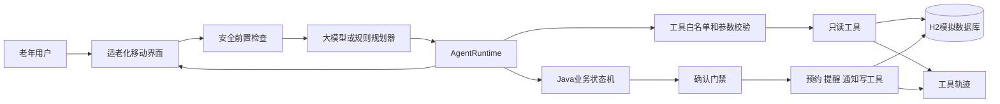
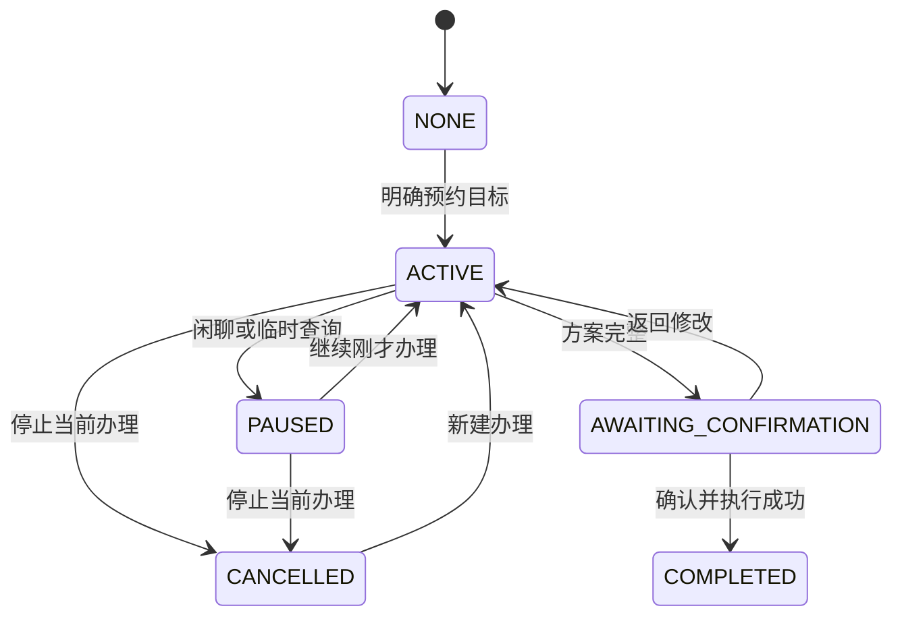

# 面向银发群体的复诊事项协同办理智能体设计思路报告

**项目名称：** 银龄复诊事项协同助手
**参赛组别：** 企业命题组 产教协同创新组
**文档版本：** v0.1
**更新日期：** 2026年9月10日
**文档用途：** 技术设计、课程作业与比赛设计思路说明的持续更新主稿

> 本项目当前为比赛演示原型。医院、用户、号源、路线、提醒和通知均为模拟数据。报告将已实现能力、正在完善内容和后续规划分别说明，不将规划功能表述为已经完成。

## 设计摘要

本项目面向老年人复诊过程中入口分散、步骤多、异常后不知道如何继续的问题，提供一个以自然语言和语音为主要入口的复诊事务协同助手。系统把医院科室选择、号源查询、材料准备、日程冲突检查、出行安排、提醒创建和家属通知组织为一项可暂停、可恢复、可修改的办理任务。

项目采用受控混合智能体架构。大模型负责理解自然表达、组织补问、生成普通交流回复，并可提出调用低风险只读工具；Java 程序负责权限检查、业务状态、确认凭据和真实写入。预约是否成功、号源是否存在、楼层房间及提醒通知结果均来自工具和数据库，不能由模型自行宣布。

与固定问答式办理相比，当前方案将普通对话与预约任务分开：用户明确说出预约目标后才创建任务；用户害怕、疲惫或临时询问流程时，任务转为暂停并保留原节点；用户选择继续后恢复办理。该设计既保留自然交流，也避免闲聊误改预约参数。

<!-- PAGE_BREAK -->

## 一 需求分析

### 1.1 业务问题

一次复诊往往包含预约、材料、日程、出行、提醒和家属协同。现有服务通常分散在医院小程序、地图、日历和通信软件中。老年用户需要记住办理顺序，在多个页面之间切换，并自行处理无号源、时间冲突和信息不完整等情况。

命题要求智能体理解口语化、多轮且不完整的表达，主动补齐必要信息，生成至少七项任务计划，调用真实模拟工具，并在关键写操作前获得明确确认。系统还要处理异常、体现适老化，并在六分钟录屏中证明工具确实被调用，而不是播放预写对话。

### 1.2 核心矛盾

本项目的主要挑战不是生成一段像人的回答，而是同时满足三项约束：

- **交流自然。** 用户可能先聊天、表达害怕或询问流程，不会始终按照表单顺序回答。
- **办理可靠。** 医疗事务中的误预约、误取消、误通知和虚构成功都会造成实际影响。
- **过程可证明。** 评委需要看到任务拆解、工具选择、参数、返回值、确认和最终结果之间的对应关系。

因此，系统不能完全依赖固定状态机，也不能把所有决策和写权限交给大模型。解决方案需要让模型拥有足够的语言理解和低风险查询能力，同时由程序保留安全和业务控制权。

### 1.3 需求与设计回应

| 命题要求 | 当前设计回应 | 验证方式 |
| --- | --- | --- |
| 理解口语和多轮表达 | 规划模型结合结构化状态与最近对话理解本轮目标 | 使用自然语句和插入式提问回归 |
| 主动补问缺失信息 | Java 检查必填字段，模型或模板一次补问一个主要问题 | 检查各阶段缺失字段与回复 |
| 七步任务拆解 | 维护预约、材料、日程、出行、提醒和通知的结构化计划 | 页面持续展示计划及状态 |
| 真实工具调用 | H2 查询和写入产生参数、结果与工具轨迹 | 对照工具日志和数据库记录 |
| 关键操作确认 | 写操作只能从确认端点执行，并校验 confirmationId | 重复确认和旧确认回归测试 |
| 异常后可恢复 | 保留有效结果，提供换日期、换时段、重试或取消 | 四组规定场景和故障注入 |
| 适老化反馈 | 大字、高对比、短句、少量按钮、事项卡 | 真机与录屏视觉检查 |
| 医疗安全边界 | 安全前置规则拦截紧急情况和医疗越界 | 越界与紧急语句用例 |

### 1.4 项目范围

当前原型不训练专用模型，不接入真实医院、支付、短信或即时通信平台。系统使用模拟业务数据实现完整链路，并为医院、地图、日程和通知平台保留工具接口。系统只协同复诊事务，不进行诊断、用药建议、剂量调整、检查结果解读或治疗决策。

<!-- PAGE_BREAK -->

## 二 用户角色

| 角色 | 主要需求 | 权限和责任 |
| --- | --- | --- |
| 老年用户 | 少输入、少记忆，清楚知道下一步和办理结果 | 提出目标、补充信息、选择方案并确认关键操作 |
| 家属或陪同人 | 及时获知复诊时间、地点和陪同需求 | 仅在用户授权后接收必要信息，不代替用户默认同意 |
| 社区或医院协助人员 | 在用户无法独立完成时提供线下帮助 | 后续可承接人工转接；当前入口为模拟状态 |
| 演示和维护人员 | 配置场景、复现异常、核对调用证据 | 维护模拟数据和演示环境，不参与用户医疗判断 |

当前主要交互端面向老年用户。家属是经过授权的信息接收者和潜在陪同者，而不是隐藏的决策主体。当前尚未实现独立家属端，因此报告中的家属协同以模拟联系人和通知记录为限。

### 2.1 典型场景

用户可以直接说“我下周三想去市第一医院心内科复诊，上午方便，出发前提醒我，也告诉女儿”。系统保存已知信息，仅询问尚未明确的替代日期和陪同偏好。用户中途说“我有点害怕去医院”，助手先进行支持性交流并暂停任务；用户之后说“继续刚才的办理”，系统恢复到原节点，不要求重新开始。

<!-- PAGE_BREAK -->

## 三 智能体架构

### 3.1 总体结构

系统采用前端移动界面、Java 模块化单体后端、可替换模型适配器和 H2 模拟数据库。模型负责自然语言规划，Java 运行时负责审核和执行，领域工具负责产生可验证结果。

<!-- PDF_FIGURE:architecture -->

### 3.2 模型与 Java 的分工

| 能力 | 大模型 | Java 程序 |
| --- | --- | --- |
| 普通聊天与情绪承接 | 生成简短自然回复 | 检查安全边界和越权承诺 |
| 理解复诊目标和字段 | 从上下文提出结构化事实 | 校验医院、科室、日期及当前状态 |
| 选择只读工具 | 可提出白名单内工具及参数 | 检查权限后真正执行并记录轨迹 |
| 修改未提交草稿 | 可提出修改语义 | 清除受影响的号源、路线和旧确认 |
| 提交或取消预约 | 只能提出用户意图 | 生成确认卡，确认后调用写工具 |
| 判断成功与失败 | 不拥有最终决定权 | 以数据库和工具返回结果为准 |
| 医疗与紧急边界 | 辅助理解灵活表达 | 确定性规则优先拦截并暂停普通流程 |

模型每轮可以直接回答、补问，提出单个或组合的只读工具调用，也可以建议进入某个业务工作流。当前模型可见的只读工具有办事知识、医院、科室、号源、本人预约、材料、路线和院内位置共八项。预约、取消、提醒和家属通知不进入模型可自动执行的工具表。

### 3.3 上下文和记忆

系统不会把全部历史对话每轮重复发送给模型。上下文由稳定规则、当前任务状态、已确认的结构化字段、最近八条消息、必要工具结果摘要和本轮允许工具组成。事实权威顺序为：数据库与工具结果高于 Java 会话状态，Java 会话状态高于模型提取结果，旧对话中的说法最低。

模型服务通过通用 `ModelGateway` 和 OpenAI compatible 协议适配，配置使用 `AGENT_MODEL_*` 环境变量。更换模型厂商不会改变业务工作流和工具权限。模型不可用时，规则规划器和回答模板继续支持核心办理路径。

## 四 任务拆解机制

### 4.1 对话状态和任务状态分离

新会话默认处于普通交流模式，预约任务状态为 `NONE`。只有用户明确表达预约目标或点击“开始复诊办理”后，任务才变为 `ACTIVE`。中途聊天或临时查询不会清空数据，而是将任务置为 `PAUSED`；继续办理后恢复原阶段。取消当前办理后状态为 `CANCELLED`，但已有预约记录不会被删除。

<!-- PDF_FIGURE:task_state -->

### 4.2 七步任务计划

| 任务 | 前置条件 | 输出和影响 |
| --- | --- | --- |
| 查询可预约日期 | 医院、科室、期望日期 | 返回真实模拟候选号源，无号时查询附近日期 |
| 选择复诊时间 | 已获得候选号源 | 保存具体 slotId，不等同于已经预约 |
| 生成材料清单 | 医院和科室明确 | 返回科室材料模板及必带标记 |
| 检查日程冲突 | 已选择具体时间 | 返回冲突事项，用户决定换时段或保留 |
| 生成出发建议 | 预约时间、地址和交通方式齐全 | 返回路线、耗时和建议出发时间 |
| 创建复诊提醒 | 用户确认且预约成功 | 写入材料准备提醒和可选出发提醒 |
| 通知指定家属 | 用户授权且预约成功 | 写入模拟通知记录 |

### 4.3 依赖失效和恢复

修改医院会使科室、号源、材料和路线失效；修改日期或时间会重新检查号源、日程和出发时间；修改通知对象会更新待执行清单。任何影响确认内容的变化都会使旧 `confirmationId` 失效。部分步骤失败时保留已成功预约，仅补办失败的提醒或通知，避免重复预约。

## 五 工具设计

### 5.1 领域工具

当前后端定义十二类领域工具接口，模型只看到其中经过筛选的只读工具。

| 工具类别 | 代表工具 | 数据或结果 | 权限 |
| --- | --- | --- | --- |
| 预约 | `AppointmentTool` | 号源查询、提交、取消和改期结果 | 查询只读，写入需确认 |
| 我的预约 | `MyAppointmentTool` | 当前用户数据库预约记录 | 身份校验后只读 |
| 日程 | `ScheduleTool` | 冲突事项、提醒记录 | 查询只读，创建需确认 |
| 出行 | `TravelTool` / `RouteGuideTool` | 耗时、出发时间、路线步骤和折线 | 只读 |
| 家属通知 | `FamilyNotificationTool` | 联系人及模拟发送结果 | 发送需确认 |
| 材料 | `MaterialChecklistTool` `MaterialPreparationTool` | 材料清单和准备状态 | 查询只读，状态修改为写入 |
| 医院科室 | `HospitalCatalogTool` `DepartmentCatalogTool` | 医院、科室及适老服务资料 | 只读 |
| 办事知识 | `CareGuideTool` | 预约流程、报到和咨询渠道 | 只读，不含医疗知识 |
| 院内位置 | `FacilityGuideTool` | 楼栋、入口、楼层、诊室、报到点 | 只读 |

### 5.2 受控工具调用过程

<!-- PDF_FIGURE:tool_loop -->

1. 程序把本轮允许使用的工具说明和参数结构发送给模型。
2. 模型输出建议调用的工具和参数，或者直接回答、补问用户。
3. Java 解析模型输出，并检查工具是否在白名单中。
4. Java 校验用户身份、参数、当前阶段、调用次数和副作用等级。
5. 校验通过后，程序真正执行工具；写工具必须先经过确认门禁。
6. 程序记录工具名、脱敏参数、返回结果和成功状态。
7. 权威结果用于生成回复、更新计划或进入下一步。

### 5.3 数据真实性与地图

医院、科室、号源、联系人、材料、路线和院内位置来自 H2。预约、提醒和通知通过实际数据库写入生成业务编号。工具调用保存到 `tool_call_logs`，用于调试和录屏取证。

出行页面分为院外路线和院内指引。院外路线展示坐标折线、距离、预计用时、建议出发时间和路线步骤；未配置地图 Key 时使用明确标注的比赛模拟地图，配置高德浏览器 Key 后可加载真实底图。院内指引通过号源关联 `clinic_locations`，展示门诊楼、入口、楼层、诊室、报到点、无障碍路径和护士站，避免由模型凭空生成“几楼几号房”。

## 六 确认机制

### 6.1 必须确认的操作

提交预约、修改或取消已有预约、创建提醒、发送家属通知以及修改已确认方案，都必须获得明确确认。号源、材料、日程冲突、路线和医院科室资料属于只读查询，可以在形成方案时自动执行。

### 6.2 确认内容

确认卡展示医院和科室、完整日期和时间、陪同需求、建议出发时间、拟创建提醒、通知对象、消息内容和可能影响。按钮使用“确认办理”“返回修改”“确认取消预约”“保留预约”等具体动作，不使用“好的”“继续”等模糊表达代替授权。

### 6.3 确认凭据

每次确认卡绑定随机 `confirmationId`。确认接口检查会话阶段和当前凭据，在执行前消费凭据。用户修改参数、取消任务、触发紧急暂停或已经使用过凭据后，旧确认不能再次执行。工具写入使用幂等策略，避免重复点击和网络重试产生重复预约、提醒或通知。

### 6.4 权限分级

| 等级 | 能力 | 系统处理 |
| --- | --- | --- |
| L0 | 普通交流 | 模型回答，Java 检查安全承诺 |
| L1 | 只读查询 | 模型可提出，Java 校验后自动执行 |
| L2 | 未提交草稿修改 | 模型提出语义动作，Java 更新状态并清理依赖 |
| L3 | 预约、取消、提醒、通知 | 模型不能直接执行，必须展示并确认 |
| L4 | 诊断、用药和越权操作 | 拒绝执行并提供安全说明 |

## 七 异常处理

异常处理遵循三个原则：说明发生了什么，保留仍然有效的结果，提供明确的下一步。

| 异常 | 处理路径 | 不允许的行为 |
| --- | --- | --- |
| 信息不完整 | 显示当前缺失字段，一次补问一项 | 虚构完整计划或成功结果 |
| 指定日期无号 | 查询前后 3 天并展示日期和时间；不接受换日时提供换医院或稍后再查 | 未经同意自动换日期 |
| 日程冲突 | 展示冲突事项，提供同日其他号源、重新选日或明确保留 | 删除或覆盖原日程 |
| 工具失败 | 记录失败步骤，提供重试、修改或人工帮助 | 把失败改写成成功 |
| 中途修改医院或日期 | 清除受影响的号源和出行结果，重新计算 | 沿用旧号源和旧确认 |
| 提醒或通知失败 | 保留已经成功的预约，重新确认后只补办失败项 | 再次提交预约 |
| 取消当前办理 | 清除未提交任务标记，保留已有预约 | 把取消办理当作取消已有预约 |
| 取消已有预约 | 查询真实预约，绑定具体 appointmentId，再次确认 | 仅凭一句话直接删除 |
| 模型不可用 | 自动使用规则规划和模板回复 | 整个办理流程瘫痪 |
| 紧急或医疗越界 | 安全规则优先拦截，不进入普通预约工具流 | 继续追问医院或给出诊断 |

规定录屏中的无号源和时间冲突均使用稳定模拟数据复现。最终演示还需增加统一的场景重置入口，保证多次录屏不会因已占用号源或历史提醒而改变结果。

<!-- PAGE_BREAK -->

## 八 适老化设计

### 8.1 交流设计

助手支持文字和模拟语音入口，回复采用短句，一次只提出一个主要问题。用户一次说出多项信息时，系统保存已知字段，不重复询问。候选按钮控制数量，并提供返回、取消和人工帮助入口。

### 8.2 对话优先设计

助手的主要职责从“只能按槽位追问”放宽为“可以交流、解释和办理复诊”。没有预约目标时，页面不会强迫用户选择医院；用户明确提出预约后才显示持续任务卡。聊天、流程知识查询、材料查询和地图查询不清除任务，也不会把暂停状态误改为正在办理。

### 8.3 页面信息层级

首页提供下一次复诊摘要和常用入口；助手页承载对话、任务卡、确认卡和结果卡；事项页集中展示预约、材料、提醒和家属通知；出行详情页统一展示院外路线与院内指引。重要时间、医院科室、楼层诊室和操作按钮使用大字号、高对比和较大点击区域，状态同时用文字表达，不只依赖颜色。

### 8.4 后续适老验证

当前适老化结论主要来自需求检查和页面视觉验收，尚未完成真实老年用户测试。后续应记录独立完成率、补问轮次、误触次数、确认内容复述正确率、寻找诊室耗时和人工帮助需求，不能仅以团队主观判断替代验证。

<!-- PAGE_BREAK -->

## 九 安全边界

### 9.1 医疗服务边界

系统只办理复诊相关事务，不诊断疾病，不推荐药品，不调整剂量，不解读检查报告，也不代替医生决定治疗方案。用户提出相关问题时，助手说明能力范围并建议咨询医生或专业医疗机构。

明显紧急表达先经过确定性安全规则。命中后系统使旧确认失效，暂停普通办理并提示及时联系急救服务、身边人员或线下医疗机构。该机制不能被描述为医疗分诊，也尚未经过临床有效性验证。

### 9.2 模型和操作边界

模型输出属于建议，不是业务事实。具体号源、预约成功、提醒创建、通知发送、路线、楼层和诊室必须由工具返回。用户消息和工具结果中的文本不能改变工具权限。API Key、Authorization 信息、完整手机号和模型隐藏推理不得出现在评委视图或日志展示中。

### 9.3 数据和部署边界

当前演示只使用模拟个人资料。启用外部模型时，会发送本轮输入、近期对话和必要的结构化状态，因此不能宣称全部数据均在本地处理。真实部署前还需补齐身份认证、会话归属校验、角色权限、数据最小化、日志脱敏、保存删除策略和第三方数据授权。

<!-- PAGE_BREAK -->

## 十 创新点

创新评价应回答“我们怎样在完成命题要求的同时做得更好”，并区分已经实现与后续规划。

### 10.1 已实现创新

| 创新设计 | 当前实现 | 相比普通方案的改进 |
| --- | --- | --- |
| 对话和任务双状态 | `DialogueMode` 与 `TaskStatus` 分开，任务可暂停恢复 | 避免固定流程吞掉闲聊、情绪和临时问题 |
| 受控混合智能体 | 模型可回答、补问和建议只读工具，Java 保留写权限 | 比纯状态机自然，比自由工具智能体更可控 |
| 办事知识与医疗知识隔离 | H2 只保存复诊流程、报到和咨询渠道 | 回答“怎么办”有依据，同时不越过医疗边界 |
| 双层到院指引 | 院外路线与院内楼层诊室使用不同数据和页面层次 | 从“何时出发”延伸到“到院后怎么找到诊室” |
| 结果可追溯 | 模型建议、工具参数、返回值和最终事项可关联 | 便于评委核验，不依赖预写对话证明能力 |
| 模型可替换和规则回退 | 通用模型网关加规则与模板备用路径 | 团队可更换模型，比赛现场断网仍可演示核心流程 |

### 10.2 后续创新规划

| 方向 | 预期价值 | 当前状态与约束 |
| --- | --- | --- |
| 材料图像识别 | 帮助视力不佳用户检查是否带齐材料 | 已预留 `PHOTO_CONFIRMED` 状态，尚未接视觉模型 |
| 老人备忘和主动提醒 | 将临时说出的复诊相关待办转为可确认提醒 | 尚未实现，必须防止把普通聊天误建为提醒 |
| 家属协同端 | 家属代建复诊草稿，老人确认后执行并接收提醒 | 尚未实现，需要身份、授权和回执机制 |
| 评委视图 | 以时间线显示模型模式、权限判断、工具参数和结果 | 后端已有轨迹，独立可视化页面尚待接入 |
| 真实平台适配 | 替换医院、地图、日历和通知模拟实现 | 需要平台授权、隐私评估和错误补偿机制 |

材料识别、备忘录和家属端可以成为后续差异化能力，但 v0.1 报告不将其列为已经完成的成果。近期最优先的是稳定四组规定场景、完善评委视图和按照新设计稿更新 UI。

<!-- PAGE_BREAK -->

## 十一 应用价值

### 11.1 对老年用户和家属的价值

统一入口减少用户记忆办理顺序和跨应用切换的负担；持续任务卡和确认卡帮助用户看清当前进度与操作后果；材料、出发和院内位置集中展示，降低遗漏与到院后寻找诊室的困难。经授权的家属通知让陪同人获得结构化时间和地点信息。

这些价值是设计目标，当前模拟演示不能直接证明真实就诊效率提升。项目需要通过老年用户试用和可量化指标验证。

### 11.2 对服务机构的价值

社区、养老服务机构或医院互联网服务可以将本方案作为事务协同入口。通过替换领域工具实现，系统可对接不同医院号源、日历、地图和消息平台，而不需要重写对话状态和确认规则。工具轨迹还能帮助服务人员定位失败步骤和提供人工补办。

### 11.3 推广边界

方案可推广到慢病复诊、术后随访准备、康复治疗预约等流程明确且需要多方协同的事务场景。推广对象仍应是行政和事务协同，而不是诊断与治疗。不同地区的医院流程、适老服务和数据政策需要通过配置和工具适配处理。

### 11.4 价值验证指标

| 评估方向 | 建议指标 |
| --- | --- |
| 办理可靠性 | 成功结果与数据库一致率，重复预约和未确认写入次数 |
| 异常恢复 | 无号和冲突场景完成率，部分失败后的补办成功率 |
| 交互负担 | 完成时长、补问轮次、返回修改次数和人工帮助需求 |
| 适老可用性 | 关键安排复述正确率、误触次数、独立完成率 |
| 到院指引 | 找到入口和诊室的完成时间、求助次数 |
| 可追溯性 | 工具参数、结果、卡片和数据库记录的一致率 |

<!-- PAGE_BREAK -->

## 十二 当前成果与迭代计划

### 12.1 当前实现证据

截至 2026年9月10日，开发容器内后端 35 项自动测试全部通过，前端 TypeScript 检查和生产构建成功。真实接口验证表明：普通交流不会自动创建预约任务；明确预约目标后任务进入 `ACTIVE`；中途聊天使任务进入 `PAUSED`；查询骨科楼层时返回五层 506诊室，同时产生预约查询、路线规划和院内位置三条工具轨迹，任务仍保持暂停。

### 12.2 版本计划

| 版本 | 主要内容 | 完成标准 |
| --- | --- | --- |
| v0.1 | 当前架构、功能边界、创新和价值初稿 | 与需求章节逐项对应，生成不超过20页 PDF |
| v0.2 | 新 UI 设计稿、评委视图和四组场景截图 | 页面与报告截图一致，调用链可视化 |
| v0.3 | 四组 Demo 完整验收和六分钟录屏脚本 | 正常、无号、冲突、越界均可稳定复现 |
| v1.0 | 最终数据、成员信息、测试结果和答辩结论 | PDF、PPT、MP4 内容一致并完成下载复核 |

## 结论

本项目的解决方案是在复诊事务场景中建立一个有明确权限边界的智能体：模型负责自然理解和低风险规划，Java 负责状态、确认和写入，工具和数据库负责真实结果。对话任务双状态解决了固定流程不自然的问题，双层地图与办事知识库补足了“怎么去、到哪找、流程怎么走”的信息缺口。下一阶段应把精力集中在新 UI、评委视图、四组场景验收和真实适老测试，而不是继续堆叠尚未验证的功能。
