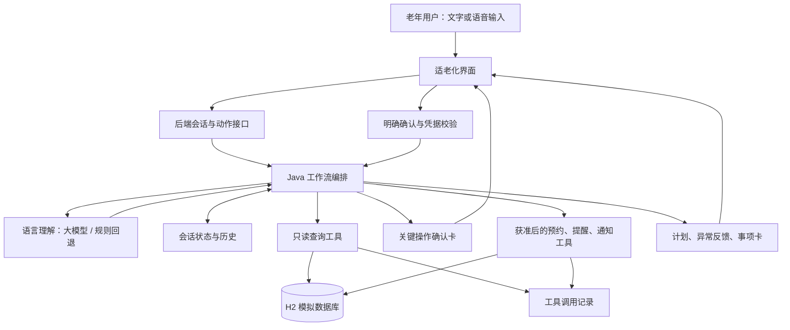

# 面向银发群体的复诊事项协同办理智能体——设计思路报告

**项目名称：** 银龄复诊事项协同助手  
**文档日期：** 2026年9月8日（2026年9月10日增补）  
**项目定位：** 面向老年用户，以自然语言交互串联预约、材料准备、日程、出行和家属通知的复诊事务协同系统。

> 本报告依据项目需求与当前源码整理。当前系统为比赛演示原型，医院、号源、路线、用户及通知均采用模拟数据；真实平台接入与尚未完成的能力在文中单独说明。

## 一、需求分析

### 1.1 问题背景

一次复诊通常包含查找医院和科室、选择时间、检查个人安排、准备材料、规划出行、设置提醒及联系家属等事项。这些事项相互依赖，却往往需要用户在不同入口中分别操作。对不熟悉智能设备的老年用户而言，困难既包括操作步骤多，也包括不知道应该先做什么、发生变化后还需要调整什么。

因此，项目以“帮我安排一次复诊”为整体目标，将分散操作组织为可理解、可确认、可修改的办理流程。用户可以说：“我下周想去医院复诊，帮我安排一下，出发前提醒我，并告诉女儿。”系统逐步补齐信息，再通过工具完成具体事项。

### 1.2 核心需求

| 需求维度 | 用户问题 | 设计回应 |
| --- | --- | --- |
| 理解表达 | 需求口语化、信息不完整，可能分多次说出 | 识别复诊意图，保留已知信息，逐项补问 |
| 组织流程 | 不清楚复诊前需要办理哪些事项 | 展示包含预约、材料、日程、出行和通知的任务计划 |
| 执行事项 | 希望助手实际办理，而非只给建议 | 调用模拟工具查询和修改数据库，展示真实执行结果 |
| 保留决定权 | 担心误预约、误通知或被自动改期 | 写入操作前展示明确确认卡，支持返回修改 |
| 应对变化 | 无号、时间冲突或临时改期后不知道怎么办 | 说明原因，提供替代选项，重新检查受影响步骤 |
| 看懂结果 | 难以从长对话中找到关键信息 | 汇总为简明事项卡，区分成功、跳过和未完成 |

系统同时重视可恢复性、可追溯性及演示可复现性：保存会话和执行记录，避免重复办理；模型不可用时保留规则办理入口；工具结果必须来自数据查询或实际写入，不能由对话文案代替。

### 1.3 项目范围

本阶段完成复诊事务协同原型，不训练专用大模型，不连接真实医院、地图或短信平台。系统支持医院、科室和号源查询，以及模拟预约、提醒和通知。诊断、药品推荐、检查结果解读和治疗决策均不属于服务范围。系统不回答“该不该吃、要不要换药”，也不给出剂量方案；药品相关能力仅提供可核对的药品事实说明，具体用药仍按医嘱或说明书执行。

## 二、用户角色

| 角色 | 主要诉求 | 在系统中的职责和边界 |
| --- | --- | --- |
| 老年用户 | 少输入、少记忆，清楚知道下一步和办理结果 | 提出需求、选择方案、确认或拒绝操作，是办理决定主体 |
| 家属或陪同人 | 及时了解复诊时间、地点与陪同需求 | 经用户授权后接收必要信息；通知成功不代表已阅读或同意陪同 |
| 人工协助人员 | 在用户遇到困难时帮助理解和操作 | 作为后续人工服务角色；当前仅有模拟帮助入口，尚未接通真人 |
| 演示与维护人员 | 配置场景、核查工具过程、复现异常 | 维护模拟目录和测试数据；这是工程职责，当前没有独立运营后台 |

当前主要交互端面向老年用户。家属通过模拟联系人和通知记录参与流程，尚未建设独立家属端或陪同回执功能。角色划分用于明确责任，不能等同于已实现多角色登录和权限系统。

## 三、智能体架构

### 3.1 总体方案

系统采用“语言理解 + 受控工作流 + 领域工具”的混合架构。模型负责从表达中提取需求，Java 工作流负责判断下一步与执行权限，工具负责读取和修改模拟业务数据。

### 3.2 模块分工

| 模块 | 当前实现 | 设计职责 |
| --- | --- | --- |
| 交互层 | React、TypeScript，首页、助手、事项、设置视图 | 输入需求，呈现计划、确认、异常与结果 |
| 语言理解层 | `QwenFactExtractor`、`RuleFactExtractor` | 提取医院、科室、日期、时段及陪同、提醒、通知等偏好 |
| 流程编排层 | `FollowupAgentService` | 补问信息、调用工具、检查状态、控制确认、处理失败与变更 |
| 会话管理层 | `ConversationState`、`ConversationStore`、`ConversationLifecycle` | 保存已知事实、阶段、确认凭据和已完成步骤，支持恢复；管理会话空闲与容量上限 |
| 工具层 | 十个领域工具接口及对应模拟实现 | 提供预约、我的预约查询、材料清单与材料准备、日程、出行、通知、医院科室资料及药品知识查询能力 |
| 数据与记录层 | H2、`AppointmentRecordStore`、`ToolTraceStore` | 保存模拟目录、业务记录、会话快照及调用轨迹 |

后端采用 Java 17 与 Spring Boot，整体为模块化单体，降低小团队的部署和联调成本。缺失检查、确认控制与异常编排目前集中在同一应用服务中，图中的职责节点不代表已经拆分为独立服务或多个智能体。

### 3.3 模型与程序的协作

自由语言输入结合当前日期、流程阶段、已知信息和最近对话提取结构化字段；无歧义的快捷按钮直接提交结构化动作。未启用模型或模型调用异常时，系统回退到本地规则，继续通过补问和按钮完成办理。

模型输出作为待校验信息使用。医院、科室及可选时段需匹配模拟目录，预约成功与否依据工具结果。模型不能自行调用写入工具，也不能通过一句“用户同意了”跳过后端确认检查。

### 3.4 实现底座

上文只说明后端采用 Java 17 与 Spring Boot。实现底座补充如下：

| 项目 | 当前实现 |
| --- | --- |
| 后端运行时 | Java 17，Spring Boot 3.5.6，模块化单体，H2 文件库（`jdbc:h2:file:./data/silver-agent`） |
| 前端运行时 | React 19，TypeScript，构建与开发服务器为 vinext（基于 Vite 的 RSC 框架），开发端口 3000 |
| 模型服务通道 | 阿里云百炼（DashScope），单把 `DASHSCOPE_API_KEY` 同时点亮对话理解、工具调用、开放问答、视觉、语音识别与语音合成六类能力 |
| 配置注入 | 通过 `.env` 与环境变量提供，`DotenvEnvironmentPostProcessor` 在配置加载最前置读取 |
| 模型开关 | `AGENT_LLM_ENABLED` 控制总开关，默认 `false`（纯本地规则）；视觉、语音识别与语音合成可各自单独开关 |

### 3.5 模型可直接调用的只读工具

3.3 的结论是“模型不能自行调用写入工具”，该结论仍然成立，并已通过工具白名单在代码中固化。3.3 尚未记录的是：模型现在可以调用一组只读工具。

模型通过 OpenAI 兼容的函数调用协议（`tool_choice: auto`）在同一轮内循环执行工具，最多 3 步；3 步内未产生最终回答即返回空，由上层回退到其他通道。可调用的工具仅限以下六项，全部为只读：

| 工具名 | 作用 |
| --- | --- |
| `drug.queryKnowledge` | 按药品名称与规格检索药品知识库 |
| `appointment.querySlots` | 查询医院、科室、日期对应的可预约号源 |
| `appointment.queryMine` | 查询该用户已成功写入的预约记录 |
| `catalog.queryHospitals` | 查询医院目录 |
| `catalog.searchDepartments` | 按关键词检索科室 |
| `material.generateChecklist` | 生成科室对应的材料清单 |

提交预约、改期、取消、创建提醒、发送家属通知等写操作不进入该白名单，模型无法看到也无法调用，仍只能在用户明确确认后由 Java 编排层执行。这是第六节确认机制的直接落地。每次真实工具调用连同参数与结果写入调用记录，与 5.2 一致；模型的推理过程字段在返回前剥离，既不落库也不回传前端，避免把内部推理当作对用户的交付内容。

### 3.6 自由问答的多级回退

3.3 描述的是“模型 / 规则”两级回退。当前自由问答实际是一条四级链，按顺序尝试，前一级不可用或失败即下沉：

1. 带只读工具的回答，适用于需要查询真实数据的问题；
2. 无工具的开放式对话回答，同时承担把视觉识别结果转述为适老化说明的职责；
3. 本地规则模板，覆盖就医建议、用药提示、越界拒绝等固定口径；
4. 会话中已保存的视觉识别文本，使图片相关追问在模型不可用时仍可回答。

该链路同样遵守第九节的边界：模型只负责理解与组织语言，不产生可执行动作，也不凭记忆编造数据；涉及药物一律提醒按医嘱或说明书服用，涉及病情一律提示咨询医生。

### 3.7 视觉识别与拍照输入

当前系统支持两种图片来源，单轮最多 3 张：

- 相机实时拍摄：前端申请摄像头权限（优先后置，依次回退前置与任意可用设备），实时预览后抓拍为 JPEG；
- 相册选择：文件选择器一次可选多张。

图像先经视觉模型生成面向老年用户的通俗描述，再执行纯文字提取（OCR）；提取过程的提示明确禁止对图像内容作医学解释。两类结果合并后写入会话的视觉上下文，随后的追问可引用上一批识别内容；识别过程同样记入工具调用记录。适用场景包括拍处方、拍检查单、拍药品包装后询问“这是什么、做什么用”。识别结果只作为理解用户表达的输入，不构成诊断、用药建议或检查结果解读，与第九节的服务边界一致。

## 四、任务拆解机制

### 4.1 先补齐办理条件

系统将用户的整体目标拆成医院、科室、期望日期、时段偏好、是否接受替代日期、是否需要陪同、是否需要出发提醒、交通方式、是否通知家属及通知对象等信息项。

未明确的偏好保留为“未知”，与“用户选择不需要”区分。已提供的信息不重复询问，缺失内容一次补问一个主要问题。对于“下周三”等表达，结合当前日期解析，并在选择与最终确认时展示具体年月日。

### 4.2 用任务模板组织依赖关系

本项目采用规则驱动的任务模板，根据用户偏好和工具结果调整分支，并非由模型任意生成可执行程序。

| 任务 | 前置条件 | 输出及后续作用 |
| --- | --- | --- |
| 查询可预约日期与时段 | 医院、科室、期望日期明确 | 返回实际候选号源；无号时进入替代日期分支 |
| 选择复诊时间 | 已获得候选号源 | 用户选定具体时段，作为后续时间计算依据 |
| 生成材料清单 | 医院、科室明确 | 返回对应模板中的材料及必带标记 |
| 检查日程冲突 | 用户和选定时间明确 | 返回冲突事项，必要时重新选择时间 |
| 生成出发建议 | 出发地址、医院地址、交通方式和时间齐全 | 返回路线耗时及建议出发时间 |
| 创建复诊相关提醒 | 预约成功且用户已明确确认 | 创建材料准备提醒，以及按偏好选择的出发提醒 |
| 通知指定家属 | 预约成功、联系人明确且用户已授权 | 保存模拟通知结果；不需要时标记跳过 |

号源查询可以在其他偏好尚未补齐时提前进行，以便尽早发现无号问题；完整计划随后展示。计划应反映已查询、待检查、待确认及已完成等状态，不能把提前完成的查询说成尚未执行。

### 4.3 状态驱动与动态调整

主流程为：信息收集 → 号源选择 → 计划展示 → 冲突检查和出行计算 → 等待确认 → 执行 → 完成。无号、冲突、工具错误和部分完成属于可处理的分支；取消任务与紧急暂停则阻止旧流程继续执行。

用户改变医院时，需要重新核对科室、号源、材料及路线；改变日期时，需要重新检查号源、日程和出发时间；改变通知对象或提醒偏好时，需要更新操作清单。涉及待执行内容的变化使原确认凭据失效，用户查看新方案后重新确认。

计划支持通过业务入口修改医院、日期和偏好、选择替代时段或取消办理。目前不支持任意拖拽任务顺序；顺序由业务依赖决定，例如家属通知必须使用已成功预约的时间。

## 五、工具设计

### 5.1 工具划分

| 工具 | 主要输入 | 主要输出 | 是否需要执行确认 |
| --- | --- | --- | --- |
| 预约工具 | 医院、科室、日期；提交时使用号源和用户标识 | 候选时段、替代时段、预约编号或变更结果 | 查询无需；提交、改期和取消需要 |
| 我的预约查询工具 | 会话、用户标识及日期、医院、科室等查询条件 | 已成功写入数据库的预约记录，不含对话中尚未提交的草稿 | 只读查询无需 |
| 日程工具 | 用户、检查时间范围；提醒标题和时间 | 冲突列表、提醒记录编号 | 查询无需；创建提醒需要 |
| 出行工具 | 用户、医院、预约时间、交通方式 | 模拟耗时、建议出发时间、路线说明 | 只读计算无需 |
| 家属通知工具 | 指定联系人、待发送内容 | 模拟通知记录编号或失败原因 | 需要 |
| 材料清单工具 | 医院与科室 | 材料清单及必带标记 | 只读查询无需 |
| 材料准备跟踪工具 | 预约号、用户与科室，以及从材料清单带入的材料名称 | 该次预约对应的材料准备项与各自状态；可将材料标记为已备好 | 查询无需；标记已备好为写入操作 |
| 医院资料工具 | 查询条件或医院标识 | 地址、介绍、特色和适老服务资料 | 只读查询无需 |
| 科室资料工具 | 医院与科室条件 | 科室位置、介绍和复诊范围 | 只读查询无需 |
| 药品知识工具 | 药品名称、可选规格 | 该药品是什么、主要用途、注意事项等事实性说明 | 只读查询无需 |

四类核心工具（预约、日程、出行、家属通知）覆盖命题要求；我的预约查询与材料准备跟踪分别服务预约核查和材料闭环，材料清单、医院科室资料以及药品知识提供可核对的业务依据。工具接口共十项，与模拟实现分离，为以后接入其他数据源保留替换位置。药品知识工具的边界见 5.4。

### 5.2 数据来源与执行真实性

医院、号源、联系人、材料和路线来自 H2；预约、提醒和通知通过实际数据库写入产生记录。每次调用记录会话、工具名称、参数、结果及状态，前端可展开查看。演示需要同时呈现用户需求、生成的参数和工具返回结果，证明智能体实际经过了办理过程。

出行建议按以下规则计算：

**建议出发时间 = 预约时间 − 模拟路线耗时 − 20分钟取号预留。**

当前材料准备提醒设在预约前一天，出发提醒设在建议出发前10分钟。这些是演示中的固定策略，并非个性化最优时间；执行前在确认卡中展示。路线数据缺失时返回明确错误，不凭空填写耗时。用户不需要出发提醒时，仍可查看出发建议。

### 5.3 写入保护

编排层检查当前状态和确认凭据，工具处理号源占用及业务写入。当前通过幂等处理避免补办产生重复预约、提醒或通知；预约改期在本地事务中更新原预约，目标号源失败时回滚并保留原预约与提醒。

该方案面向单后端实例。工具写入和会话保存尚未构成统一事务，不应据此宣称已具备跨系统一致性或分布式并发保障。

### 5.4 药品知识工具

5.1 表末新增的药品知识工具，从本地知识库文件检索，支持别名与去剂型匹配，单次最多返回 3 条，过程记入调用记录。

其口径需与 1.3“药品推荐不属于服务范围”并读，二者并不冲突：该工具不返回剂量方案，不回答“该不该吃、要不要换药”，只提供可核对的药品事实说明；涉及具体用药仍提示按医嘱或说明书服用并咨询医生。工具只回答“是什么、做什么用、要注意什么”，建议评审时把这一区分一并说明，避免被理解为系统已提供用药建议能力。

### 5.5 号源的滚动生成

5.2 说明了数据来源，此处补充号源的产生方式。号源由启动初始化组件滚动生成：

- 每次启动从当天生成到未来一个月，覆盖所有启用科室；
- 每天固定 4 个时段：09:00、10:30、14:00、15:30；
- 跳过周末。这是有意选择，用于在演示中稳定复现“指定日期无号”的分支；
- 生成具幂等性，只补齐缺失记录，已被占用的号源不会被重置，与“基础数据只补齐、不重置业务数据”的约定一致。

该机制使演示不依赖固定日期：无论哪天运行都能查到未来号源，也能通过选择一个周末日期复现无号场景。

## 六、确认机制

### 6.1 确认范围

提交预约、修改或取消预约、创建提醒、向家属发送信息，以及修改已确认计划涉及的写入操作，必须先得到用户明确确认。查询号源、读取材料、检查冲突和计算路线可以先执行，用于形成可供选择的方案。

选择候选时段仅表示确定计划中的时间。最终确认卡承担实际办理授权，避免用户把“选中时间”误认为已提交预约。

### 6.2 确认卡内容

确认卡清楚列出医院和科室、完整日期与时刻、陪同需求、建议出发时间、本次拟执行操作、每条提醒的时间、通知对象和消息内容。改期时还应展示原预约信息及关联提醒变化；取消时说明预约及提醒将失效，已发送消息无法撤回。

例如，确认摘要可以写为：“将为您提交所选时间的模拟预约，创建材料准备和出发提醒，并向小丽发送复诊时间与陪同需求。”同时逐项列明具体时间和完整通知内容。按钮采用“确认办理”“返回修改”或“确认取消预约”“保留预约”，使动作含义清晰。

### 6.3 确认凭据与防重复执行

每次生成确认卡时创建随机 `confirmationId`。确认接口核对会话阶段与当前凭据，匹配后消费凭据，再执行对应操作。计划变更、执行异常、取消或紧急暂停时使旧凭据失效；重复点击、旧页面确认或已经办理的确认请求不能再次启动同一操作。

当前实现采用随机凭据与单实例同步编排，没有独立数字计划版本或分布式执行账本。部分完成后，重新展示剩余操作并生成新的确认卡，只补办未完成内容。

### 6.4 会话生命周期与历史对话

上文只描述单次办理的确认机制，未描述会话本身如何开始与结束。当前实现如下：

| 机制 | 当前取值 |
| --- | --- |
| 空闲超时 | 600 秒无交互视为空闲 |
| 轮次水位 | 预警 20 轮，上限 30 轮 |
| 上下文水位（按字符估算） | 预警 5000，上限 6000 |
| 上下文回带 | 最近 8 条消息、最近 3 张图片 |
| 单图大小上限 | 约 10MB（按 base64 计） |

达到预警水位时提示用户，达到上限或空闲超时则关闭当前会话并引导开启新对话。已关闭的会话在前端转为只读，输入区替换为“开启新对话”，并给出直白说明，避免用户误以为还能继续办理。

历史对话列表返回最近 3 天的会话摘要（标题、阶段、状态、消息数）。前端提供历史入口，可切换并恢复任一历史会话的消息与最后一张卡片；恢复失败时清除本地会话编号并新建会话，不会让用户卡在错误状态。这与 8.3 会话恢复的目标一致，补充的是可列举、可切换的具体形态。

## 七、异常处理

异常反馈遵循“说明发生了什么—保留有效结果—提供下一步选择”的原则，避免让用户面对技术错误后重新开始。

| 异常情况 | 处理方式 | 保留的用户控制权 |
| --- | --- | --- |
| 信息不完整或无法确定 | 指出当前缺失项，继续单项补问 | 用户补充、修改或请求帮助，不生成虚假结果 |
| 指定日期没有号源 | 明确说明无号；结合替代日期偏好提供候选 | 用户拒绝替代日期时，不自动换日 |
| 复诊与已有日程冲突 | 展示冲突事项，提供换时段或保留选择 | 不自动删除或覆盖原日程 |
| 模型调用异常 | 回退规则解析，配合按钮和补问继续 | 用户可修正识别结果 |
| 工具失败或路线缺失 | 显示失败步骤与原因，提供重试或修改入口 | 不把“没有数据”描述成办理成功 |
| 提醒或通知在预约后失败 | 保留预约，展示部分完成卡，记录未完成步骤 | 用户重新确认后仅补办剩余事项 |
| 用户中途更换医院或日期 | 清理失效候选，重算关联事项，撤销旧确认 | 新方案经用户确认后执行 |
| 已有预约改期失败 | 在预约变更事务内回滚，保留原预约与提醒 | 用户仍可使用原安排或再选方案 |
| 用户取消整个任务 | 停止当前流程，使旧动作不能继续办理 | 已成功预约不会被自动删除，取消预约另行确认 |
| 输入触发紧急情况规则或意图 | 进入紧急暂停状态，提示及时联系急救服务或线下帮助 | 旧确认不能继续提交普通预约事项 |

例如，预约成功但家属通知失败时，结果应显示：“预约已保留，家属通知未完成，可补办通知。”不能把整次办理说成失败，也不能在重试时再次提交预约。已发送消息不能因取消预约而自动撤回，需要明确告知其状态。

## 八、适老化设计

### 8.1 降低输入与理解负担

支持文字和按住说话入口。语音转写优先调用后端识别通道，不可用时回退浏览器本地识别（中文，支持中间结果实时回显）；两条通道都不可用时明确提示，由用户改用文字输入。当前不宣称具备完整方言识别能力。完整交互形态见 8.5。

对话使用简短句子，一次只提出一个主要问题。用户可以一次说出多项需求，系统利用已知信息继续办理；快捷选项分批展示，当前每页最多三项，减少一次阅读和选择的负担。

### 8.2 让当前步骤与操作后果可见

界面使用较大字号、明显的文字背景区分和较大的点击区域，突出当前步骤与主要按钮。计划持续可查看，状态同时通过文字表达，不能仅依赖颜色。确认卡与最终事项卡重复呈现医院、科室和具体时间，帮助用户检查。

返回修改、取消和人工帮助入口应容易发现。当前人工帮助会明确告知尚未接通真人，避免用户误以为有人正在处理。字号、对比度和按钮设计属于当前适老化措施，后续仍需通过真机和老年用户试用检查可读性及误触情况。

### 8.3 用事项卡承接办理结果

最终卡片包含预约时间、医院科室、所需材料、建议出发时间、提醒状态、家属通知状态及模拟预约编号。部分完成时突出待补办内容；无需通知与通知失败分别表述。

事项页提供集中查询入口，会话恢复帮助用户在刷新或返回页面后继续查看办理进度；材料页按预约逐项列出待备材料，可标记为已备好；拍照确认状态由后端记录并展示，照片上传通路尚未接通前端。设计目标是让用户离开长对话后，仍能迅速找到“什么时候去、去哪里、带什么、何时出发、家属是否已通知”。

### 8.4 用户偏好与长期记忆

当前有两类持久化数据：

- **语音偏好**：是否自动朗读、语速、音量。设置页可切换，写入后端保存，刷新与重开页面后仍然生效；保存失败时前端回退开关状态并提示检查后端，不静默失败。
- **办理记忆**：预约完成后写入该次办理的关键事实，供后续轮次参考，减少重复询问。记忆只记录与办理相关的事实，不保存诊断或健康推断。

### 8.5 语音输入与朗读

8.1 说明了语音输入的通道选择，此处补充交互形态与语音输出。

**语音输入**为按住说话。按下即录，录制过程显示实时音量波形，让用户确认正在收音；上滑超过阈值进入“松开取消”状态，回滑解除，用位移表达取消意图而不依赖小按钮；按住不足 600 毫秒视为误触丢弃，避免误碰产生空消息。用户语音气泡保留原始录音可回放，转写中、完成与失败三种状态分别表述。

**语音输出**为：优先使用浏览器本地中文语音合成，失败时回退后端合成通道，本地优先以减少等待与网络依赖；全局单例播放，同一时刻只播一条，再次点击同一条即停止，避免多条朗读叠加。每条助手消息与用户文字消息都有朗读按钮，结果卡支持整卡朗读；可在设置中选择音色（8 种）与语速（0.5 至 2.0 倍），选择结果本地保存；开启自动朗读后，助手新回复自动播报。

### 8.6 其他适老化与可核查细节

8.2 提出“状态不能仅依赖颜色”，当前落实方式补充如下：

- 确认与否定选项用对勾、叉号图形配文字表达，不靠红绿区分；
- 工具调用成功与失败在记录面板中以符号加文字标注，并保留原始返回数据供展开核对；
- 工具调用面板标明参数由模型实时生成，可折叠展开查看每一步的调用名称、参数、结果与整理后的说明；
- 界面统一提供特大字体开关，作用于主要说明文字层级；
- 图标按钮普遍提供无障碍名称，当前页面在文档语言与语义标签上做了基础标注。

## 九、安全边界

### 9.1 医疗服务边界

系统仅办理复诊事务，不诊断疾病、不推荐药物、不调整剂量、不解读检查结果，也不替代医生决定治疗方案。对于相关请求，明确说明职责并建议咨询医生或专业医疗机构。医院与科室介绍依据模拟目录资料，不根据症状推断疾病，也不作缺乏依据的疗效或排名承诺。

紧急情况由关键词和意图识别触发流程暂停及求助提示。该机制是对普通办理流程的保护，不能视为可靠的医疗分诊或紧急识别服务；项目尚未进行临床有效性验证。

### 9.2 操作与模型权限边界

模型只承担理解任务，后端控制可执行动作及确认状态。用户对话、模型输出和工具返回内容均不能替代明确授权。事务成功和通知状态以工具与数据库记录为准，不能依据模型生成的承诺判断。

用户停止办理后，系统区分“当前任务停止”与“已有预约取消”。涉及既有业务记录的取消仍需独立确认，避免误删用户已经完成的安排。

### 9.3 数据与部署边界

当前仅使用模拟个人资料，设置页联系人电话脱敏展示，模型密钥通过环境配置提供。若启用外部模型，会发送本轮输入、近期对话和已知办理信息；因此当前演示应继续使用模拟信息，不能将其描述为全部数据均在本地处理。

面向真实用户部署前，需要补齐身份认证、会话归属校验、角色权限、数据最小化、日志脱敏、保存与删除策略，以及外部模型和服务的数据授权机制。现有模拟用户标识与会话编号不等同于正式账户安全体系。

真实医院预约、支付、短信到达、家属阅读回执及真人客服均未接入。当前“提醒已创建”“家属已通知”表示模拟系统成功写入相应记录，不代表真实设备已触达或家属已阅读。

## 十、创新点

本项目的创新定位为面向银发复诊场景的应用整合与工程设计。以下是本项目的设计特色，不据此宣称原创算法、行业首创或已经获得真实用户收益验证。

| 设计特色 | 具体做法 | 体现的价值 |
| --- | --- | --- |
| 围绕完整复诊目标组织服务 | 用一段需求串联预约、材料、日程、出行和通知 | 减少用户自行记忆和协调各步骤的负担 |
| 语言理解与执行控制分工 | 模型提取信息，工作流检查依赖和授权，工具产生结果 | 兼顾自然表达与可核查的办理过程 |
| 将确认绑定到当前方案 | 展示实际操作清单，变更后使旧凭据失效 | 让用户知道本次同意的内容，减少过期方案误执行 |
| 把部分完成纳入正常流程 | 保存已成功预约，显示未完成事项，确认后补办 | 避免一个后续步骤失败导致整套流程重做 |
| 将适老化落实到任务过程 | 单项补问、少量选项、可查看计划及简明事项卡 | 同时关注看得清、听得懂和知道下一步 |
| 提供可追溯的模拟执行 | 展示工具参数、结果与记录，支持异常场景复现 | 便于评审检验智能体是否实际完成任务 |

后续可探索计划变更前后对照、家属陪同回执协商，以及考虑步行距离、无障碍设施等约束的出行建议。这些属于扩展方向，当前尚未实现。

## 十一、应用价值

### 11.1 用户与服务价值

对老年用户，项目提供统一的复诊办理入口，有望降低跨页面操作、遗漏材料及重复询问的负担。对家属，经过用户授权的结构化通知有助于了解时间、地点与陪同需求。对社区和养老服务场景，该方案可作为复诊事务辅助入口的原型，为后续人工服务衔接提供清晰的计划和进度信息。

这些价值属于设计预期，不能以模拟演示结果直接推导真实就诊效率提升或漏诊率下降。

### 11.2 工程与教学价值

项目将需求理解、状态管理、工具调用、确认控制与异常恢复结合在同一可运行原型中，便于展示智能体从理解到执行的完整链路。模块化工具接口方便团队分工，也为将来替换模拟数据源提供基础。

统一使用 VS Code Dev Container，在 `/workspace` 内进行依赖安装、构建、运行和测试，隔离宿主机差异；前端依赖、编译产物和数据使用配置中的容器卷，以支持团队协作和演示复现。

### 11.3 价值验证与后续推进

| 评估方向 | 建议观察指标或方法 |
| --- | --- |
| 办理有效性 | 正常、无号、冲突和变更场景的完成率，成功结果与数据库的一致性 |
| 用户控制 | 未确认写入次数、旧确认误执行次数、拒绝通知后的新增通知数，目标均为零 |
| 异常恢复 | 部分失败后补办成功率，重复预约或重复通知数，改期失败后原预约保留情况 |
| 交互负担 | 完成时长、补问轮次、返回修改次数、人工帮助需求 |
| 适老可用性 | 老年用户能否独立找到下一步、读懂确认内容、从事项卡复述关键安排 |
| 可追溯性 | 关键工具调用记录是否完整，参数、结果与最终卡片是否一致 |

先在模拟环境覆盖正常和异常流程，再组织经过知情同意的小规模可用性试用，并与用户自行逐项办理的过程比较。记录样本条件与失败原因后，再判断是否达到了预期价值。

仓库进展记录包含历史容器测试16项通过和前端构建成功的记录，但不等于全部适老化体验、真实服务接入和生产安全能力已验收。本次报告为需求、设计与源码的静态整理，未重新运行测试或构建。

### 11.4 演示与运维接口

11.2 提到演示可复现性。当前提供以下辅助接口，便于现场排查与评审核查：

| 接口 | 作用 |
| --- | --- |
| `GET /api/demo/health` | 健康检查，返回状态与数据模式，同时作为容器健康检查目标 |
| `GET /api/demo/channels` | 返回对话理解、工具调用、开放问答、视觉、语音识别、语音合成六个通道的启用状态与模型名 |
| `GET /api/demo/channels?probe=true` | 在上述基础上真实发起一次最小请求，返回该通道当前是否实际可用及失败原因 |

自检接口只报告通道可用性与模型名称，不返回密钥内容。演示前可用 `probe=true` 一次性确认各通道是否就绪，避免现场才发现某个能力因密钥或配额不可用，也便于在评审时说明哪些能力当前真实启用。

### 11.5 前端侧的独立业务接口

5.1 从“工具”视角描述能力。除智能体对话通道外，前端还直接调用一组业务接口，用于事项页、材料页与设置页的数据展示与操作：

| 接口用途 | 说明 |
| --- | --- |
| 预约记录查询 | 返回个人全部预约记录 |
| 预约取消 | 取消预约并释放号源 |
| 材料清单查询 | 返回该次预约的材料清单与准备状态 |
| 材料状态更新 | 更新单项材料的准备状态 |
| 用户资料查询 | 返回用户资料与家属联系人（电话脱敏） |
| 语音偏好读写 | 读取与保存语音偏好 |

材料准备状态包含未准备、已准备与拍照确认三种取值。当前前端提供状态切换入口，拍照确认状态的展示已就绪，照片上传通路尚未接通前端，相关状态由后端接口预留。

---

**项目依据与实现索引**

- [需求映射](01-requirement-mapping.md)：命题背景、功能要求与服务边界。
- [架构与模块](04-architecture-and-modules.md)：实现说明、设计取舍与需求差距。
- [流程编排实现](../backend/src/main/java/com/team/silveragent/application/FollowupAgentService.java)：状态推进、确认、变更和异常恢复。
- [模型工具调用](../backend/src/main/java/com/team/silveragent/agent/ToolCallingAgent.java)：只读工具白名单与调用循环。
- [会话生命周期](../backend/src/main/java/com/team/silveragent/application/ConversationLifecycle.java)：空闲、轮次与容量上限。
- [工具接口目录](../backend/src/main/java/com/team/silveragent/domain/tool/)：核心工具与资料工具的职责定义。
- [助手界面实现](../frontend/features/assistant/assistant-view.tsx)：文字和语音入口、步骤及选项展示。
- [Demo验收清单](09-demo-acceptance-checklist.md)：场景验证要求。
- [项目进展记录](records/PROGRESS.md)：历史实现与验证记录。
