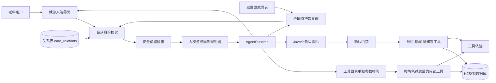
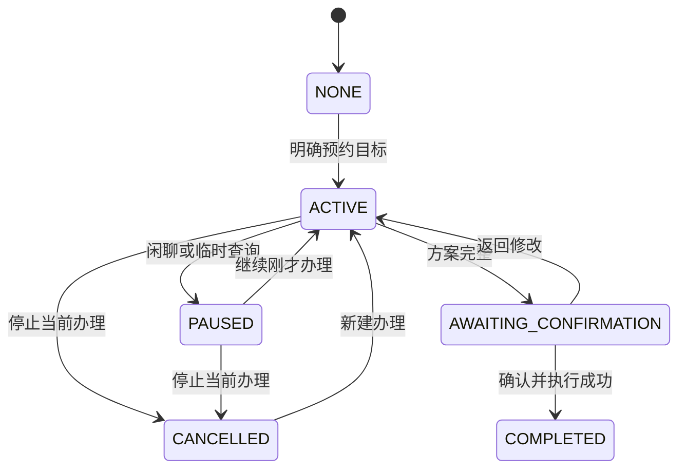
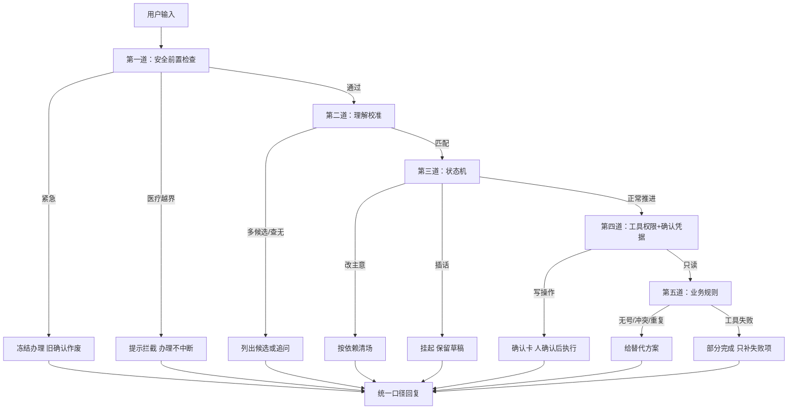

# 面向银发群体的复诊事项协同办理智能体设计思路报告

**项目名称：** 银龄复诊事项协同助手
**参赛组别：** 企业命题组 产教协同创新组
**文档版本：** v0.2
**更新日期：** 2026年9月11日
**文档用途：** 技术设计、课程作业与比赛设计思路说明的持续更新主稿

> 本项目当前为比赛演示原型。医院、用户、号源、路线、提醒和通知均为模拟数据。报告将已实现能力、正在完善内容和后续规划分别说明，不将规划功能表述为已经完成。

## 设计摘要

本项目面向老年人复诊过程中入口分散、步骤多、异常后不知道如何继续的问题，提供一个以自然语言和语音为主要入口的复诊事务协同助手。系统把医院科室选择、号源查询、材料准备、日程冲突检查、出行安排、提醒创建和家属通知组织为一项可暂停、可恢复、可修改的办理任务；此外还承接两类不属于预约流程、但老人日常真的会提出的请求：记录自己量到的血压血糖等健康数值，以及设置可重复的长期备忘。

项目采用受控混合智能体架构。大模型负责理解自然表达、组织补问、生成普通交流回复，并可提出调用低风险只读工具；Java 程序负责权限检查、业务状态、确认凭据和真实写入。预约是否成功、号源是否存在、楼层房间及提醒通知结果均来自工具和数据库，不能由模型自行宣布。

系统同时服务两个交互端：面向老年人的就诊人端，以及面向家属和志愿者的协同照护端。两端使用同一个智能体、同一套工具和同一道确认门禁，区别只在会话身份。身份被拆成两个互相独立的轴——**能力轴**回答“谁在操作”，决定提示词片段、工具可见性和权限判定；**数据轴**回答“这次服务谁”，决定工具里注入哪个 userId。操作者身份只用于关系校验和措辞，不进入任何工具参数，因此无法通过提示词把信息边界绕过去。家属或志愿者代长辈办理时，两个轴都由后端按 `care_relations` 表核实，未绑定的长辈一律拒绝。

与固定问答式办理相比，当前方案将普通对话与预约任务分开：用户明确说出预约目标后才创建任务；用户害怕、疲惫或临时询问流程时，任务转为暂停并保留原节点；用户选择继续后恢复办理。该设计既保留自然交流，也避免闲聊误改预约参数。

<!-- PAGE_BREAK -->

## 一 需求分析

### 1.1 业务问题

一次复诊往往包含预约、材料、日程、出行、提醒和家属协同。现有服务通常分散在医院小程序、地图、日历和通信软件中。老年用户需要记住办理顺序，在多个页面之间切换，并自行处理无号源、时间冲突和信息不完整等情况。

命题要求智能体理解口语化、多轮且不完整的表达，主动补齐必要信息，生成至少七项任务计划，调用真实模拟工具，并在关键写操作前获得明确确认。系统还要处理异常、体现适老化，并在六分钟录屏中证明工具确实被调用，而不是播放预写对话。

### 1.2 核心矛盾

本项目的主要挑战不是生成一段像人的回答，而是同时满足三项约束：

- **交流自然。** 用户可能先聊天、表达害怕或询问流程，不会始终按照表单顺序回答。
- **办理可靠。** 医疗事务中的误预约、误取消、误通知和虚构成功都会造成实际影响。
- **过程可证明。** 评委需要看到任务拆解、工具选择、参数、返回值、确认和最终结果之间的对应关系。

因此，系统不能完全依赖固定状态机，也不能把所有决策和写权限交给大模型。解决方案需要让模型拥有足够的语言理解和低风险查询能力，同时由程序保留安全和业务控制权。

### 1.3 需求与设计回应

| 命题要求 | 当前设计回应 | 验证方式 |
| --- | --- | --- |
| 理解口语和多轮表达 | 规划模型结合结构化状态与最近对话理解本轮目标 | 使用自然语句和插入式提问回归 |
| 主动补问缺失信息 | Java 检查必填字段，模型或模板一次补问一个主要问题 | 检查各阶段缺失字段与回复 |
| 七步任务拆解 | 维护预约、材料、日程、出行、提醒和通知的结构化计划 | 页面持续展示计划及状态 |
| 真实工具调用 | H2 查询和写入产生参数、结果与工具轨迹 | 对照工具日志和数据库记录 |
| 关键操作确认 | 写操作只能从确认端点执行，并校验 confirmationId | 重复确认和旧确认回归测试 |
| 异常后可恢复 | 保留有效结果，提供换日期、换时段、重试或取消 | 四组规定场景和故障注入 |
| 适老化反馈 | 大字、高对比、短句、少量按钮、事项卡 | 真机与录屏视觉检查 |
| 医疗安全边界 | 安全前置规则拦截紧急情况和医疗越界 | 越界与紧急语句用例 |
| 多方协同办理 | 家属和志愿者以双轴身份代长辈办理，与本人共用同一套工具和确认门禁 | 数据隔离、越权拒绝、代约归属回归测试 |
| 日常事务承接 | 健康数值记录与可重复备忘，由固定解析器填槽、模型判断“这句话属于哪件事” | 记录、回看、修改与删除的对话用例 |
| 机械事务不交给模型 | 数值与时间由 Java 解析；解析不出来时给中性追问，不假称已经办妥 | 解析失败路径断言回复不含“已经记好” |

### 1.4 项目范围

当前原型不训练专用模型，不接入真实医院、支付、短信或即时通信平台。系统使用模拟业务数据实现完整链路，并为医院、地图、日程和通知平台保留工具接口。系统只协同复诊事务，不进行诊断、用药建议、剂量调整、检查结果解读或治疗决策。

<!-- PAGE_BREAK -->

## 二 用户角色

| 角色 | 主要需求 | 权限和责任 |
| --- | --- | --- |
| 老年用户 | 少输入、少记忆，清楚知道下一步和办理结果 | 提出目标、补充信息、选择方案并确认关键操作；也可记录健康数值和管理自己的备忘 |
| 家属或陪同人 | 及时获知复诊时间、地点和陪同需求，并能在长辈不便时替其办理 | 只能操作 `care_relations` 表中与自己绑定的长辈；代办的写操作同样要过确认卡；不主动展开与本次协助无关的健康记录和联系方式 |
| 社区或医院志愿者 | 批量协助其名下结对的多位长辈 | 与家属同一套能力与限制，一次会话只钉住一位长辈，数据互不串号 |
| 演示和维护人员 | 配置场景、复现异常、核对调用证据 | 维护模拟数据和演示环境，不参与用户医疗判断 |

当前有两个交互端。就诊人端面向老年人本人；协同照护端面向家属和志愿者，已实现独立页面，而不是以模拟联系人和通知记录代替。家属和志愿者代长辈办理时，身份的两个轴都由后端从关系表核实：能办哪些事由操作者角色决定，办的是谁的数据由被服务的长辈决定。这意味着“能代办的权限”和“能看到的数据”是分开控制的——一个志愿者即便在他的长辈之间来回切换，会话之间也不会串数据。代他人办理时，本次代约记在操作者名下并通知其他照护者，确认卡会写明服务对象与代约归属。

### 2.1 典型场景

用户可以直接说“我下周三想去市第一医院心内科复诊，上午方便，出发前提醒我，也告诉女儿”。系统保存已知信息，仅询问尚未明确的替代日期和陪同偏好。用户中途说“我有点害怕去医院”，助手先进行支持性交流并暂停任务；用户之后说“继续刚才的办理”，系统恢复到原节点，不要求重新开始。

协同照护端的场景不同。女儿进入应用后选择“家属”身份，助手先读到她绑定的长辈，请她确认这次替谁办理，之后所有查询、代约和提醒都以那位长辈为准。她说“长辈下次复诊是什么时候”，系统查的是长辈名下的预约，而不是她自己的。她可以直接说“提醒我妈明天上午带身份证”，这句话会落进长辈自己的备忘，并标明是女儿留的；长辈下次打开助手就能看到。若要代约，流程与本人办理相同，只是确认卡上额外写明服务对象和代约归属，代约成功后系统会通知其他照护者。整个过程中，家属看不到这位长辈的健康记录明细——那与本次协助无关。

<!-- PAGE_BREAK -->

## 三 智能体架构

### 3.1 总体结构

系统采用前端移动界面、Java 模块化单体后端、可替换模型适配器和 H2 模拟数据库。模型负责自然语言规划，Java 运行时负责审核和执行，领域工具负责产生可验证结果。

<!-- PDF_FIGURE:architecture -->

两个端在进入规划器之前先经过同一个身份核实节点：本人自办时身份取自请求，代他人办理时还要查关系表确认绑定。这一步决定了后面下发哪些工具、以及所有工具读取哪个 userId——身份不是提示词里的一句话，而是执行链路上的一个前置判定。

### 3.2 模型与 Java 的分工

| 能力 | 大模型 | Java 程序 |
| --- | --- | --- |
| 普通聊天与情绪承接 | 生成简短自然回复 | 检查安全边界和越权承诺 |
| 理解复诊目标和字段 | 从上下文提出结构化事实 | 校验医院、科室、日期及当前状态 |
| 选择只读工具 | 可提出白名单内工具及参数 | 检查权限后真正执行并记录轨迹 |
| 修改未提交草稿 | 可提出修改语义 | 清除受影响的号源、路线和旧确认 |
| 提交或取消预约 | 只能提出用户意图 | 生成确认卡，确认后调用写工具 |
| 判断成功与失败 | 不拥有最终决定权 | 以数据库和工具返回结果为准 |
| 会话身份 | 不能指定、不能更改 | 从请求与关系表核实，决定工具可见性和数据范围 |
| 健康数值与备忘 | 只判断“这句话属于哪件事”，不拆数值和时间 | 用固定解析器填槽、落库；数值异常时先反问 |
| 医疗与紧急边界 | 辅助理解灵活表达 | 确定性规则优先拦截并暂停普通流程 |

模型每轮可以直接回答、补问，提出单个或组合的只读工具调用，也可以建议进入某个业务工作流。当前共注册 17 个只读工具，其中 15 个两个端都能用，另外 2 个（复诊动态、协同通知）只对家属和志愿者可见。模型可见的工具由运行时按会话身份过滤后下发，老人本人看不到协同照护端的入口。

需要强调的是，**过滤不等于安全**。工具目录只是能力清单，真正的判定发生在执行时：每一次工具调用都会被重新校验身份、参数和当前阶段。工具执行时读取的是会话里已经核实过的 userId，模型给出的 `elderUserId` 参数不参与取值——所以即便提示词被绕过，模型也无法把查询指向另一位长辈。预约、取消、提醒和家属通知不进入模型可自动执行的工具表，必须经过确认门禁。

一轮里模型不是只能调一次工具。它可以在同一个用户轮次内**先查一批、看到真实结果、再决定要不要接着查**：例如先查号源、发现没号、再查附近日期。循环有硬上限（最多 3 轮），并且按“工具名＋参数”拦截重复调用——同一件事不会因为模型反复选择而被查第二遍。这个循环只对只读工具有效，写操作永远不在其中。循环到达上限或模型续写失败时，直接返回最近一次权威工具结果，而不是重新执行查询或让模型自由发挥。

### 3.3 上下文和记忆

系统不会把全部历史对话每轮重复发送给模型。上下文由稳定规则、当前任务状态、已确认的结构化字段、最近 16 条消息（约八轮，可通过 `AGENT_MODEL_HISTORY_LIMIT` 在 4 到 40 之间调整）、必要工具结果摘要和本轮允许工具组成。事实权威顺序为：数据库与工具结果高于 Java 会话状态，Java 会话状态高于模型提取结果，旧对话中的说法最低。

会话身份（谁在操作、服务谁、二人是什么关系）也随会话一起持久化。这一点是被接口形状逼出来的：确认请求只带 `conversationId`，不带身份，如果身份只存在于当轮上下文里，确认执行时就没有办法知道该用哪个 userId 去写数据。因此身份必须放进 `ConversationState`，由后端在每次执行前重新读取，而不是依赖模型在对话里记住。

模型服务通过通用 `ModelGateway` 和 OpenAI compatible 协议适配，配置使用 `AGENT_MODEL_*` 环境变量。更换模型厂商不会改变业务工作流和工具权限。模型不可用时，规则规划器和回答模板继续支持核心办理路径。自由问答因此有四层回退：模型直答 → 模型加工具结果续答 → 规则规划器 → 固定模板；越往下越确定，但**没有一层会编造业务事实**。

### 3.4 跨对话长期记忆

上下文之外另有一条记忆通道，用来解决一个很具体的问题：老人每次复诊都要重说一遍常去的医院和科室。

记的内容只有三类：常去的医院、常去的科室、习惯的上午或下午。写入口**只有一处**——确认门禁放行、预约真的落进数据库之后。草稿阶段一个字都不记：他这次只是随口问了问骨科，如果就记成“常去骨科”，下次助手会拿着一个过期的偏好替他做决定，这比少问一句的收益危险得多。模型和前端都够不着这条写入路径。

同一个键只保留最新一版。换一家医院再办一次，旧的偏好被覆盖而不是并存——两版偏好同时进提示词，模型只会更糊涂。「什么时候开始知道的」和「最近一次确认」分别记录，因为这是两件事。

用法上，记忆拼成一句话接在提示词末尾，措辞明确写着“以前办过的，仅供参考，不要当成这次已经定好的安排”。**记住不等于可以替他办事**：所有写操作仍然要过确认门禁。没有记忆时这段是空串，提示词与没有这个功能时逐字相同。

老人自己能在「我的」页看到全部记忆并逐条忘掉，忘掉做成了两问（“确定忘掉 / 再想想”），因为这是不可逆的操作。删除是软删除——他什么时候让我忘掉的，本身也是一个应该留痕的事实。

### 3.5 实现底座

| 层 | 选型 | 版本或说明 |
| --- | --- | --- |
| 后端语言与框架 | Java + Spring Boot | Java 17、Spring Boot 3.5.x |
| 后端数据 | H2 | 演示用文件库；同一份 `schema.sql` 与 `data.sql` 建库播种 |
| 前端 | React + TypeScript | React 19，构建工具为 vinext/Vite |
| 模型接入 | OpenAI compatible 协议 | 通过 `ModelGateway` 适配，厂商可替换；未配置时自动降级为规则模式 |
| 多模态 | 视觉 / 语音识别 / 语音合成 | 未配置云端密钥时，语音走浏览器原生能力；**识图是唯一没有本地替代的能力**，未开启时明确告知而不是静默失败 |
| 运行环境 | Dev Container | 前后端两个独立进程，密钥经 `.devcontainer/.env` 注入且不入库 |

### 3.6 过程可见：一轮办理的实时进度

评审要求不能只展示预先写好的对话，因此系统把“一轮正在发生什么”也做成可看的：模型在理解、在决定查什么、提出了哪个工具调用、工具真实返回了什么，按序号成为一串事件，前端在助手页的「查看办理过程」卡片上增量拉取并逐步画出来；卡片默认收起，办理中也不自动展开，只在标题上换着显示此刻这一步，点开才看到参数与结果。

三个刻意的取舍：**只在内存**（进度是“此刻在发生什么”，进程重启后本来就无从谈起，落库反而会把工具参数多留一份；真正的调用记录仍由 `tool_call_logs` 负责）；**有界**（每个会话最多 40 条事件、最多同时跟踪 500 个会话，5 分钟没有新事件就不再认为“进行中”，兜住异常路径，免得页面一直转圈）；**读取时脱敏**（图片 base64 换成“（图片内容已省略）”，手机号按项目约定变成 `138****1234`，密钥样式的串一并抹掉，单字段截断 600 字）。内存里保留原始值供排查，经 HTTP 出去的一律是脱敏后的。

## 四 任务拆解机制

### 4.1 对话状态和任务状态分离

新会话默认处于普通交流模式，预约任务状态为 `NONE`。只有用户明确表达预约目标或点击“开始复诊办理”后，任务才变为 `ACTIVE`。中途聊天或临时查询不会清空数据，而是将任务置为 `PAUSED`；继续办理后恢复原阶段。取消当前办理后状态为 `CANCELLED`，但已有预约记录不会被删除。

这套任务状态机对三个身份是同一套。家属或志愿者代长辈办理时，走的就是本人办理那条链路，区别只在会话身份——因此代约不需要另写一套并发流程，确认卡和待确认动作的分发也完全复用。有一个步骤在代办时会自动跳过：本人办理要问“需要通知哪位家属”，而代办时操作者本人就是被通知的那一方，代约完成后系统直接通知其他照护者，再问他通知谁属于多余的一步。

草稿字段里有两个容易混淆的状态，系统把它们分开记：**“还不知道”**和**“已经明确不需要”**。例如“不需要家属陪同”是一个有效答案，不能和“还没问过陪同”混为一谈——否则助手会反复追问一件用户已经回答过的事，或者在用户没表态时自作主张按“不需要”执行。出发提醒同理：先说“不需要出行提醒”，之后又说“要提醒”，系统要能改回来，而不是把第一个“不需要”当成终态。

每一步该问什么、按钮怎么排，来自**规则驱动的模板**，不是让模型每轮自由生成。模型负责理解用户说了什么、决定下一步问哪一项，但“必填项有哪些、缺一项时该给出哪几个按钮”是确定性代码在管。这样既保留了自然语言入口，又保证不会因为模型的一次发挥而漏掉必填信息或给出不存在的选项。计划中的步骤顺序由业务依赖决定（先有号源才能查冲突、先有预约才能建提醒），因此不提供拖拽排序——顺序本身不是可选项。

<!-- PDF_FIGURE:task_state -->

### 4.2 七步任务计划

| 任务 | 前置条件 | 输出和影响 |
| --- | --- | --- |
| 查询可预约日期 | 医院、科室、期望日期 | 返回真实模拟候选号源，无号时查询附近日期 |
| 选择复诊时间 | 已获得候选号源 | 保存具体 slotId，不等同于已经预约 |
| 生成材料清单 | 医院和科室明确 | 返回科室材料模板及必带标记 |
| 检查日程冲突 | 已选择具体时间 | 返回冲突事项，用户决定换时段或保留 |
| 生成出发建议 | 预约时间、地址和交通方式齐全 | 返回路线、耗时和建议出发时间 |
| 创建复诊提醒 | 用户确认且预约成功 | 写入材料准备提醒和可选出发提醒 |
| 通知指定家属 | 用户授权且预约成功 | 写入模拟通知记录 |

### 4.3 依赖失效和恢复

修改医院会使科室、号源、材料和路线失效；修改日期或时间会重新检查号源、日程和出发时间；修改通知对象会更新待执行清单。任何影响确认内容的变化都会使旧 `confirmationId` 失效。部分步骤失败时保留已成功预约，仅补办失败的提醒或通知，避免重复预约。

## 五 工具设计

### 5.1 领域工具

当前后端定义十五类领域工具接口，模型只看到其中经过筛选的只读工具。

| 工具类别 | 代表工具 | 数据或结果 | 权限 |
| --- | --- | --- | --- |
| 预约 | `AppointmentTool` | 号源查询、提交、取消和改期结果 | 查询只读，写入需确认 |
| 我的预约 | `MyAppointmentTool` | 当前服务对象名下的数据库预约记录（代他人办理时是长辈的，不是操作者的） | 身份校验后只读 |
| 日程 | `ScheduleTool` | 冲突事项、提醒记录 | 查询只读，创建需确认 |
| 出行 | `TravelTool` / `RouteGuideTool` | 耗时、出发时间、路线步骤和折线 | 只读 |
| 家属通知 | `FamilyNotificationTool` | 联系人及模拟发送结果 | 发送需确认 |
| 材料 | `MaterialChecklistTool` `MaterialPreparationTool` | 材料清单和准备状态 | 查询只读，状态修改为写入 |
| 医院科室 | `HospitalCatalogTool` `DepartmentCatalogTool` | 医院、科室及适老服务资料 | 只读 |
| 办事知识 | `CareGuideTool` | 预约流程、报到和咨询渠道 | 只读，不含医疗知识 |
| 药品知识 | `DrugKnowledgeTool` | 药品的名称、规格、类别、用途和用药提醒 | 只读；数据来自人工整理的 16 条知识库，查不到就如实说没有 |
| 院内位置 | `FacilityGuideTool` | 楼栋、入口、楼层、诊室、报到点 | 只读 |
| 健康记录 | `HealthRecordTool` | 老人实测的血压、血糖、心率等数值 | 查询只读，写入需确认 |
| 健康备忘 | `MemoTool` | 到点提醒与长期备忘，支持每天/每周/每月重复 | 查询只读，增删改需确认 |

除上表外，还有两个只对家属和志愿者可见的只读查询：复诊动态（`care.timeline`）与协同通知（`care.notifications`）。老人本人没有这两个入口——他的动态和通知在就诊人端以页面形式呈现，不需要走对话。

### 5.2 受控工具调用过程

<!-- PDF_FIGURE:tool_loop -->

1. 程序把本轮允许使用的工具说明和参数结构发送给模型。
2. 模型输出建议调用的工具和参数，或者直接回答、补问用户。
3. Java 解析模型输出，并检查工具是否在白名单中。
4. Java 校验用户身份、参数、当前阶段、调用次数和副作用等级。
5. 校验通过后，程序真正执行工具；写工具必须先经过确认门禁。
6. 程序记录工具名、脱敏参数、返回结果和成功状态。
7. 权威结果用于生成回复、更新计划或进入下一步。

### 5.3 数据真实性与地图

医院、科室、号源、联系人、材料、路线和院内位置来自 H2。预约、提醒和通知通过实际数据库写入生成业务编号。工具调用保存到 `tool_call_logs`，用于调试和录屏取证。

出行页面分为院外路线和院内指引。院外路线展示坐标折线、距离、预计用时、建议出发时间和路线步骤；未配置地图 Key 时使用明确标注的比赛模拟地图，配置高德浏览器 Key 后可加载真实底图。院内指引通过号源关联 `clinic_locations`，展示门诊楼、入口、楼层、诊室、报到点、无障碍路径和护士站，避免由模型凭空生成“几楼几号房”。

### 5.4 药品知识工具

老人拿着药盒问“这药是干嘛的”是很自然的请求，但它离医疗建议只有一步之遥。这个工具的边界因此收得很紧：**只回答“这是什么”**——名称、规格、类别、用途、用药提醒，全部来自人工整理的 16 条慢病用药知识库，逐条可核对。

它不回答“我该不该吃”“要不要加量”“能不能换成另一种”。查询支持药名与规格两个参数，也容忍口语里的简称（去剂型后缀后双向匹配），单次最多返回 3 条；像“片”“胶囊”这类泛词会被过滤掉，否则一次会命中整个知识库。查不到时如实说没有，并建议咨询药师——**宁可说不知道，也不给一个听起来合理的答案**。

### 5.5 号源与关键时点

演示用的号源不是静态表格，而是每天滚动补齐的：从当天起一个月内，每个启用科室在工作日生成 09:00、10:30、14:00、15:30 四个时段，周末留空——这个空档是故意的，用来稳定复现命题要求的“所选日期没有号”恢复路径。补齐用“不存在才插入”的写法，只补不覆盖，所以已经占用的号源不会因为重启而被重置。

三个与时间有关的数字全部由工具按固定规则算出，模型只能转述、不能自行调整：

| 项目 | 规则 |
| --- | --- |
| 建议出发时间 | 预约时间 − 预计路程耗时 − 20 分钟（预留取号时间） |
| 材料准备提醒 | 预约日前一天 |
| 出发提醒 | 建议出发时间前 10 分钟 |

把这三条写成规则而不是交给模型“估算”，是因为它们直接影响老人会不会迟到：路程耗时的估算可以讨论，但不能因为模型的措辞变化而上下浮动。

需要说明的是，当前是**单实例、单数据库、非分布式事务**的实现。预约、提醒和通知按顺序执行，部分失败时保留已成功的结果并标记待补办项（见第七章），但没有跨服务的分布式事务补偿机制。

## 六 确认机制

### 6.1 必须确认的操作

提交预约、修改或取消已有预约、创建提醒、发送家属通知以及修改已确认方案，都必须获得明确确认。号源、材料、日程冲突、路线和医院科室资料属于只读查询，可以在形成方案时自动执行。

### 6.2 确认内容

确认卡展示医院和科室、完整日期和时间、陪同需求、建议出发时间、拟创建提醒、通知对象、消息内容和可能影响。按钮使用“确认办理”“返回修改”“确认取消预约”“保留预约”等具体动作，不使用“好的”“继续”等模糊表达代替授权。

### 6.3 确认凭据

每次确认卡绑定随机 `confirmationId`。确认接口检查会话阶段和当前凭据，在执行前消费凭据。用户修改参数、取消任务、触发紧急暂停或已经使用过凭据后，旧确认不能再次执行。工具写入使用幂等策略，避免重复点击和网络重试产生重复预约、提醒或通知。

### 6.4 权限分级

| 等级 | 能力 | 系统处理 |
| --- | --- | --- |
| L0 | 普通交流 | 模型回答，Java 检查安全承诺 |
| L1 | 只读查询 | 模型可提出，Java 校验后自动执行 |
| L2 | 未提交草稿修改 | 模型提出语义动作，Java 更新状态并清理依赖 |
| L3 | 预约、取消、提醒、通知 | 模型不能直接执行，必须展示并确认 |
| L4 | 诊断、用药和越权操作 | 拒绝执行并提供安全说明 |

上表回答的是“这件事有多危险”。代他人办理还多出一个维度：**“谁能办”和“能办谁的数据”是分开判定的**。

能力轴由操作者角色决定。老人本人、家属、志愿者拿到的提示词片段和工具清单不同：家属和志愿者多两个协同查询工具，以及一个给长辈留提醒的意图；老人本人则有管理自己的备忘、记录健康数值这些只有他自己才需要的入口。数据轴由被服务的长辈决定，所有查询和写入都指向他，而不是指向操作者。两个轴在会话建立时由后端按 `care_relations` 表核实并固化，之后不再改变。

这样切分有两个直接好处。一是同一段代码服务三种身份，不需要维护三套流程——代办的预约走的就是本人预约那条链路，只是身份不同。二是越权不可达：即使模型被诱导去查询另一位长辈，工具执行时取的仍是会话里核实的 userId，模型传什么参数都不作数。越权请求在会话建立阶段就已经被关系表挡掉了，返回的是明确的“没有权限查看这位就诊人的信息”，而不是一个含糊的系统错误。

需要说明的是，确认机制设计的是**绑定当前方案**，而不是一套独立的数字计划版本或分布式账本：确认凭据绑定的是一份具体的、即将执行的操作快照，它防的是“拿旧授权执行新方案”。跨系统的强一致性与可审计账本不在当前范围内。

### 6.5 会话生命周期

一场对话需要有结束的地方，否则老人回头翻历史时，分不清哪一段还能接着聊。会话有三个状态：**进行中 / 已结束 / 很久没聊**。

- **已结束的会话只能翻看，不能写。** 消息照常显示，但新消息、按钮操作和确认一律被拒；输入框会换成一条说明和一个“开始新的一段对话”按钮。这里的取舍是：**不把输入框摆在一个会被拒绝的地方**——让老人打完字才被拒绝，是最糟的一种交互。
- **结束不删除。** 旧的那段随时能从历史记录里点回来。
- **空闲超时只标记，不清理。** 隔了很久没来，这段会话被标成“很久没聊”，但**填到一半的内容还在**：再说话就能接着办，待确认的卡也还在。把超时当成“销毁用户没做完的事”，是用一条治理规则把用户正做到一半的事弄坏。
- 被拒的那句话**不写进历史**。它是一次失败的调用，不是一轮对话；如果落库，一个还开着确认卡的老页面每重试一次就多一条一模一样的“已经结束”，真正聊过的内容反倒被复读淹掉。
- 刷新页面时尝试恢复上次那段会话，但**刻意不恢复已结束的**，理由同上：不让人一进来就掉进一个打不了字的页面。

前端的只读状态由后端返回的会话状态驱动，而不是去匹配那句拒绝文案——匹配文案等于把界面绑在措辞上，改一个字就失灵。

### 6.6 权限之外的两条诚实边界

- **“提醒已创建”不等于“提醒已触达”。** 系统能证明的是数据库里多了一条提醒记录，不能证明老人看到了、更没有证明他照做了。演示里所有涉及“通知家属”的表述都只到“已发送”为止。
- **“已发送的消息无法撤回”。** 取消预约时会停用关联提醒，但已经发出去的家属通知不会追回——这一点在确认卡上就写明了，不是取消之后才告知。

## 七 异常处理

### 7.1 异常处理整体架构

在本项目里，"异常"不单指程序报错，而是复诊办理过程中一切让原定流程走不下去的情况：老人说得不清楚、选的日期没有号、办到一半改主意、工具执行失败、问出超出服务范围的问题，甚至说出胸痛这样的紧急情况。这些都不是 bug，是真实场景的常态。

我们对异常处理只定三条原则：

1. **说明发生了什么**——告诉老人当前卡在哪，而不是丢一句"操作失败"。
2. **保留仍然有效的结果**——已经问清的信息、已经办成的预约，不能因为一步失败就推倒。
3. **提供明确的下一步**——每个异常都必须给出可以点下去的选项。

这三条不是靠单一机制实现的。用户每说一句话进来，要依次经过五道防线，每道防线各管一类异常：

<!-- PDF_FIGURE:exception_architecture -->

| 防线 | 机制 | 代码类 | 拦的是 |
| --- | --- | --- | --- |
| 第一道 | 安全前置检查 | `SafetyGuard` | 紧急情况、医疗越界——还没进业务流程就拦 |
| 第二道 | 理解校准 | `CatalogEntityResolver` | 没听懂、听歧义——不猜不编 |
| 第三道 | 状态机 | `ConversationState` | 挂起、部分完成、改主意清场——管走到哪了 |
| 第四道 | 工具权限 + 确认凭据 | `ToolPolicy` + `ConfirmationInteractionTool` | 模型想直接写、旧凭据复活 |
| 第五道 | 业务规则 | `MockAppointmentTool` 等 | 无号只往后查、幂等防重复 |

这里要特别说明：**状态机是第三道，是中枢但不唯一。** 紧急检测、实体消歧、工具权限、业务规则各自独立工作，状态机负责把它们的结果汇总成"当前在哪、该退到哪"。整个架构的核心立场是一句话：**模型负责理解用户说了什么，程序负责判定能不能这么干，工具负责给出真实结果。** 下面按办理过程中最容易遇到的几类异常，分别说明每道防线怎么工作。

### 7.2 没听懂时：理解校准机制

老人说"还是以前那个医院""帮我约个心内""九点多吧"，如果系统猜错还往下走，就会得到一条错误的预约。第二道防线由 `CatalogEntityResolver` 负责，它把老人的说法和真实目录做对齐，结果只有五种：精确匹配、口语别名唯一命中、存在多个候选、查无此项、说法本身不清楚。

**关键设计是：系统绝不自己猜。** "心内"可以通过别名表唯一对应到"心内科"，但前提是目录里恰好有这一个科室。如果老人说的简称能对上两个候选，系统就把候选列出来让他选；如果目录里根本没有，就如实引导他问家属或服务台。别名表只决定"口语怎么映射"，事实来源始终是数据库里的真实目录。

追问时我们遵循一条规矩：**保留已经听懂的，只追问没有听懂的。** 比如老人只缺日期，系统不会让他把医院、科室重新说一遍。这背后有一个容易被忽略的数据设计——"还不知道"和"明确说不需要"是两个不同的值，不能都存成空。老人说"不需要家属陪同"是一个有效答案，如果和"还没问过陪同"混为一谈，系统就会反复追问同一个问题。

时间表达上还有一道双保险：模型偶尔会在回复里说"好的，下午三点半"，结构化结果里却没把时间填进去，这时 Java 会用自己的口语时间解析器从原话里再抽一次补上；但只补空、绝不覆盖模型已经给出的值。

> **举例**：老人说"帮我约个心内"。别名表把"心内"映射到"心内科"，但目录里有两家医院都有心内科。系统不会自行选一家，而是把两家列出来："您是说市第一医院的心内科，还是市人民医院的心内科？"老人选完之后，医院和科室同时落字段，接着问日期。

### 7.3 办不成时：业务恢复机制

无号、时间冲突、重复预约，这些都不是系统错误，而是现实业务条件不满足。它们有一个共同特点：**重复调用工具解决不了，只能请用户调整条件后重新规划。** 所以系统不会回"预约失败，请重试"，而是给出真实可行的替代方案。

**指定日期无号时**，系统先保留医院、科室等条件，然后问老人"接不接受附近几天的其他时间"。只有得到同意，才去查附近日期，查询范围刻意只往后看 3 天——往前查会捞出已经过去的时段，当天内换时段则走另一条"选时段"的路径，避免出现"今天没号"却又推荐今天时段的自相矛盾。

**时间与已有日程冲突时**，系统在号源刚锁定的那一刻就做只读预检，把冲突事项摆出来，给出三条出路：换号源、重新选日、或者明确表示"仍保留这个时间"。冲突检查特意提前，而不是等陪同、出行、通知全都答完才说"这个时间您有约了"——那样前面的回答全白费了。

**同一时刻已经约过时**，系统在提交前拦下重复预约。判定口径只比"同一天同一时刻"，不再比医院和科室，因为一天内在不同科室看两个病是正常需求，只有时间撞车才真正矛盾。

这几类异常有一个关键细节是怎么告诉模型的。系统提示词里专门写了一个【异常情况】块，对无号、过去时段、冲突、重复各给了明确的话术约束。其中最值得说的一条是关于"约满"和"时间过了"的区分：

> 提示词原文：*"当天已经过去的时段：说「今天这个时段已经过了」，不要说成「约满」。「约满」指名额被别人占完，和「时间走掉了」是两件事；只有工具结果明确说了名额满，才能说约满。"*

为什么这条要单独写？因为模型如果不被约束，很容易把所有拿不到号的情况一律说成"约满了"——对老人来说，"约满"意味着"别人抢完了"，他可能会急着去抢号或者换黄牛；而实际上只是那个时段的时间已经过了。理由换一个说法，等于替工具编了一句它没说过的话。提示词还要求：工具没给理由时就不补理由，只说结果。

> **举例**：老人选了 9 月 19 日市一医院心内科，查出来没有号。系统保留医院和科室，回复："9 月 19 日该科室暂无号源。您的医院和科室选择仍然保留，可以选择其他日期继续查询。"并问"如果这一天没有号，您接受附近几天的其他时间吗？"老人说"可以"，系统往后查 3 天，查到 20 号有号，列出来让老人选。

### 7.4 改主意或被打断时：状态保护机制

复诊办理涉及医院、科室、号源、材料、路线、提醒、通知一连串环节，彼此有依赖关系。老人改一个条件时，最忌讳两种极端：全部清空重来，或者继续沿用已经失效的旧结果。第三道防线由状态机的 `invalidate()` 方法负责，对策是**按依赖关系清场**——改的字段会影响后面哪些结果，就只清那些，其余全部保留。

| 老人改的是 | 清掉什么 | 保留什么 |
| --- | --- | --- |
| 陪同、交通、通知谁等细节 | 确认卡、日程检查结果 | 医院、科室、日期、号源 |
| 日期 | 号源、材料、确认卡等 | 医院、科室、陪同偏好 |
| 科室 | 科室往下的结果，连同陪同、交通、通知 | 只留医院 |
| 医院 | 除医院外几乎全部 | 无 |

这里有个关键细节：把复诊日期从 18 号改到 20 号，之前答的"需要家属陪"不会被清掉——陪不陪是跟着人走的，跟哪天去没关系；但把科室从心内科换成骨科，连"怎么去、通知谁"都要一并重算，因为科室变了这些结论可能都不成立。而且无论是点按钮改还是用一句自由的话改，触发的都是同一套清场逻辑。

老人中途聊别的，处理原则是：**暂停不等于清空。** 无论是表达害怕等情绪、普通闲聊，还是查流程、看地图这类只读查询，任务都只是从"进行中"挂起为 `PAUSED`，阶段不动、草稿一个字不改，同时给一个"继续刚才办理"的回程按钮。系统还单独存了一个"打断点"，只记住第一次被打断时的位置，后面再插话也不会覆盖它。

修改**已经办成**的预约则更加谨慎：系统不会动原来那条记录，而是先另开一份"变更草稿"，把原预约记在 `originalAppointmentId` 上；等新号源确认拿到之后，才真正动旧的。改期失败等于什么都没发生，原预约和提醒都在。

> **举例**：老人正在选号源，突然说"我有点害怕去医院"。任务挂起为 `PAUSED`，草稿里医院、科室、日期全不动。助手先做安抚回复，同时给一个"继续刚才办理"按钮。老人点完，系统回到"选号源"那一问，不用重新答医院和科室。

### 7.5 工具失败时：部分完成与恢复机制

一次确认办理背后其实是一串写操作：提交预约、建材料提醒、建出发提醒、通知家属。它们有可能在某一步失败。系统把"整体失败"拆开看，对应两个不同的状态。

- **预约已经成功，后续提醒或通知失败**：进入 `PARTIAL`（部分完成）状态。回复标题是"预约已保留，后续事项未全部完成"，逐条说明哪一项没完成、可以怎么补，并给一个"补办未完成事项"入口。补办时预约不会重复提交——代码里每一步完成都会立即保存进度标记（`materialReminderDone`、`departureReminderDone`、`notificationDone`），重试时靠这些标记跳过已完成步骤。
- **预约还没提交就失败**：进入 `TOOL_ERROR` 状态，已填的信息全部保留，给出"重试检查、修改日期、人工帮助"三个选项。
- **取消操作失败**：原预约保留，明确告知"取消未完成，原预约保留"。

防止重复的还有一道数据库层面的保险：预约提交采用幂等策略，只有"同一会话＋同一就诊人＋同一个具体号源"三者都相同，才被认定为同一次提交的重复点击，直接返回上一条记录、不再新建。

措辞上几种失败结果严格分开，不能混用：预约成了、提醒没成，绝不能写成"办理失败"；老人明确选了"不通知家属"，结果页如实写"无需通知家属"，不能写成"通知成功"——**没做的事不能记成做完了。**

> **举例**：老人确认办理后，预约成功写进了数据库（`appointmentId` 不为空）。接着创建出发提醒时工具报错了。系统不回"办理失败"，而是进入 `PARTIAL` 状态，回复"预约已保留，后续事项未全部完成：出发提醒未创建。可补办未完成事项，不会重复预约。"老人点"补办"，系统只重新建提醒，不会重新提交预约。

### 7.6 模型不可靠时：受控执行机制

接入大模型后，异常处理多了一类情况：模型本身的不可靠。它可能误解意图、可能"口头上"承诺业务结果，甚至可能吐出一个系统里根本不存在的工具名。第四道防线就是管这个的，总体立场是：**模型可以提建议，程序负责批不批准。**

**读写操作物理隔离**：查医院、查号源这类只读工具，模型提出后经 `ToolPolicy` 校验可以自动执行；预约、取消、提醒、通知这类有副作用的操作，模型怎么提都不会被直接执行，而是被翻译成一张确认卡。如果模型编造了没注册的工具、或想调用当前角色没权限的工具，系统绝不执行它，也不会静默降成一段没有卡片的回答，而是按它给出的意图转回 Java 业务流程；连意图都不可信时明确回绝，且不动任务状态。

**确认凭据一次性有效**：每张确认卡绑定随机 `confirmationId`，执行前重新校验会话阶段和凭据，执行后立即消费。修改任何参数、取消任务、触发紧急暂停，都会让旧凭据失效。

**确认卡内容由 Java 拼**：卡上的时间、地点、陪同、材料、通知对象全部由 Java 照着数据库快照直接拼出，不经过模型改写。模型最多只能在卡片前写一句不超过 60 字、不含任何业务词和数字的开场白——保证"老人看到的"和"系统将执行的"一字不差。

这里有两个关键点是怎么通过提示词告诉模型的。第一是阻止模型"嘴上说办好了"：

> 提示词原文（【写操作】块）：*"提交预约、取消预约、创建提醒和通知家属只能提出，确认前不得声称已经完成。'好的、嗯、继续'不能当成重要操作确认。"*

这条约束的背景是：开发中我们真实遇到过模型回复"我给您记一个提醒"，数据库里却一条记录都没有。从那以后，凡是要落库的动作，提示词里都要求模型必须走 `interaction.respondConfirmation` 工具，不能用自然语言代替授权。

第二是防止"模型说记住了但没填字段"：

> 提示词原文（【每轮必须真的落字段】块）：*"只在 replyDraft 里说、facts 里是空的，办理进度不会前进，老人会被同一个问题反复问。"*

这条约束的背景是：模型理解了老人说的话，不代表它在结构化输出里填了对应字段。如果只在回复文本里说"好的，下午三点半"、facts 里 `selectedTime` 是空的，Java 不会推进进度——下一轮还会问时间。提示词把这件事直接告诉模型，让它理解"说和做是两回事"。

> **举例**：老人说"九点多吧"。模型回复"好的，帮您看一下九点多的号源"，但 `facts.selectedTime` 没填。Java 不认这段回复，下一轮继续问"您是想约上午九点左右吗？"同时 Java 的口语时间解析器从"九点多"抽取出 `09:00` 补进草稿，模型下一轮就能看到草稿里已经有了，不再重复追问。

模型服务本身也可能不可用。系统准备了完整的降级链路：模型直答 → 模型结合工具结果续答 → 规则规划器 → 固定模板，越往下越确定，但没有一层会编造业务事实。模型挂掉时，核心办理路径仍可走通。

### 7.7 越界与紧急：安全拦截机制

系统服务的是复诊"办事"，不是线上"看病"，所以有两类输入需要特殊处置。有意思的是，它们的处置方向几乎是相反的，而且这种相反是刻意设计的。

**医疗越界**指的是老人索要诊断、用药建议、报告解读等。判定由模型语义识别和 Java 医疗边界规则（`MedicalBoundaryRules`）双重完成。规则口径是"默认怀疑"——症状、药物、检查类词汇一旦和疑问语气同时出现就判定越界，因为这种问题漏判后会被当成普通信息静默忽略，老人还以为得到了回答，比多提示一次危险得多。同时规则准备"办事类放行"名单，避免"去心内科要带什么材料"被误判成医疗咨询。

越界后的处置是：回一段标准提示（不能诊断、不能调药、建议咨询医生），单独渲染成橙色提示块，上面不放任何按钮——它不是一步操作；**而老人手里那张确认卡连同旧凭据会原样还回去，办理阶段也不动。** 道理很简单：老人问到一半药，如果"确认办理"按钮跟着消失，他会以为事办不成了，可服务端那张卡其实一直有效。这叫"只插话、不改办"。

这里的关键是怎么告诉模型分清"问药"和"问流程"。系统提示词的【医疗安全】块里有一段专门处理混合句式：

> 提示词原文：*"这类问病、问药、问报告的，用 MEDICAL_ADVICE。**即使句子里还带着日期或办事要求也要用**，例如'下周三，这个药量是不是该减半'——不能只接办事情那半句，把问诊这半句当没看见。"*

为什么这条要单独写？因为模型天然倾向"捡能办的那半句"——它看到"下周三"就想去查号源，把"药量是不是该减半"当闲聊丢了。但老人说这句话时，他真正关心的是药量。如果系统只帮他约了号、对药的问题不管，他会以为系统默认了他的药量可以减——这是危险的。

**紧急情况**（胸痛、呼吸困难、昏迷、想不开等）方向完全反过来：`SafetyGuard` 在模型处理前后各检一次，一旦命中立即清掉确认凭据、把任务冻结为 `EMERGENCY_PAUSED`，所有旧入口的操作全部拦下，包括那张尚未使用的旧确认卡；同时给出求助提示和一个"人工帮助"按钮，**绝不自动跳转页面**，并通知本次复诊的安排者尽快联系老人。冻结之后想恢复办理，必须显式点"重新办理"，"继续"按钮是通不过的——不能让一个遗留在页面上的旧按钮把紧急状态悄悄解除。冻结期间仍会放行"这附近医院怎么走"这类问路，因为那时候最需要的恰恰是求助信息。

> **举例 A（越界）**：老人正在确认卡前准备按"确认办理"，突然问"我这个降压药能不能减半吃"。系统识别为医疗越界，弹出橙色提示："我不能诊断疾病、判断原因、解释检查结果或调整用药。请及时咨询医生。"但确认卡原样还回去，办理阶段不动。老人看完提示，接着按"确认办理"就行。

> **举例 B（紧急）**：老人说"胸口疼、喘不上气"。系统立即冻结办理，旧确认卡作废，回复"这可能是紧急情况。请立即联系身边人员，拨打 120 或寻求线下急救帮助。普通办理已暂停，已有记录保留。"并通知这次复诊的安排者。老人之后想恢复办理，必须点"重新办理"从头开始，点"继续"无效。

### 7.8 异常怎么"说"出口：统一反馈结构

无论哪一类异常，系统最终对老人说的话都包含同样五个要素：**发生了什么、操作是否已经执行、哪些内容仍然有效、可以怎么处理、下一步该做什么。** 比如无号时说的是：

> "不好意思，9 月 19 日该科室暂无号源。您的医院和科室选择仍然保留，可以选择其他日期继续查询。"

而不是"预约失败，请重试"。前者老人听得懂、知道自己的努力没有白费、也知道手该往哪点；后者只会诱发一次又一次的重试。前端的页面状态（挂起、冻结、部分完成）也全部由后端返回的状态字段驱动，而不是去匹配某句提示文案——界面一旦绑在措辞上，改一个字就会失灵。

---

回过头看，这套机制可以用六句话概括：**听不懂就校准，办不成就换路，改不动就保进度，出错了就分开认，越界了只插话，紧急了就冻结。** 我们没有试图做一个"永不犯错"的智能体，而是做了一个"犯了错也不会闯祸、出了意外总能接着走"的智能体——模型提供智能，程序保证安全，工具提供事实，让老人面对的始终是一条可控、可靠的复诊办理之路。

异常场景的稳定复现是演示的前提：无号源和时间冲突均由滚动更新的模拟数据保证；系统还提供统一的会话与数据重置入口，保证多次录屏不会因已占用的号源或历史提醒而改变结果。

<!-- PAGE_BREAK -->

## 八 适老化设计

### 8.1 交流设计

助手支持打字和**按住说话**两种入口，回复采用短句，一次只提出一个主要问题。用户一次说出多项信息时，系统保存已知字段，不重复询问。候选按钮控制数量，并提供返回、取消和人工帮助入口。

语音输入按“按住说话”设计，而不是点一下开始、再点一下结束——后者要求老人记住当前处于哪个状态，按错了还容易录进半句话。按下不满 600 毫秒就松手视为误触，直接丢弃；说话期间上滑约 70 像素进入取消预备（回滑 40 像素可恢复），松手即取消；系统层面的中断（来电、切后台）一律按取消处理。录音期间弹出的浮层里有一排音量条实时反馈，让老人知道“它确实在听”；音量动画全屏只有这一条，按钮本身只变红，不再放第二条——手指正压着按钮，那里面的动画大半被指头挡住，还会和浮层里那条抢注意力。

说的是语音，回去的也是语音：**用嘴问的那一轮必定朗读回复**，即使全局的自动朗读开关是关的——开关管的是“助手主动念”，不是“我问了却不答”。录完的话会留成一个语音条，点一下听到的是**自己刚才的原话**（原始录音，不经过识别也不经过合成），方便确认“它有没有听错我”。播放任何一条时都会先掐掉正在念的助手朗读，不会两个声音叠在一起。

朗读本身优先用手机自带的语音（不联网也能用），配置了云端语音时用云端合成，失败自动退回手机语音。音色和语速在助手页的“朗读设置”里调，默认 1.0 倍速，范围 0.5 到 2.0。

需要如实说明的是：语音识别的准确率**受方言和口音影响**，本项目没有做方言专项优化，也不宣称支持完整方言识别。识别失败时不会把错误提示堆进聊天记录，而是给一次临时提示。

### 8.2 对话优先设计

助手的主要职责从“只能按槽位追问”放宽为“可以交流、解释和办理复诊”。没有预约目标时，页面不会强迫用户选择医院；用户明确提出预约后才显示持续任务卡。聊天、流程知识查询、材料查询和地图查询不清除任务，也不会把暂停状态误改为正在办理。

### 8.3 页面信息层级

进入应用时先选择身份（就诊人本人 / 家属 / 志愿者），再进入对应的界面。就诊人端首页提供我的复诊预约列表和常用入口；助手页承载对话、任务卡、确认卡和结果卡；事项页集中展示预约、材料、提醒和家属通知；出行详情页统一展示院外路线与院内指引。协同照护端另有一套页面：长辈列表与选择、长辈的复诊动态时间线、代约流程、协同消息收件箱。重要时间、医院科室、楼层诊室和操作按钮使用大字号、高对比和较大点击区域，状态同时用文字表达，不只依赖颜色。

两端的助手页外观一致——这是有意的：家属和志愿者用的是同一个助手，如果交互长得不一样，反而会让人以为能力也不同。差别体现在内容上而不是样式上：照护端的快捷提问是“长辈下次复诊是什么时候”“帮我给长辈留个提醒”这类，老人端则是关于他自己的事。

### 8.4 无障碍细节

- **不靠红绿区分对错。** 成功与失败同时用图标、文字和状态标签表达，色觉障碍用户不会因此读错结果。
- **特大字体开关。** 「我的」页可以整体放大一档字号，打开后所有页面生效——不是只放大标题。
- **每个可操作元素都有可读的名字。** 图标按钮（返回、朗读、麦克风）都带无障碍名称，读屏软件念得出来，不出现“按钮、按钮”。
- **操作按钮留足点击区域。** 主要按钮高度按老人手指操作设计，不用悬停才能看到关键信息。
- **一次只突出一个主按钮。** 同一屏里次要动作降级为描边样式，避免老人不知道该按哪个。

### 8.5 后续适老验证

当前适老化结论主要来自需求检查和页面视觉验收，尚未完成真实老年用户测试。后续应记录独立完成率、补问轮次、误触次数、确认内容复述正确率、寻找诊室耗时和人工帮助需求，不能仅以团队主观判断替代验证。

<!-- PAGE_BREAK -->

## 九 安全边界

### 9.1 医疗服务边界

系统只办理复诊相关事务，不诊断疾病，不推荐药品，不调整剂量，不解读检查报告，也不代替医生决定治疗方案。用户提出相关问题时，助手说明能力范围并建议咨询医生或专业医疗机构。

明显紧急表达先经过确定性安全规则。命中后系统使旧确认失效，暂停普通办理并提示及时联系急救服务、身边人员或线下医疗机构。该机制不能被描述为医疗分诊，也尚未经过临床有效性验证。

药品问答遵循同一条边界：只说明“这是什么药”，不回答该不该吃、要不要加量、能不能换药，也不判断症状与药物的关系。识别药品图片时，名称、规格、数字、用法用量要求照抄图上的内容，不凭记忆生成。

**“停止当前办理”和“取消已有预约”是两件不同的事**，系统在措辞和实现上都分开：前者只是放弃这份还没提交的草稿，数据库里什么都不变；后者必须先查出真实存在的预约、绑定具体的预约编号、再确认一次。把两者混为一谈，会让一句“我不想弄了”变成一次真实的取消。

### 9.2 模型和操作边界

模型输出属于建议，不是业务事实。具体号源、预约成功、提醒创建、通知发送、路线、楼层和诊室必须由工具返回。用户消息和工具结果中的文本不能改变工具权限。API Key、Authorization 信息、完整手机号和模型隐藏推理不得出现在评委视图或日志展示中。

### 9.3 数据和部署边界

当前演示只使用模拟个人资料。启用外部模型时，会发送本轮输入、近期对话和必要的结构化状态，因此不能宣称全部数据均在本地处理。

会话归属校验和角色权限在本版已经实现：会话建立时按关系表核实操作者与被服务长辈的绑定，未绑定直接拒绝；工具可见性按角色过滤，执行时再校验一次。但这还不等于完整的身份体系——当前的身份选择是演示用的模拟入口，没有登录态，也没有用户对授权的自助管理。

真实部署前仍需补齐：真实身份认证、数据最小化、日志脱敏、保存删除策略、授权的申请与撤销流程，以及第三方平台数据授权。

<!-- PAGE_BREAK -->

## 十 创新点

创新评价应回答“我们怎样在完成命题要求的同时做得更好”，并区分已经实现与后续规划。

### 10.1 已实现创新

| 创新设计 | 当前实现 | 相比普通方案的改进 |
| --- | --- | --- |
| 对话和任务双状态 | `DialogueMode` 与 `TaskStatus` 分开，任务可暂停恢复 | 避免固定流程吞掉闲聊、情绪和临时问题 |
| 受控混合智能体 | 模型可回答、补问和建议只读工具，Java 保留写权限 | 比纯状态机自然，比自由工具智能体更可控 |
| 办事知识与医疗知识隔离 | H2 只保存复诊流程、报到和咨询渠道 | 回答“怎么办”有依据，同时不越过医疗边界 |
| 双层到院指引 | 院外路线与院内楼层诊室使用不同数据和页面层次 | 从“何时出发”延伸到“到院后怎么找到诊室” |
| 结果可追溯 | 模型建议、工具参数、返回值和最终事项可关联 | 便于评委核验，不依赖预写对话证明能力 |
| 模型可替换和规则回退 | 通用模型网关加规则与模板备用路径 | 团队可更换模型，比赛现场断网仍可演示核心流程 |
| 双轴会话身份 | 能力轴（谁在操作）与数据轴（服务谁）分开判定，均由关系表核实并随会话固化 | 越权在会话建立阶段即被拒绝；模型参数无法改变数据指向，不靠提示词约束 |
| 一个智能体服务两端 | 就诊人端与协同照护端共用同一套工具、状态机和确认门禁 | 不为家属端另写一套流程，减少两套规则互相打架的风险，能力扩展一次即两端生效 |
| 机械事务与模型判断分层 | 健康数值、备忘这类需要精确解析的事由 Java 固定解析器填槽，模型只判断“属于哪件事” | 数值和时间不会被模型改错，同时保留自然语言入口 |
| 过程实时可见 | 一轮进行中把“理解→决定查什么→模型提出工具调用→工具真实返回”逐步画出，参数是模型当场生成的那份，结束即收起 | 直接回应“不能只展示预写对话”；结束才出现的轨迹是结论，说服力不如当场看着它跑 |
| 多模态入口 | 拍照识图（药品与材料）、按住说话（语音识别 + 音量反馈 + 原话回放）、语音朗读（本地优先、云端降级） | 视力与打字能力不足的老人不必先学会打字，识图也是清点材料的实际手段 |
| 跨对话长期记忆 | 只记“确认办成的事”，同一偏好覆盖而非累积，提示词里明确标注“仅供参考”，用户可逐条忘掉 | 记住偏好省掉重复问答，同时不让一个过期偏好替老人做决定；可删是这类功能能被接受的前提 |
| 会话有始有终 | 会话分进行中/已结束/很久没聊；结束的只读不删，超时只标记不清理草稿 | 老人能翻回以前聊过的内容，又不会掉进一个打完字才被拒绝的页面 |
| 入口可以多，确认只有一道 | 事项页有两条取消入口：垃圾桶走页内确认框后直连取消端点，「让助手帮我取消」把一句话交给助手页走确认卡；两者最终落到同一个业务方法 | 便捷入口与安全门禁不冲突：快的是找到入口，不是跳过确认；两条路都必须先让老人看清“取消哪一次、什么后果” |

### 10.2 后续创新规划

| 方向 | 预期价值 | 当前状态与约束 |
| --- | --- | --- |
| 独立评委视图页 | 跳出单轮，按时间线回看整场会话的模型模式、权限判断、工具参数和结果 | 单轮的实时过程已在助手页可看；跨轮的独立页面尚待接入 |
| 四组场景一键重置 | 多次录屏结果稳定可复现 | 当前靠重启与模拟数据保证，尚无统一重置入口 |
| 代办的主动送达 | 长辈无需重新开会话即可看到家属代约的安排 | 目前是新会话开场时读取，尚无推送通道；需要消息触达与授权 |
| 关系与授权的自助管理 | 家属自行发起绑定申请、长辈确认授权 | 当前 `care_relations` 由模拟数据预置，没有申请与撤销流程 |
| 陪同回执与变更对照 | 通知发出后确认对方是否知情；改期前后方案可对照 | 需要对方确认通道与方案版本留存 |
| 真实平台适配 | 替换医院、地图、日历和通知模拟实现 | 需要平台授权、隐私评估和错误补偿机制 |

老人备忘、家属协同端、材料拍照、识图与语音都在 v0.2 实现，不再列为规划。10.2 只列当前确实还没有做的东西，**不把规划项写进已实现成果**。近期最优先的是稳定四组规定场景、补齐场景重置入口和按新设计稿更新 UI。

关于创新性，本项目**不宣称原创算法或行业首创**。上面这些设计的价值在于把已有技术组合成一条对老人负责的链路——模型负责理解、程序负责把关、工具负责事实、人负责授权——而不是发明了某种新模型或新协议。

<!-- PAGE_BREAK -->

## 十一 应用价值

### 11.1 对老年用户和家属的价值

统一入口减少用户记忆办理顺序和跨应用切换的负担；持续任务卡和确认卡帮助用户看清当前进度与操作后果；材料、出发和院内位置集中展示，降低遗漏与到院后寻找诊室的困难。经授权的家属通知让陪同人获得结构化时间和地点信息。

这些价值是设计目标，当前模拟演示不能直接证明真实就诊效率提升。项目需要通过老年用户试用和可量化指标验证。

### 11.2 对服务机构的价值

社区、养老服务机构或医院互联网服务可以将本方案作为事务协同入口。通过替换领域工具实现，系统可对接不同医院号源、日历、地图和消息平台，而不需要重写对话状态和确认规则。工具轨迹还能帮助服务人员定位失败步骤和提供人工补办。

### 11.3 推广边界

方案可推广到慢病复诊、术后随访准备、康复治疗预约等流程明确且需要多方协同的事务场景。推广对象仍应是行政和事务协同，而不是诊断与治疗。不同地区的医院流程、适老服务和数据政策需要通过配置和工具适配处理。

### 11.4 工程与教学价值

这个项目的另一重意义在于它是一份**可复现的智能体工程范例**，而不是一次性的演示。团队三人分工明确（后端、前端、文档与验收），全部代码在同一仓库、同一分支规范下协作，环境由 Dev Container 固定，任何人拉下来都能跑出同样的结果。

几条可以带走的经验：

- **模型能做什么、不能做什么，应该由程序结构决定，而不是由提示词语气决定。** 写操作不进模型可自动执行的工具表，比在提示词里反复叮嘱“不要擅自取消预约”可靠得多。
- **权威事实入口越少越好。** 所有工具轨迹经同一个记录点、所有写操作经同一道确认门禁、所有长期记忆经同一处写入——出口多了，就一定会有一条被绕过。
- **状态该放哪儿是按生命周期选的，不是随手挑的。** 会话快照、会话状态列、内存进度、长期记忆表、审计日志各司其职（见 3.5 与 3.6）。
- **对老人说的每句话都要能兑现。** “无需通知家属”不能写成“通知成功”，识别不出来就说识别不出来——这类边界比功能数量更能决定这个系统能不能真的被用。

### 11.5 可以自己验证的演示接口

评委或验收人不必只信文档，可以直接打这几个只读接口：

| 接口 | 用途 |
| --- | --- |
| `GET /api/demo/health` | 服务是否在跑、当前是否使用模拟数据 |
| `GET /api/demo/channels?probe=true` | 各条模型通道是否可用，以及各自用的哪个模型；`probe=true` 会真实发一次最小请求 |
| `GET /api/agent/conversations?userId=…` | 历史会话列表（新的在前） |
| `GET /api/agent/conversations/{id}/progress?afterSeq=` | 一轮办理的实时过程事件 |
| `GET /api/agent/memories?userId=…` | 助手跨对话记住的事 |

配了云端视觉/语音密钥时，另有三条状态接口可查各模态是否开启。**未配置密钥不会让功能报错**：识图会明确说明未开启，语音播报与语音输入退回浏览器原生能力，其余办理流程照常可用——这是为了让演示不依赖现场网络。

上面五条都是只读的。另有一个**破坏性**接口，仅用于录屏与评审查验：`POST /api/demo/scenarios/{scenarioId}`（编号 `normal` / `no-slot` / `conflict` / `boundary`）会清掉上一场演示留下的数据、按「今天」重排号源与日程，并返回一份照着念就能复现该场景的步骤。它不在正常业务流程里，演示前调一次即可。

### 11.6 价值验证指标

| 评估方向 | 建议指标 |
| --- | --- |
| 办理可靠性 | 成功结果与数据库一致率，重复预约和未确认写入次数 |
| 异常恢复 | 无号和冲突场景完成率，部分失败后的补办成功率 |
| 交互负担 | 完成时长、补问轮次、返回修改次数和人工帮助需求 |
| 适老可用性 | 关键安排复述正确率、误触次数、独立完成率 |
| 到院指引 | 找到入口和诊室的完成时间、求助次数 |
| 可追溯性 | 工具参数、结果、卡片和数据库记录的一致率 |

<!-- PAGE_BREAK -->

## 十二 当前成果与迭代计划

### 12.1 当前实现证据

截至 2026年9月11日，开发容器内后端 **317 项自动测试**全部通过（0 失败、0 错误），前端 TypeScript 检查与生产构建成功，代码规范检查**未引入新的命中**（改动过的文件与改动前逐条比对；仓库既有的历史命中不在本次改动范围内）。

老人端的真实接口验证表明：普通交流不会自动创建预约任务；明确预约目标后任务进入 `ACTIVE`；中途聊天使任务进入 `PAUSED`；查询骨科楼层时返回五层 506 诊室，同时产生预约查询、路线规划和院内位置三条工具轨迹，任务仍保持暂停。

协同照护端的验证覆盖了四条关键路径：一是数据隔离——同一个查询工具，以小丽本人身份开会话查不到任何预约，改以“替王阿姨办理”的身份开会话就能查到王阿姨的安排；二是越权拒绝——家属尝试为未绑定的长辈开会话时返回“没有权限查看这位就诊人的信息”；三是代约归属——走完代约流程后 `appointments.arranged_by` 记录的是操作者，结果卡上的归属也写作操作者，而不是老人端口径的“不通知家属”；四是提醒落点——家属说“提醒我妈明天带身份证”，这条落进长辈自己的备忘并标明“女儿 小丽”，同时在操作者的协同通知里留下反向记录。

本版新增能力也有对应的自动化验证：会话结束时确认被拒**且数据库里没有产生任何预约、提醒或通知**；结束的会话仍可读取，但新消息与按钮操作被拒；空闲超时后草稿与待确认卡仍在，再说一句话即可继续；历史列表按最后活动时间倒序，标题取自第一句用户消息。长期记忆方面，未确认的草稿不产生任何记忆，确认办成后记下医院、科室与时段，换一家医院再办会**覆盖而不是并存**，用户逐条忘掉后该条不再进提示词。这些断言全部以数据库真实行数为准，而不是看回复文案。

多模态部分验证了「没有云端 key 也能演示」这条底线：识图在未启用时第一步就返回“图片识别功能暂时没有开启”，不落入任何模型调用；语音输入在后端转写不可用时回落到浏览器识别，仍然生成可回放的语音气泡；朗读优先使用设备本地中文音色，没有本地音色时才回落云端。播报内容与回复文字逐字一致，这一点由测试固定（`reply == speechText`），口播不允许出现结果卡里没有的信息。

### 12.2 版本计划

| 版本 | 主要内容 | 完成标准 |
| --- | --- | --- |
| v0.1 | 当前架构、功能边界、创新和价值初稿 | 与需求章节逐项对应，生成不超过20页 PDF |
| v0.2 | 双轴会话身份、协同照护端、健康记录与健康备忘、多模态（识图 / 语音 / 朗读）、会话生命周期与长期记忆（本版） | 两端共用一套工具与确认门禁，317 项测试通过，越权、数据隔离、会话收尾与记忆覆盖均有回归 |
| v0.3 | 新 UI 设计稿、跨轮评委视图、四组场景截图与一键重置 | 页面与报告截图一致，调用链可视化，场景可反复复现 |
| v0.4 | 四组 Demo 完整验收和六分钟录屏脚本 | 正常、无号、冲突、越界均可稳定复现 |
| v1.0 | 最终数据、成员信息、测试结果和答辩结论 | PDF、PPT、MP4 内容一致并完成下载复核 |

## 结论

本项目的解决方案是在复诊事务场景中建立一个有明确权限边界的智能体：模型负责自然理解和低风险规划，Java 负责状态、确认和写入，工具和数据库负责真实结果。对话任务双状态解决了固定流程不自然的问题，双层地图与办事知识库补足了“怎么去、到哪找、流程怎么走”的信息缺口。双轴会话身份把“谁能办”和“能办谁的数据”分开判定，使家属和志愿者可以放心代长辈办理，而越权在会话建立阶段就已不可达——就诊人端与协同照护端因此能共用同一个智能体，而不是各自维护一套规则。下一阶段应把精力集中在新 UI、评委视图、四组场景验收和真实适老测试，而不是继续堆叠尚未验证的功能。
